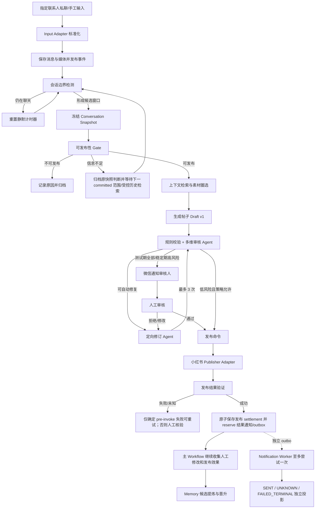
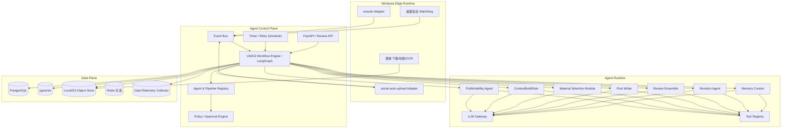
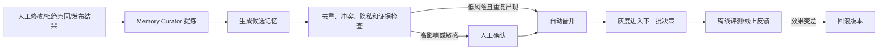

# USAGI-Agent 技术架构方案

> 文档来源：飞书《小红书自动化项目》，2026-08-29 读取的 revision 288。  
> 目标：监听本人与指定联系人的微信私聊，以对方消息为主要判断和创作来源、本人消息为辅助上下文，在会话阶段性结束后生成小红书图文，完成自动/人工审核与发布，并从反馈中逐步学习用户偏好。

## 1. 结论

本方案是 **基于 USAGI 通用 Agent Framework 构建的业务应用**，不是为小红书单独开发一套 Agent 底座。通用框架的边界、抽象和实施顺序见 [《通用 Agent Framework 架构》](generic-agent-framework.md)。

分层原则：

- `usagi-agent` 是与业务无关、可独立发布和测试的通用框架。
- `apps/xhs-autopost` 是框架的第一个业务应用，定义工作流、业务 Agent、规则和 UI。
- `plugins/wxauto`、`plugins/social-auto-upload` 是可替换插件，框架核心不引用它们。
- 小红书需求用于验证框架抽象是否实用，但任何业务概念都不能反向渗透进框架 Kernel。

采用 **事件驱动 + 可恢复状态机 + Adapter + Pipeline + 专用 Agent** 的混合架构。

- 状态机负责顺序、分支、重试、超时、幂等和人工暂停，不能交给 LLM 自由决定。
- Agent 只处理需要语义理解的节点：可发布性判断、上下文补全、素材选择、内容创作、风险审核、定向修订和记忆提炼。
- Adapter 隔离微信、小红书、LLM、存储等外部依赖，业务流程不直接依赖 `wxauto` 或 `social-auto-upload`。
- WorkflowSpec 与 Agent PipelineSpec 将 Agent、规则和 Tool 组织为 LangGraph 节点/子图；节点只返回 State Patch，执行快照由 LangGraph checkpointer 保存。
- Memory 采用“候选记忆 → 验证 → 晋升”的闭环，禁止把全部聊天或单次模型判断直接写成长期规则。

这不是一个无限 ReAct 循环，而是一个有明确状态、预算和终止条件的工作流型 Agent 系统。

## 2. 需求重构

### 2.1 核心业务流程



### 2.2 两个关键判断

#### 如何判断聊天中断

使用确定性 debounce 为主、LLM 为辅：

1. 每个 `conversation_key` 保存最后消息时间。
2. 短静默阈值默认为 90 秒，触发一次边界候选判断。
3. 若消息语义明显未完成，如“等下发你图”“然后呢”，延长到 5 分钟。
4. 硬超时默认为 15 分钟，到时强制形成快照，避免永久等待。
5. 边界关闭时以数据库序列冻结不可变快照区间；冻结后到达的新消息始终归属下一快照，不使当前快照失效，也绝不合并到已经 reserve 的发布中。

边界检测输出：

```json
{
  "boundary": "closed",
  "confidence": 0.91,
  "reason_codes": ["silence_threshold", "topic_complete"],
  "wait_seconds": 0
}
```

#### 消息摄取与快照原子切点

每个 `InboundEvent` 必须携带来源稳定的 opaque `source_event_ref`、opaque `source_cursor_ref`、`ordering_mode=source_ordered|observation_ordered` 和 adapter watermark。平台原始 ID/cursor 只存在于 Edge secure store 或 per-account/per-scope 加密 IdentityLink。`source_ordered` Adapter 必须证明 cursor 在账号/会话内单调、断线后可从 durable ack 重放；事件先进入持久化 inbox/reorder buffer，只有 cursor 已被连续接受时才按 source order 分配 `ingest_seq`。数据库到达顺序和客户端时间都不能直接决定业务顺序。

wxauto 等没有可靠消息 ID/cursor 的来源只能声明 `observation_ordered`。Edge 为每个桌面 session 持久化 `session_epoch + poll_seq + item_index`，使用重叠轮询和“账号/会话/发送者/平台时间/受控内容 tag + 同屏 occurrence ordinal + 前后邻接 tag”对齐历史；不能只用时间和内容 tag，否则相同消息会误合并。发生窗口截断、无法对齐或 cursor gap 时停止推进 watermark、暂停该会话发布并要求人工重扫，不能猜测缺失消息。该模式的契约明确是可靠观察顺序，不声称恢复平台不可见的历史顺序。

Control Plane 摄取事务按 `(tenant, source_stream_id, source_event_ref)` 去重，再锁定 stream/conversation，原子写 source event inbox、cursor mapping、message、`accepted_watermark`、`message.ingested` outbox 和 `source.ack_requested` outbox；它**不声称**与 Edge/network ack 原子。Edge 消费 ack event 后按 `(stream_id, accepted_watermark, ack_generation)` 幂等推进本地 durable acknowledged watermark，再回传 ack observation；Control Plane 只据此推进 `last_acknowledged_watermark`。任一侧在提交/发送/回传窗口崩溃都重放同一 event/ack key，不丢事件也不重复分配 ingest_seq。`last_event_at` 仅驱动 debounce，不作为游标。

形成快照时在锁定 conversation 的同一事务中读取 `after_consumed_seq`，只取 Control Plane `accepted_watermark` 连续覆盖的最大序列为 `cutoff_seq`，创建唯一范围 `(after_consumed_seq, cutoff_seq]` 的 ConversationSnapshot，并把 `consumed_seq` CAS 到 cutoff。Edge ack 落后不影响已接受事实，但 source gap 会冻结 accepted watermark。若 source_ordered Adapter 在已接受 watermark 后报告更早 cursor，写 `late_source_event` incident：publish reserve 前 supersede Snapshot/重新审批，reserve 后进入下一 correction Snapshot并强制人工判断。

#### 如何圈定文字、图片和历史

先用时间边界得到确定候选集，再做语义扩展，避免 LLM 在全部历史中任意挑选：

1. 基础范围：上一个已消费边界之后，到本次边界之前的消息。
2. 线程扩展：回复、引用、同一图片附近的文字和连续主题消息。
3. 历史检索：使用当前候选摘要检索过往 episodic memory，只返回 Top-K 片段。
4. 图片处理：保存原图、哈希去重、OCR、视觉摘要、清晰度和敏感信息检测。
5. Material Selector 输出 `selected_ids`、顺序、用途和排除原因，不能直接返回无法追溯的自由文本。

候选消息按发送者区分优先级：

- 对方消息是可发布性判断和帖子事实素材的主要来源。
- 本人消息允许参与标题、正文和图片选择，但默认作为问题背景、解释和上下文补充。
- “允许发布所有聊天内容”表示不限制话题类别和内容 profile；并不等于每条消息都单独成帖。系统仍需判断一段会话是否已形成有意义、可组织且满足平台安全规则的笔记素材。

## 3. 总体架构



### 3.1 四个平面

| 平面 | 职责 | 不应该负责 |
|---|---|---|
| Edge Runtime | 微信桌面监听、媒体落盘、小红书浏览器发布 | 内容判断和业务状态 |
| Control Plane | 编排、持久化状态、重试、审批、预算、版本 | 自由生成文案 |
| Agent Runtime | 语义判断、生成、审核、修订、记忆提炼 | 直接操作 UI、决定是否重复发布 |
| Data Plane | 事实、快照、向量、资源、审计和指标 | 隐式业务逻辑 |

## 4. Agent 设计

### 4.1 Agent 标准定义

每个 Agent 都是在 Python factory 中直接构造的类型化 AgentSpec，而不是 YAML 配置或散落的 prompt。第一版由 Server Bootstrap 装入 RuntimeBundleCatalog：

```python
post_writer = AgentSpec(
    id="post_writer",
    input_schema=PostWriterInput,
    output_schema=PostDraft,
    prompt=POST_WRITER_PROMPT,
    allowed_tools=(MEDIA_DESCRIBE,),
)
```

第一版所有 Agent 共享同一个 ModelAdapter 和六 Rule AgentLoop，不配置 per-Agent model、timeout、token、fallback 或 MemoryPolicy profile。确需差异时直接实现明确的业务 Agent/Adapter，不能先增加通用配置开关。

所有业务 Agent 统一装配到六个标准 Rule：`PreRecallRule → RecallSourcesRule → ContextBuildRule → ModelRule → ResultProcessRule → EndRule`。其中 RecallSourcesRule 与 ContextBuildRule 可在产品视角合并称为“召回与 Context 构建”。业务只提供 AgentSpec、Module/Stage Adapter 和 Policy，不自行实现 Agent 循环。

### 4.2 Agent 划分

| Agent | 作用 | 输入 | 输出 | 失败策略 |
|---|---|---|---|---|
| Boundary Agent | 处理语义未完结等模糊边界 | 消息尾部、静默时长 | `BoundaryDecision` | 回退确定性硬超时 |
| Publishability Agent | 判断内容是否形成了值得发布的帖子素材 | 快照摘要、规则、偏好 | 三态建议 + 原因码 + 置信度 | 低置信度归档或人工确认；是否允许发布由 Policy 决定 |
| Post Writer | 生成标题、正文、标签和配图顺序 | 选定素材、风格记忆 | `PostDraft` | 同一模型修复一次，仍失败则转人工处理 |
| Review Ensemble | 情绪、暴力、政治、隐私、版权、事实、平台规则审核 | Draft + 来源证据 | 风险项、证据、修改指令 | 任一硬规则失败即阻断 |
| Revision Agent | 严格按审核项定向修改 | Draft + ReviewReport | 新版本 Draft | 最多 3 次，之后人工处理 |
| Memory Curator | 从明确反馈中提炼可复用偏好 | 修改 diff、审批、效果 | `MemoryCandidate[]` | 不影响主发布链路 |

聊天历史召回、Context 构建和素材选择不再定义成独立 Agent。第一版扩展白名单固定为：`ChatRetrieverAdapter` 位于 RecallSourcesRule 的 Business Retriever 分支，只返回聊天/媒体候选；`MaterialSelectorAdapter` 位于 ContextBuildRule 的 Select/Trim 节点，只从框架已经过滤、去重、融分和重排的候选中选择文字/图片。ScoreFusion、Reranker、Budget、Citation 和 Pack Validate 均使用框架固定实现，不允许小红书业务替换；最终 `ContextPack` 只能由 ContextBuildRule 生成并保存为 Artifact，AgentPassState 只保存 `ContextPackRef`。

### 4.3 不做成 Agent 的节点

- 消息去重、时间窗口、状态迁移、重试和幂等。
- 标题长度、图片数量、文件类型、必填字段等可编码规则。
- 发布器调用、截图取证和发布结果校验。
- 权限判断、敏感字段脱敏和审计记录。

原则：能写成确定性规则的，不使用 LLM。

## 5. Pipeline 与 Adapter

### 5.1 Pipeline 抽象

小红书应用只声明 WorkflowSpec，并引用通用框架的 AgentSpec 和 PipelineSpec：

```text
XhsAutoPostWorkflowSpec
→ AgentNode
→ AgentLoop
→ AgentPassPipeline
→ Module Pipeline
→ LangGraph Node + Business Adapter
```

框架的 PipelineCompiler 将声明统一编译为 LangGraph `StateGraph`/subgraph。不存在额外的 `PipelineNode.run()` 调度器或 `NodeResult` 状态机：

- Node 返回类型化 State Patch 或 LangGraph `Command`。
- 顺序、branch、parallel、map 和有界循环编译为 edge、conditional edge、`Send` 和 subgraph。
- retry、cache、timeout 和 reducer 来自 NodeSpec/ModulePipelineSpec。
- 状态持久化只使用 LangGraph checkpointer。
- 人工审批只使用 `interrupt()`/`Command(resume=...)`，恢复当前中断节点。
- 等待新消息、定时器和外部回执由 Workflow Wait/事件节点表达。
- Tool 副作用统一经过 Permission、Policy、Approval、Idempotency、Execution 和 Observation 节点。

业务 Adapter 只能替换 Spec 声明的扩展点；ContextBuildRule、EndRule、安全、预算、审批和幂等强制节点不能被业务删除。

第一版所有场景在 Server Bootstrap 时初始化并放入只读 dict：

```python
runtime_bundles = {
    "xhs.publishability": publishability_bundle,
    "xhs.post_writer": post_writer_bundle,
    "xhs.review": review_bundle,
    "xhs.memory_curator": memory_curator_bundle,
    "xhs.autopost_workflow": autopost_workflow_bundle,
}
```

启动过程完成 Spec 校验、Adapter 初始化和 LangGraph 编译；任一启用场景缺少必需配置时 fail-fast。Run 只根据 `scenario_key` 查找 Bundle、创建 State 并执行，不重新解析配置。第一版配置变更通过修改代码/最小部署配置并重启生效，不支持热更新、动态 Registry、租户覆盖或按 Run 灰度。

### 5.2 Adapter 接口

```python
class MessageSourceAdapter(Protocol):
    async def listen(self) -> AsyncIterator[InboundEvent]: ...
    async def fetch_media(self, media_ref: str) -> LocalAsset: ...

class PublisherAdapter(Protocol):
    async def validate(self, draft: PublishRequest) -> ValidationReport: ...
    async def publish(self, request: PublishRequest, idempotency_key: str) -> PublishReceipt: ...
    async def verify(self, receipt: PublishReceipt) -> PublishStatus: ...

class ModelAdapter(Protocol):
    async def generate(self, request: ModelRequest) -> ModelResponse: ...

class MemoryAdapter(Protocol):
    async def search(self, query: MemoryQuery) -> list[MemoryHit]: ...
    async def propose(self, candidate: MemoryCandidate) -> str: ...
```

首批实现：

- `WxAutoMessageAdapter`：只负责将 wxauto 事件转成统一消息事件。
- `ManualInputAdapter`：用于测试和人工补录，绕过桌面自动化。
- `XhsSauPublisherAdapter`：仅封装 `sau xiaohongshu check/upload-note`；当前没有可靠 delete/unpublish API。
- `OpenAICompatibleModelAdapter`：只通过模型网关调用已登记 DataEgressPolicy 的兼容 endpoint；协议兼容不等于允许发送原始聊天。
- `PostgresMemoryAdapter`：结构化记忆和 pgvector 检索。

这些 Adapter 都由框架 Node 注入和调用。特别是 PublisherAdapter 只能由 Fixed Workflow ToolNode 的标准治理节点链调用，业务 service 不得直接执行 `publish()`。

## 6. 状态机与恢复

### 6.1 状态定义

```text
workflow_state:
COLLECTING
  -> BOUNDARY_PENDING
  -> SNAPSHOT_READY
  -> ELIGIBILITY_CHECKED
  -> MATERIALS_SELECTED
  -> DRAFTED
  -> REVIEWING
  -> REVISING -> REVIEWING
  -> HUMAN_REVIEW_PENDING
  -> APPROVED
  -> PUBLISH_STEP
  -> SUSPENDED_MANUAL            # publish unknown 时的控制层 interrupt
  -> PUBLISH_SETTLED
  -> LEARNING
  -> COMPLETED

workflow 终止状态：REJECTED / CANCELLED / FAILED

publish_status：
NOT_RESERVED -> RESERVED -> EXECUTING -> PUBLISHED | UNKNOWN | FAILED_TERMINAL

notification_state（每个 notification operation 独立）：
NOT_RESERVED -> RESERVED -> EXECUTING -> SENT | UNKNOWN | FAILED_TERMINAL
```

上述是三个正交投影，不是第二套图调度状态。发布成功事务耐久 reserve 通知 operation/outbox 后，`publish_status` 永久保持 PUBLISHED，`workflow_state` 可继续 LEARNING/COMPLETED，Notification Worker 独立推进自己的状态；通知 UNKNOWN/FAILED_TERMINAL 不得阻塞 Learning、改变帖子状态、触发重发或重新发布。实际图恢复点只以 LangGraph checkpoint 为准，业务投影使用 CAS。

### 6.2 幂等设计

- 消息键：`tenant + source_stream_id + source_event_ref`；observation_ordered 的 local ref 使用持久化 cursor mapping 与 occurrence/邻接对齐生成，平台 ID/cursor 只在加密 IdentityLink/Edge secure store，禁止退回仅按时间+内容去重。
- 会话快照键：对排序后的随机消息 ID 使用 tenant-scoped HMAC，不保存聊天正文的裸 SHA-256。
- 草稿版本：`snapshot_id + writer_version + revision_no`；内容比较值使用 tenant-scoped HMAC。
- 发布业务 operation key：`tenant + account_ref + publish_intent_id + approval_operation_id + approval_generation + approved_draft_revision`；每次独立的人为发布意图必须生成新的 `publish_intent_id`，因此相同内容可被合法发布两次。`approved_draft_hmac` 只做不可变内容完整性校验，不能作为发布身份或去重键。
- Publisher Tool 使用不可变 `tool_id + version + implementation_checksum`，发布键同时作为 ToolExecution 的 business operation key，并声明 `creates_external_resource=true`。
- 第一版 Publisher 声明 `write_safety=at_most_once_manual`、`locator_requirement=required`：发布前以 CAS 创建 execution reserved、adoption pending，以及独立 ExternalEffectRecord、effect/incident key 和资源登记槽位；执行时 execution 转 executing。远端返回后必须通过 `settle_external_effect` 同事务提交不可变第一 execution settlement、逐资源独立 key 加密的 locator、Usage 和 outbox，再由 live Worker 把 adoption 从 pending 转 adopted。
- 网络超时或进程崩溃时 execution 进入 `unknown`；首个确定 settlement 此后不可改写，晚到的不同 outcome 或 resource identity 只创建独立 `SettlementConflictIncident`。仅当 Run 仍为 active running 时，业务状态进入 `PUBLISH_UNKNOWN`，Workflow 创建 durable operator interrupt、把 RunControl 转为 suspended，并对外返回 `Suspended(reason=manual_required)`；取消中或终态 Run 只关联独立 incident/case，禁止逆向恢复 Run。所有情形均禁止自动再次上传。后续只有在实现并验证可靠的平台查询后，才能通过代码版本升级为 `reconcile`。新 generation 只把旧 adoption 标为 superseded，旧 execution 的 late result 仍可结算但永不采用。
- 首版远端删除能力明确为 `deletion_mode=manual_only, delete_tool_ref=None`；可选 `reconcile_tool_ref` 独立声明。ErasureCase 保留加密 locator，通过 case portal指导获授权 operator 人工下架。后续只有提供精确、可长期解析的 delete/unpublish ToolRef 并通过治理/幂等测试后，才能迁移 capability。

### 6.3 重试分类

| 错误 | 处理 |
|---|---|
| 模型限流、短暂网络错误 | 指数退避 + jitter，最多 3 次 |
| JSON/schema 不合格 | 同一模型修复 1 次，仍失败则本次 Run 失败并转人工处理 |
| 微信窗口不可见、未登录 | Watchdog 告警并暂停入口 |
| 小红书登录失效 | 暂停发布队列，要求人工重新登录 |
| 平台规则拒绝 | 回到定向修订，不做原请求重试 |
| 发布结果未知 | 禁止自动重发；进入 durable 人工核验，由 operator 在平台查询/截图并通过受控恢复入口提交证据 |

每个模型节点使用 `tenant + run_id + pass_id + node_id + logical_call_no` 生成 logical invocation ID；只允许同一 logical invocation 在 durable replay 时复用已归档响应。`request_hash` 是覆盖模型身份、Prompt checksum、ContextPack tenant HMAC、Tool Schema checksum 和生成参数的 tenant-scoped HMAC，仅用于完整性校验，不允许跨 Run 复用帖子内容。

## 7. Memory 与 RAG

### 7.1 四层记忆

| 层级 | 示例 | 生命周期 |
|---|---|---|
| Working Memory | 当前窗口、Draft、审核报告 | 单次 run |
| Episodic Memory | 某次聊天如何变成某篇帖子 | 可检索历史 |
| Preference Memory | 喜欢的语气、标题风格、禁发话题 | 长期、可版本化 |
| Policy Memory | 隐私规则、人物黑名单、平台限制 | 人工维护、最高优先级 |

发布效果属于 Outcome Memory，作为参考信号，但不能直接改写安全策略。

### 7.2 自动学习闭环



Memory 记录字段：`type`、`content_ref`、`scope`、`evidence_ids`、`confidence`、`support_count`、`contradicts`、`created_by_ref`、`approved_by_ref`、`version`、`expires_at`。正文和身份均为当前 scope 下的加密 Ref；当前产品策略下 `expires_at = null` 表示永久保留。

所有 propose/promote/revoke/compact 写入都携带稳定 operation/evidence/expected version、tenant/scope/control kind/id/fencing 和 DataAccessContext。Run 结束后，后台只能凭 `MemoryMaintenanceControl` 的 system principal + scope/purpose + 短 lease 对原 unknown operation 做 get/reconcile 证明，不能首次 apply；定期 compact/expire/reindex 必须创建新的 maintenance operation。每次读写重查 tombstone，数据库以 operation/evidence 唯一键与 CAS 防止重放。

### 7.3 检索策略

组合检索而不是只做向量相似度：

`score = 0.45 * semantic + 0.25 * recency + 0.20 * user_feedback + 0.10 * topic_match`

再进行权限过滤、时间衰减和 MMR 去重。每条传给 Agent 的历史片段必须附 `memory_id` 和来源，便于解释与删除。

## 8. 审核与人工介入

### 8.1 审核矩阵

| 维度 | 实现 | 结果 |
|---|---|---|
| 格式与平台约束 | 确定性 validator | hard pass/fail |
| 情绪/攻击性 | 分类 Agent | score + evidence |
| 暴力/自伤/色情 | Moderation/分类模型 | hard block 或人工 |
| 政治与敏感实体 | 规则词典 + 分类 Agent | 人工审核 |
| 个人隐私 | PII/人名/地址/聊天身份检测 | 默认阻断或脱敏 |
| 事实一致性 | Draft 对来源证据核验 | unsupported claims |
| 图片隐私 | OCR + 人脸/二维码/定位信息检测 | 打码、排除或人工 |
| 来源策略 | 会话白名单、sender_role | 指定私聊内容无需授权记录；非白名单来源阻断 |

审核输出必须是结构化 `ReviewReport`，包含 `severity`、`category`、`evidence`、`instruction`、`auto_fixable`。

### 8.2 人工审核策略

测试阶段所有帖子都必须人工审核。Draft 准备完成后，通过微信向配置的审核会话发送通知和审核入口；通知失败不能绕过审核。

运行稳定后按风险放开自动发布：

- 含聊天截图、人脸、联系方式、健康/金融/政治内容必须人工审核。
- Agent 置信度低于 0.85、审核器结果冲突或修订超过 2 次时必须人工审核。
- 只有指定私聊、低风险、无个人敏感信息且历史批准率足够高时允许自动发布。
- 无论人工还是自动发布，每篇笔记发布成功后都必须耐久创建一次通知 operation，并由受治理 Tool 至多尝试发送一次；微信缺少可靠查询/删除能力，因此不承诺 exactly-once 或自动补发 unknown。通知固定使用最小不可逆 schema。该边界以代码级 Product/ComplianceDecisionRef 固化；ErasureReceipt 对已知送达和可能送达分别披露 `external_irreversible_disclosed` / `external_irreversible_delivery_unknown_disclosed`，不能声称已从微信远端删除。
- 审核通知和发布后通知都作为受治理写 Tool 执行：`write_safety=at_most_once_manual`、`creates_external_resource=true`、`deletion_mode=irreversible_minimal`、`locator_requirement=forbidden`、`resource_identity_strategy=operation_tag`。reserve 事务先创建 Notification/ToolExecution/ExternalEffect 与无 locator/key 的 `delivery_pending` resource placeholder；成功发送转 observed，unknown 转 delivery_unknown。只有可证明 pre-invoke failure 才允许新 attempt；一旦可能调用过外部发送就永久禁止自动重发。Erasure 在 permit/generation 全部收口后把 unknown 资源转 `irreversible_delivery_unknown_disclosed` 并在 receipt 明确披露“可能已发送”，因此 unknown 不会无期限阻塞删除，也不能伪造未发送。帖子始终保持 `PUBLISHED`。
- 审核通知 operation key 绑定 `approval_operation_id + approval_generation + notification_type`；发布结果通知绑定 adopted `publish_execution_id + publish_generation + notification_type`。不同通知类型/新审批代次互不合并，同一 operation/attempt/generation 重投只返回原 reserve。
- 每次通知 reserve/发送前重查 tombstone。Erasure 仅在 execution 仍 reserved 且 durable invoke-start marker 不存在时，原子取消 queued outbox、清 payload并把 placeholder 转 `cancelled_before_invoke`；这类未调用资源无需披露。已 invoking/unknown 必须按已知或可能送达披露，不从已删除 conversation 重建 recipient。

人工界面展示：原始消息、入选/排除素材、历史引用、Draft diff、所有风险项、Agent/Prompt/Model 版本和发布预览。

## 9. 数据模型

首期 PostgreSQL 表：

| 表 | 关键字段 |
|---|---|
| `source_accounts` | tenant_id、source、opaque account_ref、status、credential_ref；账号身份映射位于 per-scope/账户域加密 IdentityLink |
| `business_identity_links` | tenant_id、identity_link_id、identity_kind(account/conversation/contact/sender/destination/source_event/source_cursor)、opaque local ref、tenant-scoped keyed lookup tag、encrypted platform identifier/ref、scope/account key ref、version/retention；业务表只引用 local ref，scope Erasure 清映射/tag，account credential 域按独立 lifecycle 清理 |
| `source_streams` | tenant_id、source_stream_id、source、account_ref、conversation_ref、ordering_mode、session_epoch、accepted_watermark_ref、last_acknowledged_watermark_ref、ack_generation、status/version |
| `source_event_inbox` | tenant_id、source_stream_id、source_event_ref、source_cursor_ref、ordering tuple、observed_at、status、ingest_seq、version；原始平台 event/cursor 位于 IdentityLink |
| `source_cursor_mappings` | tenant_id、source_stream_id、session_epoch/poll_seq/item_index、occurrence/neighbor keyed tags、source_event_ref、alignment status/version；observation_ordered 恢复依据 |
| `source_ack_outbox` | tenant_id、stream、accepted watermark ref、ack_generation、pending/published/observed、attempt/version；Edge 按 stream/generation 幂等 ack |
| `conversations` | tenant_id、source、opaque conversation_ref、keyed_routing_tag、erasure_scope_id、kind=direct、self/peer_identity_link_ref、allow_publish、last_observed_at、next_ingest_seq、consumed_seq、accepted_watermark_ref、version；不保存原始会话/联系人 ID |
| `messages` | tenant_id、source_event_ref/source_cursor_ref、ordering_mode、conversation_id、ingest_seq、sender_identity_link_ref、sender_role(self/peer)、observed_at、platform_time_ref、type、content_ref；来源事件唯一，会话 ingest_seq 唯一 |
| `artifact_metadata` | artifact_id、tenant/scope、operation_id、status、data_key_ref、lineage seed、加密完整性元数据 |
| `assets` | artifact_ref、keyed_integrity_tag、mime、ocr/vision ArtifactRef、privacy_flags；原始 SHA 仅存在加密 Artifact metadata |
| `conversation_snapshots` | conversation_id、after_consumed_seq、cutoff_seq、first/last_message_ref、snapshot_hmac、status/version；同会话范围不重叠 |
| `run_start_requests` | tenant_id、server-derived idempotency_namespace、request_idempotency_key、scenario、Bundle-independent canonical client_request_fingerprint、含 input schema checksum 的 execution_bundle_fingerprint、run_id、input_metadata_ref、status；namespace/request key 唯一 |
| `run_metadata` | tenant_id、workflow/agent/pipeline 版本、业务状态投影、checkpoint/thread 引用、started_at、ended_at；不复制 graph state |
| `execution_contexts` | tenant_id、不可变 original_principal、授权范围、absolute_deadline、bundle/graph checksum、secret_refs |
| `run_controls` | tenant_id、version、独立 lease_version、run_status、suspended_checkpoint_id、interrupt_set_digest、accepted_resume_attempt_id、budget_used、lease owner/expiry、fencing_token；预算/状态与 lease 分别 CAS |
| `thread_control_bindings` | globally unique thread_id、tenant_id、control kind/id、graph checksum；tenant/thread 复合外键，raw adelete_thread 只能命中一条 binding |
| `resume_attempts` | interrupt/checkpoint、authenticated_actor link、状态约束的 nullable validated_payload_ref、accepted/invoking/applied/reconcile/failed phase、fencing_token、resulting_checkpoint_id；failed/applied 清理后不得持有 payload |
| `interrupt_credentials` | interrupt/checkpoint/digest 绑定、token digest、version、active/consumed/revoked/expired、accepted attempt；明文不落库 |
| `usage_facts` | 随机 event_id、kind、amount/unit、reserved/settled/released/adjustment、time；append-only 且不含 tenant/run/source |
| `usage_identity_links` | event_id、tenant/scope、usage_key_hmac、run/source/reservation/corrects event/sequence 映射；加密且可 Erasure |
| `node_traces` | telemetry_correlation_id、node、attempt、payload_type/size、latency、cost；禁止 ArtifactRef、checkpoint_id 和主体 ID |
| `drafts` | snapshot_id、revision、title_ref、body_ref、tags_ref、selected_asset_ids、draft_hmac；敏感生成内容均为 per-scope DEK 加密 ArtifactRef |
| `review_reports` | draft_id、reviewer_link、severity、issues_ref、decision；评审正文为加密 ArtifactRef |
| `approval_tasks` | approval_operation_id、business/langgraph interrupt ID、draft_id、checkpoint_id、approval_scope、action_hmac、generation、status、reviewer_link、expires_at、version；operation/interrupt 全状态唯一，终态一次性 CAS |
| `tool_executions` | execution_id、完整 ToolRef、idempotency_key、write_safety、execution_status、adoption_status、attempt/generation、settlement permit、quarantine receipt_ref |
| `publish_receipts` | execution_id/generation、idempotency_key、完整 ToolRef、adoption_status、evidence_ref；远端 locator 不存此表 |
| `external_effects` | effect_id、tenant/control/execution/operation/attempt/generation、producer ToolRef/Policy、platform、account_ref、scope_link_count、resource-set aggregate/version、effect key；不保存单一 scope/case |
| `external_effect_scope_links` | tenant_id、effect_id、scope_pseudonym、derivation_set_id、direct/derived relation、version；任一 parent Erasure 可找到 effect |
| `erasure_case_effect_links` | tenant_id、case_id、effect_id、matched_scope、active/resolved/supplemental、version；多 case 历史不覆盖 aggregate |
| `external_effect_resources` | tenant/effect/resource、identity tag、nullable key/version/locator、delivery_pending/cancelled_before_invoke/observed/delivery_unknown/delete_pending/deleted/not_found/irreversible disclosed/unknown disclosed、version |
| `settlement_conflict_incidents` | tenant_id、execution/effect、第一 settlement Ref、冲突 outcome/resource observation、独立 evidence Ref、open/reconciling/resolved、operator case；不改写第一 settlement |
| `post_closure_settlement_incidents` | tenant/effect/execution/new observation、supplemental effect/case obligation、status/version；closed 后可信新资源绝不丢弃 |
| `external_erasure_cases` | tenant/case、delete/reconcile status、operator interrupt、manual case、可重建 effect_count；effect 集合只以 `erasure_case_effect_links` 为权威，不保存 effect_ids |
| `erasure_controls` | ErasureWorkflow 独立 thread/status（含 preflight_retryable/blocked）、tombstone_committed_at、retry_plan/next_retry、scheduler lease、resume attempt/credential、interrupt digest、lease owner/expiry、fencing_token、version/lease_version；不复用原 RunControl |
| `erasure_notification_subscriptions` | tenant/case/requester_namespace 唯一、route Ref、status/version/retention；请求者只能更新自己的订阅 |
| `model_invocations` | logical_invocation_id、tenant/run/pass/node/logical_call_no、request_hash、attempt/generation、settlement permit、execution_status、adoption_status、response quarantine、token/cost |
| `notifications` | tenant_id、notification_operation_id、recipient_identity_ref、type、payload_ref、scope_id、ToolExecution/ExternalEffect/resource Ref、attempt/generation、notification_state、source_draft_id、sent_at、version；operation/attempt/generation 唯一且与 publication state 正交 |
| `memories` | type、content_ref、embedding_ref、scope、scope_dek_ref、confidence、version、status、last_operation_id；正文/向量不明文入表 |
| `memory_evidence` | tenant_id、memory_id、evidence_id、scope、event/draft/feedback 加密引用；`(tenant_id, memory_id, evidence_id)` 唯一 |
| `memory_mutations` | tenant_id、namespace/scope、control_kind/id、operation_id、evidence_id、expected/resulting_version、fencing_token、status；`(tenant_id, namespace, operation_id)` 唯一 |
| `memory_maintenance_controls` | tenant/control ID、scope/purpose(compact/expire/reindex/reconcile_existing)、system principal、lease owner/expiry、fencing/version；reconcile_existing 只读证明原 operation，后台不借用已结束 Run |
| `reconciliation_controls` | tenant/reconciliation ID、incident/effect/execution/account/exact ToolRef、expected versions、system principal、lease/expiry/fencing/status/version；只允许原 permit settlement |
| `lineage_edges` | tenant_id、erasure_scope/DerivationScopeSet、source opaque ref、derived opaque ref、relation、created_at；主体映射加密且可删除 |
| `scope_hierarchy_edges` | tenant_id、parent_scope_pseudonym、child_scope_pseudonym、scope kind、status/version；无正文，acceptance lock 下维护 closure |
| `derivation_scope_sets` | tenant_id、set_id、parent scope refs、dedicated derivation_dek_ref、status；任一 parent tombstone 即销毁派生 key |
| `erasure_case_scope_closure_entries` | tenant/case、scope pseudonym/kind/target-or-descendant、scope key identity/version、derivation set、destruction operation/status/receipt；冻结后 append supplemental，不原地缩小 |
| `erasure_requests` | tenant/requester_namespace/request key、opaque scope ref/pseudonym、effective_scope_closure digest、waiting_on_case、case/tombstone/status/progress/receipt/time；tenant acceptance lock 串行化 ancestor/descendant overlap |
| `key_destruction_operations` | operation、tenant、nullable key_ref、key_identity_hmac/version/purpose、状态/attempt/receipt/version；key identity/version/purpose 唯一，destroyed 必须清 ref 且有 receipt |
| `outbox_events` | event_id、tenant_id、aggregate type/id/version、event_type、dedup_key、payload_ref、pending/claimed/published/dead-letter/cancelled、available_at、attempt/version、claim owner/expiry、reason、created/published_at |
| `inbox_receipts` | tenant_id、consumer、event_id、outcome、applied_operation_id；消费者业务提交与 receipt 原子完成 |
| `audit_facts` | 随机 audit_id、event_type、outcome、risk/amount/time/retention_class；append-only、无身份/ArtifactRef |
| `audit_identity_links` | audit_id、tenant/scope、actor/resource/ArtifactRef；加密、受权限控制并可 crypto-erasure |
| `deployment_attestations` | signed ref、tenant、integration/real environment、build/bundle/test digest、adapter/decision refs、test-account/limit/cleanup constraints、issued/expires/signer；Bootstrap 只读验签 |

使用 transactional outbox，数据库状态提交和事件发布保持一致。

所有表中的 `*_identity_ref` 都是随机 opaque Ref。Outbox payload 只允许低敏 envelope/ArtifactRef；Dispatcher 用 DB-time claim，消费者以 InboxReceipt 去重。Erasure 对普通未投递业务事件可取消并清 payload；notification placeholder 还必须满足 reserved + 无 invoke marker 才能原子转 cancelled_before_invoke，删除/对账系统事件永不取消。

Erasure 完成判定只遍历冻结的 `erasure_case_scope_closure_entries`、`erasure_case_effect_links`、resource/incident 与对应 KeyDestruction receipt；digest/effect_count 只用于完整性和查询投影，绝不能充当权威集合。重启后从这些逐条记录恢复，不重新猜测当时的 scope tree。

LangGraph State/checkpoint 只保存低敏路由枚举、tenant-scoped HMAC，以及消息、素材、ContextPack、AgentAction、AgentResult、ToolObservation、FinalOutput、Draft 和模型响应的随机 ID/ArtifactRef，不复制正文、图片、裸内容 hash、Tool 参数或输出。`lineage_edges` 必须覆盖消息 → 快照 → 素材/OCR/视觉结果 → embedding/cache → NormalizedInput/RecallPlan/RecallBundle → ContextPack/模型响应/AgentAction → ToolObservation/AgentResult/FinalOutput → Draft/Memory → checkpoint thread，保证按人物或会话可以遍历全部派生数据。

## 10. 小红书应用工程目录

```text
apps/xhs-autopost/
  src/xhs_autopost/
    domain/
      models/                 # Message、Snapshot、Draft、ReviewReport
      events/                 # 领域事件
      policies/               # 确定性业务规则
    application/
      pipelines/              # 使用框架公开 API 声明工作流
      services/               # 会话、审批、发布用例
    agents/
      boundary.py
      publishability.py
      post_writer.py
      reviewers/
      revision.py
      memory_curator.py
    adapters/
      inbound/manual.py
      context_build/
        chat_retriever.py
        material_selector.py
      plugins.py              # 装配通用框架和外部插件
    infrastructure/
      db/
    interfaces/
      api/
      worker/
      review_ui/
  tests/
    unit/
    contract/
    pipeline/
    evals/

plugins/
  wxauto/
  social-auto-upload/
```

应用依赖 `usagi-agent` 的公开接口；插件依赖框架的 Port/Tool SDK。依赖方向固定为 `interfaces/adapters → application → domain`，业务 `domain` 和框架 Kernel 都不引用任何外部 SDK。

## 11. 技术选型

| 类别 | MVP | 扩展阶段 |
|---|---|---|
| 语言 | Python 3.11/3.12 | 保持 Python |
| API/Schema | FastAPI + Pydantic v2 | 同左 |
| ORM/迁移 | SQLAlchemy 2 + Alembic | 同左 |
| 状态与记忆 | PostgreSQL + pgvector | 可拆向量服务 |
| 外部事件与定时触发 | 进程内 worker + outbox/DB lease | Redis Streams/NATS/Kafka + 远程 worker；只负责启动/恢复 LangGraph Run |
| 消息总线 | PostgreSQL outbox | Redis Streams/NATS/Kafka |
| 对象存储 | 本地加密目录 | MinIO/S3 |
| Agent 编排 | USAGI Workflow Facade + LangGraph `StateGraph` | 仍使用 LangGraph，扩展 PostgreSQL checkpointer/远程 worker |
| 可观测性 | OpenTelemetry API/SDK + OTLP Collector；structlog 关联 trace/span | Collector 对接 Prometheus/Grafana/Tempo 或其他兼容后端 |
| 评测 | pytest + 固定数据集 + LLM judge 辅助 | 在线 shadow/canary |

首版不应同时引入 Celery、Kafka 和多个 Agent 框架。外部队列只负责事件投递和 worker 分发，不能接管 Workflow/Agent 的节点调度；LangGraph 始终是唯一图执行与 checkpoint 运行时。

## 12. 部署拓扑

### MVP：单机 Windows

- Windows 用户会话内运行 `edge-worker`，保证微信客户端和浏览器可交互。
- PostgreSQL 可本机 Docker 或独立安装；媒体存放在加密工作目录。
- API、pipeline worker、review UI 可同进程部署，但模块边界保持独立。
- 本机运行 OpenTelemetry Collector，API、worker 和 edge-worker 通过 OTLP 上报 trace、metric 和关联日志。
- 进程守护不能把 UI 自动化服务放到无桌面 Session 0。

### 扩展：Edge + Control Plane

- Windows Edge 仅运行微信监听和小红书发布。
- Linux/容器部署 API、Agent、数据库和审批 UI。
- Edge 通过 mTLS 出站连接拉取发布任务；不暴露桌面控制端口。
- Edge、Control Plane 和远程 Worker 使用 W3C Trace Context 传播链路；各环境向就近 Collector 上报，再由 Collector 统一处理和导出。
- 原始聊天默认不离开本机。若 ModelRule 运行在 Control Plane 或 endpoint 非本机，不能直接渲染/发送原始 ContextPack；必须先通过下面的数据出境 Gate。

### 模型数据出境 Gate

- `local_plaintext`：模型 endpoint 与 Artifact 解密边界都位于受控本机，允许在授权 scope 内接收原文。
- `remote_redacted`：发送前按字段分类执行最小化与脱敏，只允许 Policy 明确批准的字段；Gateway 校验供应商身份、部署地域、传输加密、训练/留存策略、留存期限和删除能力，并归档非敏感 policy decision。
- 原始私聊、图片或可逆身份信息只有获得明确的代码级 DataEgressPolicy 和当前主体/tenant 授权时才可发送远程模型；“OpenAI-compatible”只表示协议兼容，不代表供应商已获许可。
- ModelGateway 在构造请求、归档 request hash 和真正发出网络请求前执行 Gate。endpoint 未登记、地域/留存不符合、脱敏失败或 Policy 信息缺失时 fail closed，Run 进入安全 Suspended/Failed，不允许降级为直接上传原文。

## 13. 可观测性与评测

### OpenTelemetry

服务运行观测统一使用 OpenTelemetry，不在业务代码中直接绑定具体后端：

```text
wxauto edge-worker / API / LangGraph worker / review service
→ OpenTelemetry API + SDK
→ OTLP
→ OpenTelemetry Collector
→ trace / metric / log backend
```

- FastAPI、HTTP Client、SQLAlchemy 使用 instrumentation；Workflow、AgentLoop、AgentPass、Rule、Tool、审批、发布和通知使用 USAGI 手工埋点。
- Resource 至少包含 `service.name`、`service.version`、`service.instance.id` 和 `deployment.environment.name`。
- HTTP、outbox、远程 Worker 和 Edge 消息 envelope 传播 W3C `traceparent`/`tracestate`。
- 日志关联当前 `trace_id`/`span_id`；聊天正文、Prompt、Cookie、Token、图片内容和完整 Tool 参数不得进入 span、metric、log 或 baggage。
- 审批决定、发布 receipt 和通知结果继续写入业务审计表；OpenTelemetry 不作为可靠审计存储。
- Collector 不可用时遥测使用有界缓冲并告警，不能因此重复发布或阻断 checkpoint；审计写入失败则按发布 Policy 处理。

### 指标

- 服务运行：请求量、错误率、延迟、worker 心跳、队列 lag、DB pool、Collector export failure。
- Agent 运行：每个 Rule 延迟、Pass 数、interrupt pending、Model/Tool 调用和失败原因。
- `boundary_precision/recall`：会话切分准确率。
- `publishability_precision`：宁可少发，不可误发。
- 素材选择 precision/recall 和人工调整率。
- Draft 一次通过率、平均修订轮数、人工拒绝率。
- 重复发布数，目标必须为 0。
- 每篇 token、延迟和模型成本。
- Memory 命中率、引用后采纳率、回滚率。
- 审核通知和发布后通知的送达率、延迟、仅 pre-invoke-rejected 重试次数、unknown/manual dead-letter 数。

### 离线数据集

Gate 前离线集只允许人工构造 synthetic 样本。真实数据 Gate 后若经独立授权纳入回放，样本正文必须保存为 tenant/scope/DerivationScopeSet 加密 ArtifactRef，记录来源 Lineage、purpose、访问审计和 retention；Erasure 时与生产派生数据一起删除，不能导出成仓库 JSON、日志或无 scope 的评测文件。每条样本的低敏标签包含预期边界、是否可发、应选素材 Ref、风险标签和人工最终稿 Ref。任何 Prompt、Model、规则或 Memory 版本上线前都要回放并把去标识化结果绑定到版本。

### Trace

单次 run 使用 OpenTelemetry Context 中的 `trace_id` 串联各运行阶段，但 span/log 不记录消息、ArtifactRef、checkpoint ID、Tool receipt Ref 或主体 ID。框架生成随机 `telemetry_correlation_id` 关联受控 AuditStore；`run_id` 不进入 span attribute。日志中不记录原始 token、cookie 或完整敏感聊天。

## 14. 安全与合规边界

1. 只监听配置白名单中的一对一私聊，不监听群聊；白名单会话中对方消息为主要发布来源，本人消息可作为辅助素材。
2. 产品策略已确认：指定联系人私聊中的全部内容均可作为发布候选，系统不设置对方授权记录或授权审批门槛。隐私、平台规则和高风险内容审核仍然生效。
3. 聊天文本、图片、派生摘要和记忆默认永久保存、无自动 TTL；必须加密保存、限制访问、纳入备份，并通过框架 ErasureCoordinator/LineageIndex 实现按会话/人物主动删除。每个 thread 只绑定一个 erasure scope；删除先写 tombstone、阻止召回和新处理、取消关联 Run，再按逐 Store 矩阵清理业务表、Artifact、执行记录中的 Ref、embedding、缓存、Memory 和 LangGraph checkpoint/thread。
   `encryption_kek_ref` 只 wrap 每个 subject/conversation/derivation 的独立 DEK；所有正文、媒体、Draft、Review、Memory、embedding/cache 列只保存 EncryptedField/ArtifactRef。删除必须由 KeyDestructionStore/outbox 确认完成条件要求的 scope/derivation/resource/effect/incident/settlement-domain key 已不可用；locator-forbidden 通知则必须完成不可逆披露，不能把“已发送 KMS 请求”或“远端不可删除”直接当成完成。
4. Cookie/登录态只保存在 Edge 的系统凭据库，不进入数据库和日志。
5. 发布工具只接受已通过当前审核策略且 hash 未变化的 Draft：测试阶段需要人工批准，稳定阶段低风险内容可以由 Policy 自动批准；批准后任何变化都会使审批失效。
6. 人工审批恢复分两层：Runtime 在调用 LangGraph 前从认证上下文取得审批者身份，在内存中校验输入并把 payload 放入不可读、短 TTL quarantine，只读确认 expected checkpoint 是 checkpointer 最新恢复点，再在 RunControlStore/ResumeAttemptStore/InterruptCredentialStore/ArtifactMetadataStore 同一事务中消费 credential、执行 suspended → resume_accepted CAS、取得 fencing lease，并只 finalize 胜出 payload；graph 恢复后再校验审批 scope、有效期、action hash，并重新检查原始调用主体权限、当前 Policy、账号登录态和 Draft 状态。审批者身份不得由 Resume payload 自报，并发败者输入必须 abandoned/清扫。
7. `wxauto` 项目 README 明确声明仅用于 UIAutomation 交流学习并禁止实际生产/商业用途，因此它只能作为学习验证 Adapter；若进入真实生产，应重新确认授权、平台条款并替换为合规接入方式。
8. 浏览器自动化存在账号风控和页面变更风险，必须限速、保留人工接管和 kill switch。第一版 Publisher 使用 `at_most_once_manual`，unknown 后只允许人工核验，禁止自动重发。
9. 删除请求保留去标识化最小审计事实和 deletion ledger；会话/人物数据使用独立数据密钥支持 crypto-erasure，备份恢复后必须先重放 deletion ledger 才能恢复服务。
10. 每个 Node 开始和模型/发布/Memory/Artifact reserve 前检查取消与绝对 deadline。取消通过 RunControl CAS 递增 fencing token 并阻止新 lease/resume；已经发出的发布动作按 execution `settled_success/settled_failure/unknown` 收口，冲突另建 SettlementConflictIncident。普通 Run 只有在 active running 时才把 manual_required 投影为带 operator interrupt 的 Suspended；取消中/终态 Run 只挂独立 incident。旧 token 和 Erasure tombstone 禁止 late result 生成 Draft、普通 Artifact、Memory 或业务通知。FencedCheckpointer 的 `put/aput` 与 `put_writes/aput_writes` 在同一数据库事务中校验 token、lease owner、数据库时钟 expiry 和状态。heartbeat 只竞争独立 lease_version；普通 version/预算并发冲突只重读重试，只有 owner/token/status/DB expiry gate 失效才视为 lease 丢失。
11. 本应用的 Erasure 包含由聊天生成的远端帖子。每个 effect 用多条 scope link 与 closure 匹配，多请求者 route 使用独立 subscription；ancestor 请求遇 active descendant 时持久排队，不能返回范围不足的 case。微信通知 reserve 时创建 operation-tag placeholder；已知送达转 irreversible_disclosed，unknown 在 permit 收口后转 irreversible_delivery_unknown_disclosed，均明确披露且不伪造删除。帖子 `deletion_mode=manual_only`，ManualExecutionSession/证据绑定 effect/resource version并固定清理期限。case 完成要求 closure 内所有 descendant/derivation DEK receipt、所有 remote/supplemental obligation、resource set 和独立 key均收口；closed 后新发现资源自动创建 supplemental obligation。
12. Usage/Audit 从写入时分离 append-only 非敏感 Fact 与加密 IdentityLink；Fact 不含联系人、run/source、reviewer 或 ArtifactRef。主动删除只 crypto-erasure IdentityLink，不修改或重键核心 Fact。
13. `run_id`、thread/checkpoint ID、ArtifactRef 和 resume token 均不是凭据。start/get/stream/resume/issue_resume_token/reissue_resume_token/cancel 从服务端认证上下文执行 `run.start/read/resume/cancel` 及 interrupt scope 检查；GET/stream 不返回明文 token，审核通知只放认证 UI 链接。token 仅由获授权审核者通过 no-store POST 获得一次；响应丢失时，仅在 checkpoint/interrupt 未变化且不存在任何可能已调用 graph 的 attempt（或现存 attempt 全部可证明为 `failed(pre_invoke_rejected)`）时 CAS 轮换 digest，旧 token 立即失效。
14. 对外 RunOutcome 将 `resume_accepted` 映射为 Resuming、`cancel_requested` 映射为 Cancelling；Publisher/Model 尚未收口或 cancellation lease 尚未释放时不得显示 Cancelled。Cancelled 只表示本地 Run 停止推进，不代表远端帖子已补偿/删除；未解决 ExternalEffect 必须继续单独展示并由 manual/Erasure case 处置。
15. 外部调用同时保存 `execution_status=reserved/executing/settled_success/settled_failure/unknown` 与 `adoption_status=pending/adopted/superseded/discarded`。`progress_write` 必须持有 live lease 才可推进业务；`settlement_write` 分别按 effect/response/usage fingerprint 幂等：相同 effect/resource observation 返回原结算；不同 outcome 或 resource identity 创建独立 SettlementConflictIncident 并保留加密证据，第一 settlement 永不改写；receipt 差异本身不构成资源冲突。新 generation 将旧 adoption 标为 superseded，但旧 execution 仍可 settlement 且永不采用。
16. ErasureControl 的 pending/unknown/reconciling/blocked 分别公开为 ErasurePending/ErasureReconciling(awaiting_lease)/ErasureReconciling(active)/ErasureBlocked。unknown 只能由单个 Reconciliation Worker 以 CAS 取得独立 lease 后转 reconciling，再进入 running/blocked/manual_required/completed。Failed 只允许 tombstone 前的 preflight；tombstone 后永久技术失败保持非终态 blocked/manual_required。ErasureManualRequired 必须向获授权 operator 返回 checkpoint 和经过 scope 过滤的 interrupt；恢复只接受独立 ErasureResumeEnvelope，普通 Run payload/token 跨域使用必须拒绝。
17. 首版小红书下架能力是 `manual_only`，不虚构 sau 不具备的 delete Tool。部署校验必须扫描 unresolved effect/case/incident 的 producer、delete、reconcile 三类 ToolRef；任何已固化引用都必须继续可解析。版本替换通过逐 effect 的受审计 CapabilityMigration，不能漏掉独立 reconcile capability。

## 15. 实施阶段

### Phase 0A：契约与一次性原型（3–5 个工作日）

- 定义所有 Pydantic schema、状态和原因码。
- 评审 RunOutcome/ResumeEnvelope、ExecutionContext/RunControl、Tool/Model/Memory、Artifact、Usage/Audit、Erasure 和 Lineage 契约。
- 固化 checkpoint 仅保存低敏路由字段和 ArtifactRef 的 State Schema。
- 用手工 JSON 消息建立 30–50 条回放样本。
- 使用 LangGraph `StateGraph` + InMemory checkpointer 制作可丢弃的单进程 spike，只验证六 Rule 编排、Schema 和评测样本，不接真实微信/小红书，也不宣称进程恢复或副作用安全。

验收：契约评审通过，State Schema contract test 能拒绝内嵌领域 payload，30–50 条样本可在单进程原型中回放；该阶段产物不得作为 durable kernel 发布。

### Phase 0B：Durable Kernel（2–3 周）

- 实现 RunStartRequest/start fingerprint/input quarantine/start-outbox，以及包含 token POST issuance/reissue 的统一生命周期 API；实现 `run.start/read/resume/cancel` 授权、Resuming/Cancelling/Suspended(manual_required) 投影、不可变 ExecutionContextSnapshot、RunControl/ResumeAttempt/InterruptCredential 状态机和 SQLite 自定义 FencedCheckpointer。普通 version 与 lease_version 分离；`put/aput` 与 `put_writes/aput_writes` 在同一事务中校验 token、owner、数据库时钟 expiry 和 status，heartbeat 只竞争 lease_version。
- 实现 Artifact metadata+lineage reserve → upload → finalize/sweeper、resume payload quarantine 胜出后 finalize，以及 tenant/scope/purpose 访问控制。
- 实现 GovernedExecutionContext/DataAccessContext 窄协议，确保普通 Run 与后续 Erasure case-domain 共用 Artifact/Audit 授权和 fencing Port。
- 实现 ModelInvocation/ToolExecution 的 execution/adoption 双状态契约、UsageFact/IdentityLink、AuditFact/IdentityLink 和 Memory mutation 幂等协议。
- 实现 Node/Model/Tool/Memory/Artifact 边界的 cancel/deadline/fencing、progress_write/settlement_write 与 SettlementPermit，以及 Erasure tombstone 对 late result 的阻断。
- 接入 OpenTelemetry SDK/OTLP Collector，建立 service → Workflow → Agent → Rule 的基础 trace/metric/log correlation，遥测不携带 ArtifactRef、checkpoint ID 或主体标识。

验收：SQLite 只用于框架耐久语义验证。同 start key 只产生一个 Run，start/resume 崩溃可恢复。thread_id 全局唯一；双 tenant 同 thread 插入被拒绝，tenant 不匹配 Admin 删除不影响数据。token/owner/DB expiry/status 任一不满足时不能写 checkpoint。heartbeat 与 Usage 投影并发不误丢 lease；旧 Worker只能最小 settlement。Memory reconcile_existing 只查询/证明 namespace-bound 原 operation，不能首次 apply；后台 compact 使用 maintenance fencing。Cancellation begin reconcile 的 incident/control/mandatory outbox 原子且崩溃重放同 ID。

### Phase 1：闭环 MVP（1–2 周）

- 将 M0B SQLite schema/Port 迁移到 PostgreSQL，运行同一套 checkpointer、CAS、lease、start/resume、settlement 和崩溃恢复等价 contract tests；APP 从本阶段起只运行 PostgreSQL。
- `ManualInputAdapter` + wxauto 只读 Adapter；本阶段只能使用 synthetic、专门创建且可人工清空的测试会话，不接入真实私人聊天。
- 边界、Gate、素材选择、Writer、Review、Revision。
- 所有帖子必须人工审批，并通过微信发送待审核通知。
- 小红书 Publisher 先 dry-run，后在测试账号启用。
- Publisher reserve 创建 ExternalEffectRecord/effect key；远端返回只通过 `settle_external_effect` 原子提交不可变第一 execution settlement、逐资源独立 key 加密的 ExternalEffectResource、usage 和 outbox。相同 effect/resource observation 重放幂等；不同 outcome 或 resource identity 创建独立 SettlementConflictIncident，不改写第一 settlement。
- 发布成功后耐久创建微信最小通知 operation，并按 at-most-once-manual 契约尝试发送；unknown 进入人工核验，不自动重发。
- 审批恢复在调用 graph 前完成认证、输入 quarantine 和 checkpointer 只读校验，并在同库事务中执行 credential/ResumeAttempt/suspended → resume_accepted CAS、lease 和胜出 payload finalize，graph 内执行 scope/hash/expiry 和发布前重授权；Publisher unknown 转人工核验。

验收：PostgreSQL 与 SQLite 语义 contract tests 等价；覆盖 Edge ack 请求提交前后、ack 发送/回传前后崩溃、重复 event/ack、gap/late event和 observation cursor 对齐，保证 accepted/acknowledged watermark、ingest_seq 与 Snapshot 范围无遗漏/重复。发布 key 以 publish intent/approval/revision 区分独立发布，内容 HMAC 只校验完整性。通知 success/unknown 均有 operation-tag placeholder，unknown 不重发且可在 Erasure receipt 中终态披露。本阶段不得处理真实私聊。

### Phase 2A：Memory、OCR 与检索

- episodic/preference memory、候选晋升和回滚。
- OCR/视觉摘要、历史混合检索。

Gate：Memory mutation、per-scope DEK、Lineage 和 RAG contract/eval 通过后，才进入删除能力里程碑；不承诺与完整 Erasure 在一周内同时交付。

### Phase 2B：本地 Erasure 与耐久密钥销毁

- LineageIndex、按人物/会话 ErasureCoordinator、Erasure request/preflight、KeyDestructionStore/outbox/reconcile、checkpoint 删除和备份 deletion ledger 回放。
- preflight_retryable/blocked due-case scheduler 使用 DB time、CAS lease 和幂等 wakeup outbox。

Gate：scope DEK confirmed destroyed、逐 Store 验证、备份恢复重放和多 Scheduler 崩溃接管测试全部通过。

### Phase 2C：远端副作用处置与运维稳定性

- 独立 ErasureWorkflow/ErasureControlStore、ErasureCaseService request/get/stream/resume/reissue、route input 验证、ExternalEffect/effect-key 生命周期和 case portal。
- 第一版保持小红书 `manual_only` 下架：人工操作并上传核验证据；实现可靠 delete/unpublish Tool 后作为独立版本和 capability migration 交付。
- Watchdog、dead-letter、告警，以及基于 OpenTelemetry 数据的成本、运行和质量 dashboard。

所有平台外发 Gate 都由代码强制验证签名的 `DeploymentAttestationRef`；integration 与真实数据使用不同、不可互换的 environment：

```python
class DeploymentAttestationRef(BaseModel):
    attestation_id: str
    signed_digest: str

class DeploymentAttestation(BaseModel):
    tenant_id: str
    environment: Literal["integration", "real_manual", "real_auto"]
    build_checksum: str
    bundle_checksum: str
    contract_suite_digest: str
    source_adapter_ref: AdapterRef
    publisher_adapter_ref: AdapterRef
    notification_adapter_ref: AdapterRef
    production_eligibility_decision_refs: tuple[str, ...]
    data_egress_decision_ref: str
    erasure_decision_ref: str
    dedicated_test_account_refs: tuple[str, ...]
    synthetic_only: bool
    external_action_limit: int | None
    cleanup_plan_ref: str | None
    issued_at: datetime
    expires_at: datetime
    signer_key_id: str
```

Bootstrap 从独立可信根验签，并验证 digest 等于当前二进制、测试结果和上述全部字段。`integration` attestation 强制 `synthetic_only=true`、仅允许 dedicated test account refs、固定短有效期/外部动作上限和 mandatory cleanup plan/receipt；不能读取真实联系人，也不能被升级复用为 real。`real_manual|real_auto` 才要求 production eligibility，并要求 Phase 2B/2C 的完整 Erasure Gate。任一字段不匹配或过期时不构建对应 Source/Publisher/Notification Bundle；`wxauto learning-only` 永远不能用于 real。

| 运行档位 | Framework/应用 Gate | Source | Publisher/通知 | 必需证明 |
|---|---|---|---|---|
| spike/preview | M0B | Manual synthetic | dry-run | schema/eval digest |
| integration | M0B + M1/Phase 1 | synthetic + 隔离测试账号 | dedicated 测试账号、限额外发 | 签名 integration attestation + cleanup receipt |
| real-manual | M0B + M1 + M2/Phase 2B/2C | production-eligible source | 每帖人工批准、manual erasure | 签名 real_manual attestation |
| real-auto | 以上 + Phase 3 | 同上 | canary/kill switch | 新版 real_auto attestation + automation eval |

总体验收：人工修改能形成可解释候选记忆；主动删除后 closure 内业务表、Artifact、Memory、embedding、缓存、checkpoint 与全部 descendant/derivation key 均不可读取。ancestor/descendant 并发请求按 acceptance lock 去重或排队；closed 后迟到资源生成 supplemental obligation。首版远端帖子通过受控 manual case 下架并核验；Cancelled Run 不代表远端已删除。旧 capability 版本仍被 unresolved effect 引用时部署必须保留，或执行可审计 migration。

### Phase 3：后续版本的有限自动发布（1 周）

- 白名单会话中的低风险内容自动发布。
- shadow mode 比较“自动决策”和“人工决策”。
- canary 放量和全局 kill switch。
- 高风险内容继续人工审核；每篇发布结果继续创建一次受治理最小通知 operation，遵守 at-most-once-manual。

Phase 3 不属于第一版运行配置切换；需要修改实现、完成评测并发布新的应用版本。

验收：连续观察期内无未经确认的重复发布、无高风险误发，达到预设人工通过率；所有 unknown 发布均有人工处置闭环。

## 16. 第一版最小配置

第一版使用一个扁平 `BootstrapSettings`，只接收程序无法知道的值：

```yaml
monitored_contact_ref: null          # 必填：Bootstrap 注册得到的 opaque BusinessIdentityRef
review_route_ref: null               # 必填：已验证的 opaque notification route Ref
model_endpoint: null                 # 必填：已登记 DataEgressPolicy 的 OpenAI-compatible endpoint
model_credential_ref: null           # 必填：SecretRef
encryption_kek_ref: null             # 必填：仅用于 wrap per-scope DEK 的 KEK SecretRef
xhs_account_ref: null                # live 发布前填写的 opaque account Ref
xhs_credential_ref: null             # live 发布前填写
deployment_attestation_ref: null      # integration/真实外发 Bundle 必填；dry-run preview 可空
```

配置文件只保存 opaque Ref。真实微信联系人/会话、小红书账号、平台 source event/cursor 与通知 destination 由受控 Bootstrap 注册到 Edge secure store/`business_identity_links` 后解析，绝不明文进入 YAML。实际 Secret 只通过系统凭据库或 SecretStore 解析 credential/KEK Ref。`encryption_kek_ref` 不是正文数据密钥：每个 subject/conversation erasure scope 创建独立随机 DEK，敏感 payload 只保存 EncryptedField/ArtifactRef。

第一期 APP 固定使用本地 PostgreSQL、`./data/artifacts` 和 `http://127.0.0.1:4317` OTLP endpoint，不提供数据库、目录、Collector、stage、dry-run/live 等配置项；M0B 的 SQLite 仅是框架语义验证，Phase 1 必须完成 PostgreSQL 迁移和等价 contract tests。单租户仍固定持久化非空 `tenant_id="default"`，所有业务根表、唯一键和外键都包含 tenant，禁止 SQL NULL。未填写小红书账号时只启用预览/审核，不构建 live publisher Bundle；填写后由启动校验决定是否启用发布 Bundle。

除此之外第一期不再定义配置项，也不建立“代码内默认配置”或 PolicySpec 参数表。会话边界、人工审核、重试、数据保留和通知行为直接按照本文需求实现并由测试验证。只有实际运行证明某个值必须由运维调整时，才单独增加该配置项。

## 17. 已确认的产品策略

1. **监听范围**：只监听本人与配置中特定联系人的一对一私聊，不监听群聊。对方消息是判断能否发帖和生成内容的主要来源；本人消息可作为上下文和发帖素材参与生成。
2. **内容范围**：指定私聊中的所有话题和内容类型都允许进入候选池，不设置内容 profile 白名单。系统按会话段落组织成帖，而不是逐条消息直接发布。
3. **授权策略**：指定联系人聊天内容无需额外授权，系统不维护对方授权证明或设置授权 Gate。安全审核、隐私检测和平台规则校验仍保留。
4. **审核与通知**：测试阶段每篇帖子都需要人工审核，通过微信的受治理 at-most-once Tool 尝试发送最小化待审核通知；稳定后低风险帖子可免人工审核，高风险帖子继续人工审核。每篇笔记发布成功后都耐久创建一次最小化状态通知 operation和认证 portal 链接发送尝试；unknown 不自动重发。不在微信消息中发送标题、正文、平台 locator 或可逆身份。
5. **账号与时效**：小红书测试账号待定。采用实时触发：会话边界判定为结束且存在可发布内容后立即进入生成、审核和发布流程，不设置固定发布时间窗。若触发平台限流，则进入队列按限流策略执行。
6. **数据保留**：聊天文本、图片、派生数据和记忆默认永久保存，不执行自动过期清理；使用加密、访问控制、备份和可审计的主动删除机制控制风险。

尚待提供的部署值是联系人、审核通知接收会话和小红书测试账号。第一版固定运行在“全部人工审核”行为；切换到稳定期自动发布属于后续应用版本变更，不作为运行时配置开关。

## 18. 外部实现依据

- [OpenTelemetry](https://opentelemetry.io/docs/)：统一生成和采集 trace、metric 与 log。
- [OpenTelemetry Collector](https://opentelemetry.io/docs/collector/)：通过 OTLP 接收、处理并导出遥测数据。
- [wxauto](https://github.com/cluic/wxauto)：Windows 微信客户端 UIAutomation 消息收发；其许可/用途声明必须单独评估。
- [social-auto-upload](https://github.com/dreammis/social-auto-upload)：当前提供小红书浏览器版登录检查、图文/视频上传和 CLI，可通过 Publisher Adapter 封装，避免业务代码绑定其内部模块。
