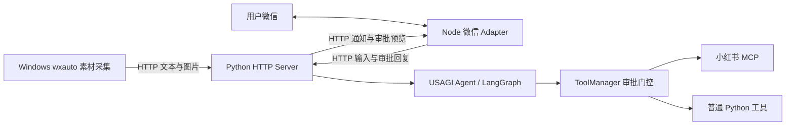

# 微信应用接入与工具审批

应用入口是 `apps/httpserver`。它在启动时创建 USAGI Runtime、注册集中定义的工具、连接小红书 MCP，并启动持久化消息 Worker 和通知 Worker。微信通信使用独立 Node 进程，不安装或启动 OpenClaw Agent。

## 目录与职责

| 位置 | 职责 |
|---|---|
| `apps/httpserver/usagi_httpserver/bootstrap.py` | 一次性装配 Runtime、Agent、工具与场景 |
| `apps/httpserver/usagi_httpserver/tool_specs.py` | 应用已启用工具的审批配置；MCP 参数 schema 来自工具发现 |
| `apps/httpserver/usagi_httpserver/ingress.py` | 身份绑定、消息、媒体、任务与通知查询 |
| `apps/httpserver/usagi_httpserver/store.py` | SQLite inbox、素材快照、任务、outbox |
| `apps/httpserver/usagi_httpserver/service.py` | 创作请求、审批命令、恢复与渠道路由 |
| `apps/weixin-adapter` | 扫码、长轮询、CDN 图片、投递、游标和发送记录 |
| `apps/wechat-edge` | Windows 交互桌面内轮询允许的聊天，下载图片并断网补传 |
| `apps/xhs-autopost` | 保留 MCP 调试 CLI 和兼容层；线上由 HTTP Server 注册 MCP |
| `usagi-agent/.../tools/approval.py` | 通用工具审批，无微信或 QQ 逻辑 |

## 两类输入

Windows 消息始终作为素材。服务按用户与会话归集，默认静默 90 秒或累计 900 秒后冻结当前范围；快照与任务在同一事务中创建，后续消息进入下一份快照。Agent 判断素材是否足以形成笔记，不足时说明原因，足够时创作并通过发布工具请求审批。语义判断由模型完成，窗口划分和去重由代码保证。

用户与 Agent 的微信对话作为交互输入。文字触发一次任务；先发的图片暂存，后发的任务文字（如“开始生成”）携带这些图片。每个文字消息独立处理；审批命令不会吃掉待创作的图片。同一用户同一会话使用稳定的框架会话键，不同会话保持独立。

图片先上传 Linux，校验类型、大小、归属和摘要，再提交消息。Agent 接收 Artifact 图片和 Linux 文件路径；MCP 必须能读取同一绝对路径。Windows 路径不会用于 Linux 发布。当前创作素材支持文字与图片；其他附件明确标记未导入，语音已有的文字转写可作为文本。

## 工具审批

1. `ToolSpec.requires_approval` 默认 `True`，普通工具和 MCP 一致；它是服务端配置，不进入模型参数。
2. ToolManager 先验证权限与参数，再检查审批。免审必须在创建工具时显式设置 `False`。
3. 需要审批时保存工具名和完整参数 Artifact，并抛出通用审批请求；Pipeline 调用 LangGraph `interrupt()`，保存 checkpoint。
4. HTTP 应用读取暂停结果，将工具名、参数、审批编号和可用图片预览写入 outbox；渠道由应用配置决定。
5. 用户发送 `批准 <编号>` 或 `拒绝 <编号>`。应用核对本人待审批任务，取得版本与参数摘要，在服务端签发恢复令牌后调用 `Server.resume()`。
6. LangGraph 恢复原节点，ToolManager 验证持久化审批状态后执行。拒绝不会执行该工具。多工具调用逐个暂停，重放按原中断顺序消费决定。

审批绑定 tenant、run、operation、工具与参数摘要。修改参数不能复用旧批准。改稿时先拒绝旧审批，再发送修改要求；新工具调用获得新审批编号。`待审批` 可重新推送当前待办。素材中的“批准”不会被解释为审批命令。

默认仅由集中 Spec 决定是否审核；risk 用于副作用与重试策略，Policy 的 deny 仍可阻止执行。增加 QQ 时只需实现应用通知投递和审批输入，不修改 Agent 审批流程。

## 持久化与故障处理

- Node 在同一事务保存上游批次、游标和 inbox，Python 接受后才确认本地输入。重传使用相同事件 ID；HTTP 同 ID 同内容返回原收据，内容冲突返回 409。
- Windows 持久化观察锚点与待上传消息。锚点丢失或匹配歧义产生 gap，服务停止该会话自动成稿。人工核对后清理服务端不完整范围，并在 Windows `--rebaseline` 建立新基线。
- Runtime 的审批、输入快照、去重、执行记录、Artifact、checkpoint 均落盘。固定 `USAGI_RESUME_KEY` 后，待审批任务可跨进程重启恢复；测试覆盖真实 LangGraph 暂停与继续。
- 工具执行前持久化执行记录。外部写操作超时、执行中进程退出、微信投递停在 sending 时，保留结果未知状态，不盲目重发。checkpoint 无法保证外部服务恰好执行一次。
- outbox 失败可重试同一 delivery ID；Node 接受后由 Python 查询状态。结果未知、上下文不可用、无路由等状态可从通知 API 查看，需核对微信/小红书真实结果后处理。
- HTTP 为单实例、单执行 Worker，进程锁避免共享数据目录重复启动。通用 SQLite Store 采用整份 JSON 状态事务，适合个人/低吞吐部署；扩容应先换成索引表实现。
- EventBus 是进程内提示，可靠恢复依赖持久化状态。备份需停止服务后整体复制数据目录，包括 SQLite 数据库和 media；恢复密钥另行保管。

## 部署与验收

按 [HTTP Server](../apps/httpserver/README.md)、[Node Adapter](../apps/weixin-adapter/README.md)、[Windows 采集端](../apps/wechat-edge/README.md) 配置。Linux systemd 模板在 `deploy/systemd`，Windows 登录任务模板在 `deploy/windows`。

自动测试覆盖工具门控、拒绝/重放、消息去重、素材 gap、审批命令与图片分离、持久化恢复、连续会话和 Node inbox/outgoing。真实微信扫码、wxauto 桌面版本、Linux 浏览器登录和小红书发布仍需使用部署账号联调；本次没有执行真实发送或发布。

实机验收顺序：扫码并发送问候建立回复上下文 → 上传图片与创作要求 → 查看完整审批 → 拒绝一次 → 再次创作并重启 HTTP → 审批继续 → 使用明确同意的测试内容验证一次真实发布。微信上下文过期时先主动发消息，再检查通知状态。
