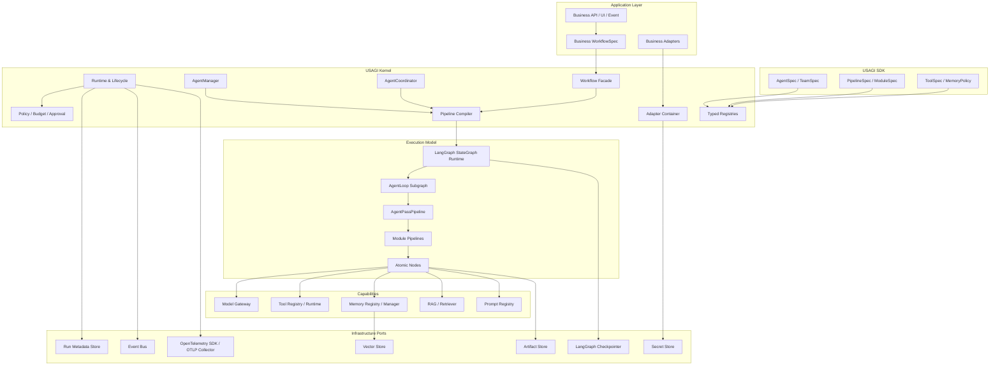
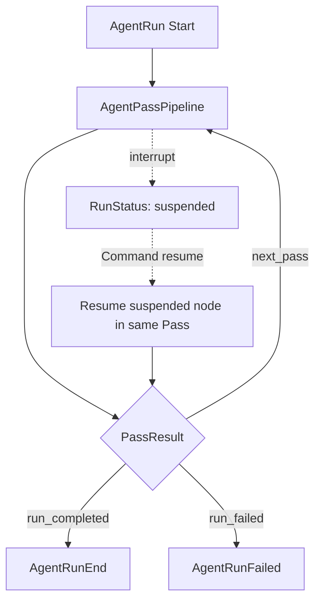
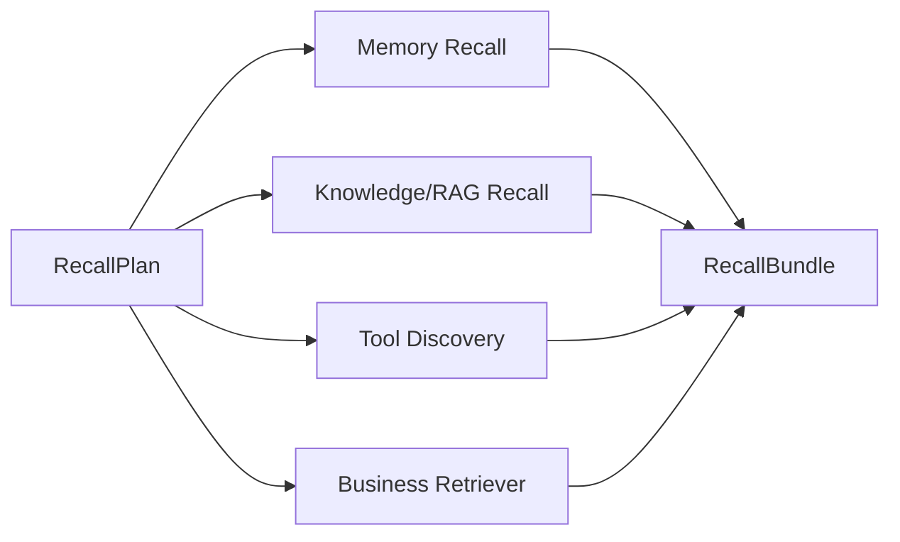
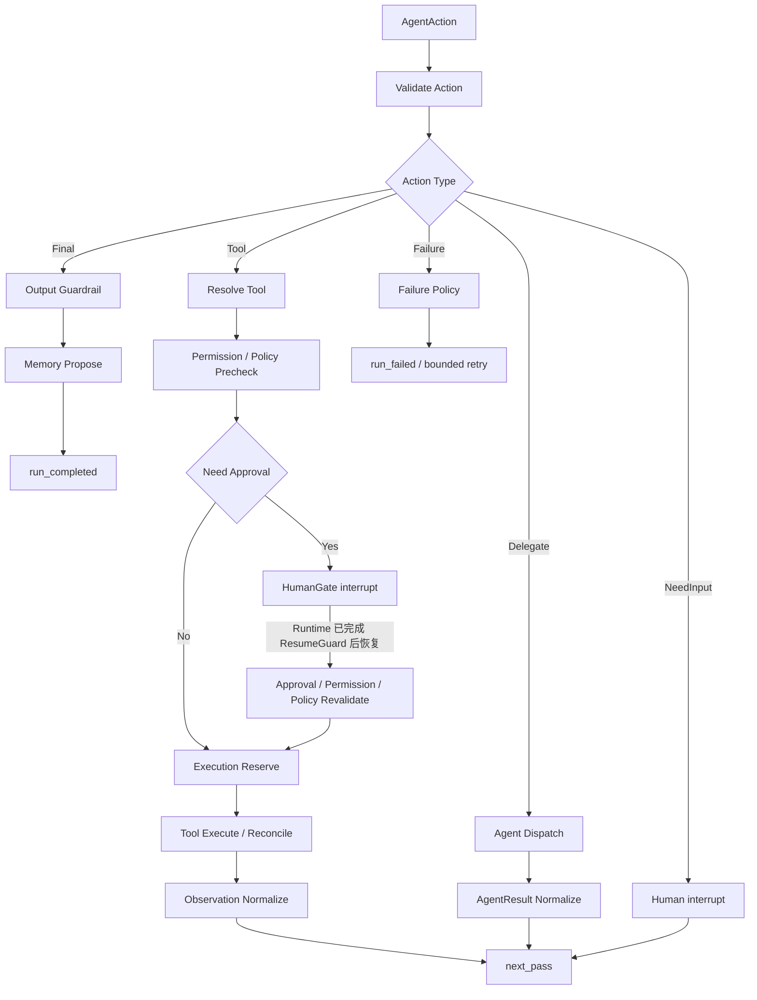

# USAGI 通用 Agent Framework 技术方案

> 本文先说明整个框架为什么存在、如何运行和如何分层，再按依赖顺序详细设计每个核心模块。  
> 强制约束：Workflow 与 Agent 执行图统一基于 LangGraph 实现；USAGI 不自研第二套图运行时。

> 范围约定：本文同时包含“首个正式版本”与“目标架构”两层设计。v1/v2 边界以 §2.3 为权威。CAS 谓词、状态机与逐 Store 删除矩阵等规则以 §10.6/§10.8/§24.5 为权威定义；§31 测试与 §32 验收可重述摘要但以权威节为准，规则变更先改权威节再同步引用处。

## 目录与阅读顺序

- 第一部分：框架总体设计——先建立完整心智模型。
- 第二部分：核心模块设计——逐个说明模块的背景、职责、接口、运行流程和设计理由。
- 第三部分：落地与验证——用完整运行案例、小红书映射、实施计划和验收标准收口。

# 第一部分：框架总体设计

## 1. 背景与问题

直接使用 LangGraph 可以构建状态图、分支、循环、checkpoint 和 Human-in-the-loop，但真实业务仍会重复面对以下工程问题：

- Agent 的定义、版本、模型、Prompt、Tool、Memory 和预算没有统一规范。
- 不同业务会重复编写召回、Context 构建、模型调用和结果处理流程。
- Tool 发现、权限、审批、幂等、执行和审计容易散落在 Agent 代码中。
- LangGraph thread checkpoint、长期 Memory 和业务数据容易混为一体。
- 多 Agent 协作缺少统一任务协议、上下文隔离、预算和终止规则。
- 模型、存储、外部系统和业务算法更换时会侵入核心流程。
- Prompt、Agent、Pipeline 和 Tool 无法稳定回放、评测和灰度。

USAGI 的目标不是替代 LangGraph，而是在 LangGraph 之上建立一套业务无关的 Agent 工程规范、稳定 API 和扩展协议。

第一个验证应用是“小红书自动发帖”，但框架 Kernel 中不得出现微信、小红书、帖子或聊天中断等业务概念。

## 2. 目标与非目标

### 2.1 目标

1. 使用统一协议描述 Agent、Pipeline、Tool、Memory、Model、Workflow 和 Adapter。
2. 使用 Pipeline + Adapter 让业务替换算法，不修改框架控制逻辑。
3. 使用 LangGraph 实现分支、并行、循环、子图、中断和持久化恢复。
4. 让所有模型决策、Tool 副作用、Agent 协作和人工审批可追踪、可评测。
5. 让同一个 Agent/Pipeline 能在不同模型、Memory 和基础设施 Adapter 上运行。
6. 支持从单 Agent 到多 Agent、从本地进程到远程 Worker 的渐进演进。
7. 保证长流程可 checkpoint、可恢复、可取消、可限额；副作用按照 Tool 声明的写安全能力实现可证明的重放语义，而不做脱离外部系统能力的“绝对 exactly-once”承诺。

### 2.2 非目标

- 不提供无边界自主运行的“万能 Agent”。
- 不把可编码的业务规则交给 LLM。
- 不重新实现图执行器、向量数据库、消息队列和模型 SDK。
- 首版不建设可视化低代码平台、模型训练平台或复杂多租户控制台。
- 不保证任意业务 Adapter 都可绕过框架 Policy、预算和审计节点。

### 2.3 第一版实现边界

第一版采用静态、启动期初始化模型，优先完成可运行闭环，不建设“可配置一切”的系统：

- Agent、AgentLoop、Pipeline、Rule 和 Tool 由少量 Python factory 构造；ModelSpec 与 PromptSpec 在各自 catalog 中静态声明。AgentManager 创建和管理 AgentSpec，AgentSpec 只持有所用 ModelSpec；Context Build 根据 Agent ID 解析 PromptSpec。Server 仍只使用一个 MemoryManager 和一套固定 Guardrail。
- Server Bootstrap 时加载、校验、初始化并编译全部业务场景，按 `scenario_key` 存入只读 `RuntimeBundleCatalog`。
- 每次 Run 只按 key 获取已就绪 Bundle、绑定运行数据、创建 State 并执行，不重新解析 Spec、创建 Adapter 或编译 LangGraph。
- 配置变化必须重启 Server；第一版不支持热更新、动态注册、多租户覆盖、按 Run 灰度或在线 State migration。
- 只保留程序无法推导的启动参数，例如联系人、账号、SecretRef 和外部服务地址。
- 其余行为直接按本期已确认需求实现，不再抽象成“代码内默认配置”、PolicySpec 参数表或可调阈值集合。
- 第一版不支持配置继承、环境覆盖链、tenant/user override、feature flag 和在线调参；场景只能选择 framework-owned stage rules，不能删除 stage process 中的强制逻辑。
- 后续可以在不改变 RuntimeBundle/Spec 接口的前提下，把静态 Catalog 演进成动态 Registry，但不提前实现。
- **多租户**：第一版以单租户部署（`tenant_id="default"`）验证，但 §10.6 的 ThreadControlBinding、tenant 参与根表唯一键/外键等隔离设计保留并随 v1 一起实现（单租户下退化为基础约束），以保证 FencedCheckpointer 等 v1 机制可工作。真正的跨租户并发验收场景不在首版覆盖；fencing/lease 因防崩溃恢复后 stale worker 写 checkpoint，单租户也保留。
- **Erasure**：属首个正式版本，完整机制（独立 ErasureWorkflow / ErasureControlStore / KeyDestructionStore / 分布式对账 / DerivationScopeSet）按 §24.5 在 M2 交付并进入 §32 验收。注意这构成真实监听的关键路径长杆（§30.6 A1 依赖 M2）；若后续版本需提前解锁真实监听，可作为独立版本决策引入分阶段 Gate，但首版不拆分，按完整机制验收以避免下游悬空引用。
- **单库事务边界（v1 硬约束）**：第一版所有跨 Store 原子性（`settle_external_effect`、resume CAS、FencedCheckpointer 与 RunControlStore 同库）依赖同一关系数据库事务。这是向远程 Worker / 跨进程部署演进的边界：跨进程/跨机时这些单库事务假设不再成立，必须设计显式跨进程 settlement 协议（outbox + Saga + 幂等 settlement permit），第一版不实现也不声称该能力。
- **业务扩展点（v1 现实 vs 目标架构）**：第一版业务可替换扩展点只有 RecallSourcesRule 的 `ChatRetrieverAdapter` 与 ContextBuildRule Select/Trim 的 `MaterialSelectorAdapter`。§17 与 §11 描述的其余 Adapter seam 为目标架构，不等于 v1 生产可替换；"通用框架"定位以目标架构为准，v1 实质是"一条刚性六 Rule pipeline + 两个业务扩展点"。

## 3. 核心设计原则

### 3.1 LangGraph 是唯一执行引擎

USAGI Pipeline 是声明式规范和模块边界，最终必须编译成 LangGraph `StateGraph`/Subgraph：

- LangGraph 负责节点执行、条件边、循环、并行、interrupt 和 checkpoint。
- USAGI 负责 Spec、Registry、Pipeline Compiler、Adapter、Policy、版本、幂等和审计。
- 不允许再实现一套 Python `while` Pipeline runner 或第二套 graph state checkpoint。

### 3.2 Pipeline + Adapter

- Pipeline 定义“步骤和控制关系”。
- Adapter 定义“某个步骤如何实现”。
- Module Pipeline 负责复杂可复用能力。
- Atomic Node + Adapter 负责单一算法或外部调用。
- 业务只能替换声明为扩展点的 Adapter；强制安全节点不可移除。

### 3.3 推理、控制、行动、许可和事实分离

- Agent 负责推理。
- Workflow/AgentLoop 负责控制。
- Tool 负责行动。
- Policy 负责许可。
- Store 负责事实和状态。
- Adapter 负责连接具体实现。

### 3.4 Agent 无状态，State 外置

AgentSpec 是不可变配置。运行中的数据进入 WorkflowState、AgentLoopState、AgentPassState、Module State、Artifact 或长期 Memory，不能藏在 Agent 实例字段中。

### 3.5 Tool 发现与执行分离

RecallSourcesRule 只召回 Tool 名称、说明和 Schema，不执行任何 Tool。由 Agent 提出的 ToolAction 只能在 EndRule 中经过权限、Policy、审批和幂等后执行。Memory、RAG 和业务查询如果需要在 RecallSourcesRule 中直接获取候选，必须实现 Retriever Port，而不能伪装成 Tool 绕过 EndRule。

### 3.6 Checkpoint 与长期 Memory 分离

- LangGraph checkpointer 保存 thread 的图状态，用于恢复和时间旅行。
- MemoryStore 保存跨 thread 的 episodic、semantic 和 preference memory。
- 二者不能互相替代。

### 3.7 每个复杂模块独立版本化

PreRecallRule、RecallSourcesRule、ContextBuildRule、ModelRule、ResultProcessRule 和 EndRule 都是标准 Rule。其中复杂 Rule 以 Module Pipeline 实现，拥有稳定输入输出、私有 State、版本、测试和 Adapter 扩展点。

### 3.8 OpenTelemetry 是统一观测标准

- 所有服务、Workflow、Agent、Rule、Node、Model、Tool、Policy 和 Adapter 使用 OpenTelemetry 产生 trace、metric 和关联日志。
- 服务只依赖 OpenTelemetry API/SDK 与 OTLP，不直接依赖 Tempo、Jaeger、Prometheus 或商业观测平台 SDK。
- 跨进程调用、事件和远程 Worker 必须传播 W3C Trace Context；Baggage 使用字段白名单且禁止携带聊天内容、凭据和其他敏感信息。
- OpenTelemetry 负责运行观测，不替代业务审计表、Tool receipt、checkpoint 或领域事件。

## 4. 核心概念

| 概念 | 定义 | 生命周期 |
|---|---|---|
| Workflow | 业务级有状态执行图 | 业务 Run |
| AgentNode | Workflow 中调用一个 Agent 的包装节点 | Workflow 节点 |
| AgentLoop | 根据 PassResult 有界调度多轮 AgentPassPipeline | Agent Run |
| AgentPassPipeline | 一次单向、无环、必经 EndRule 的推理 Pass | 单个 Pass |
| Module Pipeline | 可独立版本化、测试和复用的复杂阶段 | Module Run |
| Atomic Node | LangGraph 中最小可 checkpoint 执行单元 | Node execution |
| Adapter | Port/Stage 的具体实现 | application/run/session scoped |
| AgentSpec | Agent 的不可变版本化声明 | 配置版本 |
| ToolSpec | Tool 能力、Schema、风险和权限声明 | 配置版本 |
| Memory | 跨步骤或跨 Run 保存的信息 | 按 MemoryPolicy |
| ContextPack | 送给模型的结构化上下文 | 单个 Pass |
| Artifact | 大对象或原始输出的引用 | 按 ArtifactPolicy |
| PassResult | EndRule 对本轮的处置结果 | 单个 Pass |
| AgentResult | 完整 Agent Run 的最终结果 | Agent Run |

### 4.1 基础类型定义

下列类型被多个模块引用，此处集中定义以避免歧义。所有持久化比较值遵循 §24.5 的 tenant-scoped HMAC / 随机 opaque ID 规则；`ToolRef` 见 §21.3，`AdapterRef`/`RetrieverRef`/`MemoryPolicyRef`/`PolicyRef`/`PromptRef` 同理为 Registry 解析的版本化标识，不接受自由文本。

```python
# —— Schema / 引用类型 ——
SchemaRef = str          # 版本化 Schema 标识，由 Registry 解析
ReducerRef = str         # 已注册 reducer 标识，用于并行写冲突合并
ConditionRef = str       # 已注册条件求值器标识，用于 conditional edge / next_pass
InvariantRef = str       # 编译期不变量标识，由 Compiler 强制
PromptRef = str          # 已发布 Prompt 标识（模板 + variables_schema + checksum）

NodeRole = Literal[
    "plain", "safety", "budget", "interrupt",
    "tool_resolve", "tool_policy", "tool_approval", "tool_revalidation",
    "tool_reserve", "tool_execute", "tool_reconcile", "observation",
    "end_rule", "recall", "context_build", "model", "result_process",
]

# —— 预算类型 ——
class Budget(BaseModel):
    """硬预算上限声明，随 AgentLoopSpec / AgentTeamSpec / AgentTask 固化，不可被 Run 覆盖。
    注：pass/tool-call/delegation 数量上限以 AgentLoopSpec 的必填直接字段（§9.3）为唯一权威来源，
    不在此重复声明，避免与 AgentLoopSpec.max_passes 等冲突。"""
    max_total_cost: Decimal | None = None
    max_input_tokens: int | None = None
    max_output_tokens: int | None = None

class BudgetUsage(BaseModel):
    """UsageLedger 聚合出的已用量投影，写入 RunControlState.budget_used。"""
    settled_cost: Decimal = Decimal("0")
    reserved_cost: Decimal = Decimal("0")
    input_tokens: int = 0
    output_tokens: int = 0
    passes: int = 0
    tool_calls: int = 0
    delegations: int = 0

class BudgetSummary(BudgetUsage):
    """checkpoint 中用于路由/展示的预算快照，不可反向覆盖 RunControlState.budget_used。"""
    remaining: Budget | None = None

class BudgetState(BaseModel):
    """PreRecallRule 输入中的剩余预算视图。"""
    total: Budget
    used: BudgetUsage
    remaining: Budget

class RecallBudget(BaseModel):
    """RecallPlan 内分配给召回阶段的预算。"""
    max_candidates: int | None = None
    max_tokens: int | None = None
    parallel_sources: int = 1

class ContextBudget(BaseModel):
    """ContextBuildRule 的 token 预算，由 AgentManager 按模型窗口、PromptBudgetProfile 与输出上限预留计算。"""
    total_tokens: int
    system_prompt_tokens: int
    tool_schema_tokens: int
    max_output_tokens: int
    reserved_for_citations: int = 0

# —— Runtime 公开类型 ——
class RunOptions(BaseModel):
    """第一版只允许运行控制字段（extra=forbid），不接受自报身份或覆盖 Model/Tool/MemoryPolicy/Rule/Prompt/Pipeline。"""
    model_config = ConfigDict(extra="forbid")
    absolute_deadline: datetime | None = None
    cancellation_reason_code: CancellationReasonCode | None = None
    delegation_ref: str | None = None        # 服务端签发的 delegation lineage 引用
    trace_parent: str | None = None          # W3C traceparent，仅用于传播

class RunHandle(BaseModel):
    """start/resume/cancel 返回的稳定句柄；终态结果通过 get_run/stream 观察，不在此处重复。"""
    run_id: str
    thread_id: str
    scenario_key: str
    outcome: "RunOutcome"
    created_at: datetime

class RunEvent(BaseModel):
    """stream 产出的生命周期事件，按当前权限与 interrupt scope 过滤后下发。"""
    event_type: str
    run_id: str
    occurred_at: datetime
    payload_ref: ArtifactRef | None = None
    reason_codes: list[str] = []

# —— 核心引用与安全类型（跨模块共用，多处协议签名引用）——
class ArtifactRef(BaseModel):
    """公开引用，非 bearer credential（§24.4）。只含随机 opaque artifact_id、类型与非内容 lineage ID。"""
    artifact_id: str
    content_type: str
    lineage_id: str | None = None

class SettlementArtifactRef(ArtifactRef):
    """settlement quarantine receipt 引用：不可读、短 TTL、无业务 Lineage（§24.4 put_settlement_quarantine）。"""

class PrincipalRef(BaseModel):
    """受控主体引用；明文身份只存于可 crypto-erasure 的 IdentityLink。"""
    principal_kind: Literal["user", "service", "system"]
    principal_opaque_id: str

class SecretRef(BaseModel):
    """凭据引用；只在执行边界解析，不进 Prompt/State/Artifact/日志。"""
    secret_id: str
    version: int

class EncryptedField(BaseModel):
    """字段级密文；明文不落库。"""
    ciphertext: str
    key_ref: SecretRef
    algorithm: str

class ThreadControlBinding(BaseModel):
    """thread_id ↔ control 的权威绑定（§10.6）。v1 单租户下退化为 thread_id↔run_id + 固定 tenant；
    跨租户全局 UNIQUE(thread_id) 防护随隔离设计一起实现。"""
    tenant_id: str
    thread_id: str
    control_kind: Literal["run", "erasure"]
    control_id: str
    graph_checksum: str

ToolSpecRef = ToolRef   # ToolSpec 引用与 ToolRef 同型（id + version + implementation_checksum，§21.3）

class ContextBudgetUsage(BaseModel):
    """ContextPack.budget_usage：各分区实际 token 占用，供 ModelRule Final Token Validate 与 ContextBudget 预留对比。"""
    system_prompt_used: int
    tool_schema_used: int
    conversation_used: int
    memories_used: int
    knowledge_used: int
    tool_observations_used: int
    total_used: int

class PromptBudgetProfile(BaseModel):
    """Prompt 的预算属性（§18.4），由 AgentManager 用于计算 ContextBudget 预留。"""
    system_prompt_tokens: int
    reserved_output_tokens: int
```

`RunOutcome` 全部变体（含 Running/Completed/Failed/Cancelled）与 `CancellationReasonCode` 在 §10.5 定义。`RunHandle.outcome` 在 Run 尚未终态时为 `Running`/`Suspended` 等非终态投影，终态时为 `Completed`/`Failed`/`Cancelled`。`ToolRef` 见 §21.3；其余 Registry 标识（`AdapterRef`/`RetrieverRef`/`MemoryPolicyRef`/`PolicyRef`）为版本化 `str`。

## 5. 总体架构



### 5.1 依赖方向

```text
业务应用
  → USAGI public API / Spec / Port
  → Kernel 与 Capability 接口
  → Adapter
  → 外部 SDK / 基础设施
```

Kernel 不能依赖具体模型 SDK、数据库驱动或业务插件。应用不得导入 Kernel 私有模块。

### 5.2 控制流与数据流

- 控制流：Workflow → AgentNode → AgentLoop → AgentPassPipeline → Module Pipeline → Node。
- 数据流：外部输入 → State Patch → ContextPack → AgentAction → PassResult → AgentResult。
- 副作用流：AgentAction → EndRule → Policy/Approval → ToolRuntime → ToolObservation。
- 长期信息流：Recall 从 MemoryStore 读取；Final/反馈经 MemoryWriter propose 后再晋升。

## 6. 六 Rule Agent Pipeline

> 当前实现边界：Stage Process 保留每个阶段不可替代的编排和强制逻辑；同一
> Stage 内可重复、可排序、可组合的处理单元才抽象为 framework-owned Rule。
> Scenario 只选择 Rule，不实现框架通用流程。Memory Rule/Stage 只调用
> MemoryManager，召回、压缩、提取、冲突处理和持久化算法均位于 memory 模块。

AgentPass 由六个标准 Rule 顺序组成；其中 RecallSourcesRule 与 ContextBuildRule 在用户视角共同构成“召回与 Context 构建”，因此仍可归纳为五个业务阶段：

```text
1. PreRecallRule
2. RecallSourcesRule
3. ContextBuildRule
4. ModelRule
5. ResultProcessRule
6. EndRule
```

框架映射如下：

```text
AgentPassPipeline
├─ 1. PreRecallRule               # 召回前
├─ 2. RecallSourcesRule           # 召回来源
├─ 3. ContextBuildRule            # Context 构建
├─ 4. ModelRule                   # 送入 LLM
├─ 5. ResultProcessRule           # 处理 LLM 结果
└─ 6. EndRule                     # 本轮收口
```

这里的 Rule 表示 AgentPass 的“标准阶段契约”，不表示该阶段只能使用确定性规则。Rule 可以编译为 Module Pipeline，例如 ModelRule 内部仍包含模型路由和 LLM 调用。`StartRule` 的输入校验、归一化、trace 和预算初始化并入 PreRecallRule，不再作为独立阶段。

### 6.1 单轮与多轮

每个 AgentPassPipeline 单向无环；所有正常路径和可恢复失败路径必须进入 EndRule：


AgentLoop 根据 EndRule 输出控制多轮：



Tool 执行完成后生成 `ToolObservation` 和 `PassResult(next_pass)`；下一轮 Pipeline 根据 observation 增量构建 Context，而不是在当前 Pass 内回跳。

`interrupt()` 是图运行状态，不是 PassResult。恢复时 LangGraph 使用同一 `thread_id` 重新进入发生中断的节点；该节点完成后继续当前 Pass，只有 EndRule 真正收口时才产生 PassResult。

## 7. 一次端到端运行

### 7.1 Server Bootstrap

```text
1. ApplicationContainer 初始化 OpenTelemetry、Store、Model Client 和共享连接池
2. 加载代码中静态声明的业务场景
3. AgentManagerInitializer 根据 live/scripted 开关初始化 AgentManager；业务调用 AgentManager.create_agent 创建 AgentSpec，并为每个 scenario_key 构建 AgentLoopSpec、PipelineSpec 和 ToolCatalog
4. 校验 Schema、依赖、权限、Rule 顺序和强制节点
5. 创建并注入 Adapter
6. 编译全部 LangGraph Workflow/AgentLoop subgraph
7. 组装不可变 RuntimeBundle 并写入 RuntimeBundleCatalog[scenario_key]
8. 执行 health check；任一必需 Bundle 失败则 Server 启动失败
9. Server Ready
```

### 7.2 Agent Run

```text
1. Application 调用 Runtime.start_agent(RunStartRequest(scenario_key, request_idempotency_key, input, options))
2. Gateway 授权并派生 idempotency namespace，规范化客户端请求、计算 client fingerprint，先查询 RunStartRequestStore；合法重试直接返回旧 Run
3. 仅首次请求从只读 RuntimeBundleCatalog 获取已初始化 Bundle并计算 execution bundle fingerprint
4. 在同库事务创建 input metadata、ExecutionContextSnapshot、RunControl、RunMetadata 和 start-outbox
5. Start Worker 按 run_id get-or-start，取得 lease 后调用已绑定的 bundle.compiled_graph，不重新解析配置或编译图
6. PreRecallRule 归一化输入并生成 RecallPlan
7. RecallSourcesRule 并行召回 Memory、Knowledge 和 ToolSpec
8. ContextBuildRule 过滤、去重、重排、分配预算，归档 ContextPack 并把 ContextPackRef 写入 State
9. Context Build Stage 根据 AgentSpec 持有的静态 ModelSpec，并按 Agent ID 从 Prompt Catalog 解析 PromptSpec，构造完整 ModelRequest；Model Stage 只把该请求交给 AgentManager 调用并统计 Agent usage
10. ResultProcessRule 将响应解析并归档为 AgentAction，State 只保存 action type/hash/ref
11. EndRule 根据 Action 分支
12. 若为 ToolAction：Policy → Approval → Idempotency → Execute
13. ToolObservation 归档后将 ToolObservationRef 写入 AgentLoopState，EndRule 返回 next_pass
14. 下一轮复用或增量召回，再构建 Context 并调用模型
15. 若为 FinalAction：OutputGuardrail → MemoryPropose
16. EndRule 返回 run_completed，AgentManager 输出 AgentResult
17. AgentResult/FinalOutput 在 live fencing gate 下归档；成本已由各 invocation settlement 写 UsageLedger，Runtime 只把 terminal RunControl/metadata projection 与 terminal outbox 原子提交，trace 独立导出
```

这条运行链是所有模块设计的共同上下文。后续每个模块都要说明自己处于哪一步、消费什么、产出什么。

## 8. State 与数据生命周期

### 8.1 State 分层

```python
ContextPackRef = ArtifactRef
AgentActionRef = ArtifactRef
AgentResultRef = ArtifactRef
ToolObservationRef = ArtifactRef
FinalOutputRef = ArtifactRef
PassResultRef = ArtifactRef
ModelResponseRef = ArtifactRef

class WorkflowState(TypedDict, total=False):
    business_input_ref: ArtifactRef
    agent_result_refs: dict[str, AgentResultRef]
    workflow_status: str
    artifact_refs: list[ArtifactRef]

class AgentLoopState(TypedDict, total=False):
    request_ref: ArtifactRef
    recall_cache: dict[str, ArtifactRef]
    tool_observation_refs: Annotated[list[ToolObservationRef], append_dedup]
    delegated_result_refs: Annotated[list[AgentResultRef], append_dedup]
    iteration: int
    budget_summary: BudgetSummary
    pass_disposition: Literal["next_pass", "run_completed", "run_failed"]
    pass_result_ref: PassResultRef
    final_output_ref: FinalOutputRef | None

class AgentPassState(TypedDict, total=False):
    normalized_input_ref: ArtifactRef
    recall_plan_ref: ArtifactRef
    recall_bundle_ref: ArtifactRef
    context_pack_ref: ContextPackRef
    model_response_ref: ModelResponseRef
    action_type: Literal["final", "tool", "delegate", "need_input", "failure"]
    action_hash: str
    agent_action_ref: AgentActionRef
    pass_disposition: Literal["next_pass", "run_completed", "run_failed"]
    pass_result_ref: PassResultRef

class ModuleState(TypedDict, total=False):
    """模块私有状态基类；具体 Module Pipeline 定义自己的扩展字段。"""
    module_input_ref: ArtifactRef
    module_output_ref: ArtifactRef
    status: str
    reason_codes: list[str]
    diagnostics_ref: ArtifactRef | None
```

Module Pipeline 可以拥有私有 State，但只能通过声明的 public output 合并回上层。

### 8.2 State 规则

- State 只保存可序列化的低敏路由字段和 Artifact 引用。
- 原始聊天、图片、Prompt、模型响应、ContextPack、AgentAction、AgentResult、Tool 参数/输出、FinalOutput 和其他待删除业务内容不得以内嵌对象进入 checkpoint；State 只保存随机业务主键、低敏枚举、reason code、tenant-scoped HMAC、`ArtifactRef` 和 `ExecutionContextSnapshotRef`。
- Rule/Node 可在执行期间根据 Ref 加载领域对象作为瞬时局部变量，但返回的 State Patch 必须重新写成 Ref；Compiler/contract test 拒绝在 State Schema 中声明上述领域对象。
- checkpoint 中的 ArtifactRef 只能含随机 opaque ID、content type、非内容 lineage ID 和 tenant-scoped keyed integrity tag，不含原始内容 hash、文件名、路径、正文摘要或可访问 URL；枚举/status/reason code 必须来自框架 Registry，禁止自由文本。
- 不保存 Model Client、数据库连接、Secret、文件句柄或 Adapter 实例。
- 并行写同一字段必须声明 reducer。
- State Schema 变更必须升级 Pipeline/Workflow 版本。
- 副作用前后使用独立节点形成 checkpoint 边界。
- 第一版 Catalog 在进程生命周期内不可变。unresolved ExternalEffect/ErasureCase/incident 引用的 producer、delete **和 reconcile** ToolRef 都必须由新 Catalog 继续解析，或先完成受审计 CapabilityMigration；不能随 Run 排空一起丢弃旧版本。

### 8.3 数据归属

| 数据 | 所有者 | 保存位置 |
|---|---|---|
| 图执行状态 | LangGraph | Checkpointer |
| Agent/Workflow 版本与业务索引 | USAGI Runtime | RunMetadataStore |
| 领域 payload、原始模型响应和大文件 | ArtifactManager | ArtifactMetadataStore/ArtifactBlobStore |
| 长期 Memory | MemoryManager | MemoryStore/VectorStore |
| Tool 幂等与 receipt | ToolRuntime | ToolExecutionStore |
| 远端资源定位与删除密钥 | ExternalEffectSettlementService | ExternalEffectStore / SecretStore |
| 审批 | ApprovalManager | ApprovalStore |
| 不可变执行上下文 / 可变运行控制 | Kernel Runtime | ExecutionContextStore / RunControlStore |
| Trace/指标/关联日志 | Observability | OpenTelemetry SDK → OTLP Collector → backend |

## 9. 与 LangGraph 的映射

| USAGI 抽象 | LangGraph 实现 |
|---|---|
| WorkflowSpec | StateGraph |
| AgentNode | 调用 AgentLoop subgraph 的 node |
| AgentLoop | 带条件循环边的 subgraph |
| AgentPassPipeline | 单向 subgraph |
| Module Pipeline | subgraph 或节点集合 |
| Atomic Node + Adapter | `add_node` 注册的 async callable |
| State Patch | node 返回的 update |
| Branch | conditional edge / `Command(goto=...)` |
| Parallel Recall | fan-out / `Send` + reducer |
| NextPass | EndRule 到 Pass 起点的条件边 |
| Agent Handoff | `Command`、`Send` 或 subgraph |
| HumanGate | `interrupt()` + `Command(resume=...)` |
| Checkpoint | LangGraph checkpointer |
| Run ID | `thread_id` + USAGI metadata |

### 9.1 编译原则

PipelineCompiler 只做声明到 LangGraph 的转换，不执行任务：

```text
Spec validation
→ resolve static references during Server Bootstrap
→ resolve State Schema/reducers
→ wrap Stage Adapter as nodes
→ add edges/branches/subgraphs
→ attach retry/cache/interrupt policy
→ compile with checkpointer
→ cache compiled graph by checksum
```

### 9.2 恢复原则

LangGraph interrupt 恢复时会从节点开头重新执行，因此：

- interrupt 前不执行不可重复副作用。
- Runtime ResumeGuard 位于 LangGraph 调用之外；只有只读校验 checkpointer 最新 checkpoint，并在 RunControlStore 完成 suspended → resume_accepted CAS、取得 run lease/fencing token 后，才能提交 `Command(resume=...)`。
- 图内 HumanGate、Revalidation、ExecutionReserve、ToolExecute/Reconcile 必须是独立节点。
- ToolExecute 必须使用 idempotency key。
- 外部结果未知时进入 reconcile，不能盲目重试。
- USAGI 不复制 LangGraph checkpoint 数据。

### 9.3 PipelineSpec

PipelineSpec 是声明和编译契约，不包含执行循环。第一版所有引用在 Server Bootstrap 时解析并校验，Run 直接复用已组装的 RuntimeBundle：

```python
class StateContract(BaseModel):
    schema: SchemaRef
    input_schema: SchemaRef
    output_schema: SchemaRef
    reducers: dict[str, ReducerRef] = Field(default_factory=dict)

class StateMapping(BaseModel):
    input: dict[str, str]       # parent path -> child input path
    output: dict[str, str]      # child output path -> parent patch path

class NodeSpec(BaseModel):
    id: str
    kind: Literal["atomic", "module"]
    role: NodeRole              # 供 Compiler 校验 safety/tool/interrupt 等强制语义
    adapter: AdapterRef | None = None
    module: ModulePipelineRef | None = None
    reads: set[str]
    writes: set[str]
    state_mapping: StateMapping | None = None
    retry_policy: RetryPolicyRef | None = None
    timeout_seconds: int | None = None
    required: bool = True
    interruptible: bool = False

class EdgeSpec(BaseModel):
    source: str
    target: str
    condition: ConditionRef | None = None

class ModulePipelineSpec(BaseModel):
    id: str
    version: str
    state: StateContract
    nodes: list[NodeSpec]
    edges: list[EdgeSpec]
    entry_node: str
    exit_nodes: set[str]
    invariants: list[InvariantRef] = Field(default_factory=list)

class AgentPassPipelineSpec(BaseModel):
    id: str
    version: str
    state: StateContract
    pre_recall_rule: ModulePipelineRef
    recall_sources_rule: ModulePipelineRef
    context_build_rule: ModulePipelineRef
    model_rule: ModulePipelineRef
    result_process_rule: ModulePipelineRef
    end_rule: ModulePipelineRef
    failure_route: Literal["end_rule"] = "end_rule"

class AgentLoopSpec(BaseModel):
    id: str
    version: str
    state: StateContract
    pass_pipeline: AgentPassPipelineRef
    max_passes: int
    max_tool_calls: int
    max_delegations: int
    budget: Budget
    next_pass_condition: ConditionRef

PipelineSpec = ModulePipelineSpec | AgentPassPipelineSpec
```

`AgentPassPipelineSpec` 显式列出六个 Rule 引用；`recall_sources_rule + context_build_rule` 在产品表达上可合并为“召回与 Context 构建”。显式字段用于防止业务漏掉 ContextBuildRule 或 EndRule。

### 9.4 Node、Module 与 Adapter 约束

- `atomic` Node 必须引用 Adapter，不能同时引用 Module。
- `module` Node 必须引用 ModulePipelineSpec，并声明父子 StateMapping。
- Module 私有字段不能直接泄漏到父 State，只能通过 output mapping 返回 public patch。
- `reads/writes` 用于编译期检测未声明字段、并行写冲突和 reducer 缺失。
- 安全、预算、EndRule、Tool Policy 和幂等节点标记为 required，业务 Spec 不能删除或跳过。
- Adapter 只实现节点算法；不得返回任意下一个节点名称绕过 Spec 中的边。

父子 State Schema 不同时，Compiler 生成显式 wrapper 完成输入输出映射；共享字段时才将 compiled subgraph 直接注册为 LangGraph node。Subgraph 默认继承父 checkpointer并按单次调用保存，只有明确需要跨调用积累状态时才启用 per-thread persistence。

### 9.5 AgentPass 编译不变量

Compiler 必须拒绝以下 Spec：

- 六个标准 Rule 缺失、重复或顺序倒置。
- AgentPass 内存在从后续阶段回到前序阶段的边。
- 任一正常或可恢复失败出口没有到达 EndRule。
- RecallSourcesRule 中存在 ToolExecution 类型节点。
- Action Tool 分支缺少 Permission、Policy、Approval、Idempotency、Execution 或 Observation 节点。
- 并行节点写同一字段但没有 reducer。
- interrupt 节点与其前置副作用被折叠到同一个 Atomic Node。
- AgentLoop 没有 passes、tool calls、delegations、成本或 recursion 上限。
- 同一 super-step 并行触发多个 HumanGate/NeedInput 的图（见 §10.5 单 active interrupt 限制）。多维审核等并行模式必须先聚合到单一审批 gate 再 interrupt，不得由并行分支各自产生审批 interrupt。

### 9.6 最小 AgentPass Spec 示例

第一版不从 YAML 读取 AgentPass。框架提供唯一 factory，并由应用直接调用：

```python
standard_agent_pass = build_standard_agent_pass(
    pre_recall_rule=pre_recall_rule,
    recall_sources_rule=recall_sources_rule,
    context_build_rule=context_build_rule,
    model_rule=model_rule,
    result_process_rule=result_process_rule,
    end_rule=end_rule,
)
```

State Schema、固定边、failure route、强制节点和 reducer 由 factory 填充，业务不能配置。

# 第二部分：核心模块设计

## 10. Kernel 与 Runtime

### 10.1 背景与目标

Kernel 解决“所有 Agent/Workflow 都必须遵守的运行约束”。如果这些逻辑分散到业务 Node 中，权限、预算、取消、版本和 trace 会出现旁路。

架构位置：

```text
Application SDK
→ Kernel Runtime
→ AgentManager / WorkflowEngine
→ LangGraph Runtime
→ Capability / Infrastructure Adapter
```

### 10.2 职责与非职责

负责：

- Server Bootstrap 时构建所有静态 RuntimeBundle 并执行 fail-fast 校验。
- 建立 `RunContext`、trace、预算、取消令牌和身份。
- Run 时按 scenario_key 获取不可变 RuntimeBundle。
- 执行 Middleware 和生命周期事件。
- 启动、暂停、恢复、取消 Agent/Workflow。
- 统一错误、usage、成本和运行结果。
- 强制执行不可绕过的 Policy。

不负责：

- 不实现业务推理、Prompt、召回算法和 Context 排序。
- 不直接调用外部业务 SDK。
- 不保存长期 Memory。
- 不替代 LangGraph 调度节点。

### 10.3 内部结构

```text
Kernel
├─ Runtime
├─ LifecycleManager
├─ RunContextFactory
├─ BudgetManager
├─ CancellationManager
├─ MiddlewareChain
├─ ErrorMapper
└─ EventPublisher
```

### 10.4 生命周期

Server Bootstrap：

```text
initialize shared infrastructure
→ load static scenario definitions
→ validate Specs and mandatory configuration
→ construct Adapters
→ compile graphs
→ build immutable RuntimeBundleCatalog
→ health check
→ ready
```

Agent Run 分为 API ingress 与 Start Worker；具体幂等、指纹和事务规则以 10.5 为唯一权威定义：

```text
API ingress
→ authenticate and derive server idempotency namespace
→ compute bundle-independent client request fingerprint
→ lookup existing namespace/request key before RuntimeBundle
→ on first miss only: resolve Bundle, validate input, lock execution fingerprint
→ atomically create RunStartRequest/input metadata/RunContext/RunControl/RunMetadata/start outbox
→ return durable RunHandle

Start Worker
→ consume run.start_requested and re-read authoritative records
→ resolve the pinned RuntimeBundle and acquire live start lease/fencing gate
→ get-or-start graph by run_id/thread_id; inject input only if initial checkpoint is absent
→ run middleware/graph and handle interrupt/result/error
→ each model/tool/usage/checkpoint/adoption write commits through its own governed transaction
→ atomically project suspended/terminal state and corresponding outbox event
```

不存在“运行结束后统一 persist metadata/usage”的隐含提交窗口：usage、外部调用 settlement、checkpoint 和 RunControl 投影各自按本章事务契约落库；terminal event 只能与最终权威状态同事务写 outbox。

### 10.5 公开接口

```python
RunOutcome = (
    Running | Suspended | Resuming | Cancelling |
    Completed | Failed | Cancelled
)

class RunStartRequest(BaseModel):
    scenario_key: str
    request_idempotency_key: str
    input: BaseModel
    options: RunOptions

class CancellationReasonCode(str, Enum):
    USER_REQUEST = "user_request"
    DEADLINE_EXCEEDED = "deadline_exceeded"
    ADMINISTRATIVE = "administrative"
    ERASURE_REQUESTED = "erasure_requested"
    POLICY_REVOKED = "policy_revoked"

class InterruptDescriptor(BaseModel):
    interrupt_id: str
    kind: Literal["approval", "user_input", "external_event"]
    checkpoint_id: str
    expected_schema_checksum: str | None
    token_delivery: Literal["issued", "already_delivered", "reissue_required"]

class ResumeTokenEnvelope(BaseModel):
    run_id: str
    interrupt_id: str
    checkpoint_id: str
    credential_version: int
    resume_token: SecretStr

class Suspended(BaseModel):
    run_id: str
    checkpoint_id: str
    reason_code: Literal["interrupt", "manual_required"]
    interrupts: list[InterruptDescriptor]

class Resuming(BaseModel):
    run_id: str
    resume_attempt_id: str
    source_checkpoint_id: str
    stage: Literal["accepted", "invoking", "reconciling"]

class Cancelling(BaseModel):
    run_id: str
    requested_at: datetime
    reason_code: CancellationReasonCode
    in_flight_operations: int
    unresolved_operations: int

class Running(BaseModel):
    run_id: str
    started_at: datetime
    scenario_key: str

class Completed(BaseModel):
    run_id: str
    completed_at: datetime
    result_ref: ArtifactRef          # AgentResultRef 或 WorkflowResultRef，仅终态填充

class Failed(BaseModel):
    run_id: str
    failed_at: datetime
    reason_codes: list[str]
    failure_detail_ref: ArtifactRef | None = None   # 受控 Artifact，自由文本不进 RunControl/checkpoint

class Cancelled(BaseModel):
    run_id: str
    cancelled_at: datetime
    reason_code: CancellationReasonCode
    cancellation_detail_ref: ArtifactRef | None = None

class AgentRuntime(Protocol):
    async def start_agent(
        self, request: RunStartRequest,
        *, auth: Injected[RequestAuthContext],
    ) -> RunHandle: ...

    async def start_workflow(
        self, request: RunStartRequest,
        *, auth: Injected[RequestAuthContext],
    ) -> RunHandle: ...

    async def resume(
        self, run_id: str, resume: ResumeEnvelope,
        *, auth: Injected[RequestAuthContext],
    ) -> RunHandle: ...

    async def reissue_resume_token(
        self, run_id: str, interrupt_id: str, expected_checkpoint_id: str,
        *, auth: Injected[RequestAuthContext],
    ) -> ResumeTokenEnvelope: ...

    async def issue_resume_token(
        self, run_id: str, interrupt_id: str, expected_checkpoint_id: str,
        *, auth: Injected[RequestAuthContext],
    ) -> ResumeTokenEnvelope: ...

    async def cancel(
        self, run_id: str, reason_code: CancellationReasonCode,
        *, auth: Injected[RequestAuthContext],
    ) -> RunHandle: ...

    async def get_run(
        self, run_id: str, *, auth: Injected[RequestAuthContext]
    ) -> RunOutcome: ...

    def stream(
        self, run_id: str, *, auth: Injected[RequestAuthContext]
    ) -> AsyncIterator[RunEvent]: ...
```

启动、恢复、token 签发/补发和取消接口都只提交一次持久化状态转换并返回句柄或一次性凭据；调用方通过 `get_run` 或 `stream` 观察状态。`Completed` 才包含最终 `AgentResult/WorkflowResult`。`Suspended` 暴露经过授权过滤的 interrupt 描述，但 `get_run` 是无副作用 GET，永远不返回或消费明文 resume token；客户端必须通过 POST 语义的 `issue_resume_token/reissue_resume_token` 取得一次性凭据，响应强制 `Cache-Control: no-store`。

`RunOutcome` 是 RunControl 的稳定公开投影：`running → Running`、`suspended → Suspended`、`resume_accepted → Resuming`、`cancel_requested → Cancelling`，终态分别映射为 `Completed/Failed/Cancelled`。仅当 Run 仍处于可推进的 `running` 时，Tool/Model unknown 需要人工处置才由图创建 `kind=external_event|approval` 的 durable operator interrupt，并把 RunControl CAS 为 `suspended`；`Suspended.reason_code=manual_required`，后续复用授权、token、ResumeAttempt 和恢复后 Revalidation 协议。处于 `cancel_requested` 或任一终态时不得逆向转 suspended，而创建独立 incident/case。`Resuming` 只暴露 attempt 与阶段，不暴露恢复 payload；`Cancelling` 返回仍在收口的外部操作计数。模型或 Tool execution 尚未得到最小 settlement、lease 尚未释放或必需 incident 尚未耐久创建时，绝不能提前返回 `Cancelled`。

`RequestAuthContext` 只能由 API Gateway/服务端认证 Middleware 注入，不从 JSON、消息 payload、RunOptions 或 ResumeEnvelope 反序列化，也不写入 LangGraph State/Artifact；Run 仅持久化 original principal 的受控 Ref。生命周期 API 固定执行：

| API | 必需权限 | 额外约束 |
|---|---|---|
| start_agent/start_workflow | `run.start` + scenario permission | original principal/tenant 从 auth 创建，不接受调用方覆盖 |
| get_run | `run.read` | 只返回 actor 有权查看的结果字段；run_id 仅用于定位资源 |
| stream | `run.read` | 每个事件按当前权限和 interrupt scope 过滤，连接期间权限变化立即生效 |
| resume | `run.resume` + 对应 interrupt scope | token 只验证一次恢复意图，不能替代 actor、scope 或当前权限 |
| issue_resume_token | `run.resume` + 对应 interrupt scope | POST；原子创建/标记 delivery，响应 no-store；get/stream 不返回明文 token |
| reissue_resume_token | `run.resume` + 对应 interrupt scope | checkpoint/interrupt 未变化，且无可能已调用 graph 的 attempt；仅可证明的 pre-invoke rejected 不阻止轮换 |
| cancel | `run.cancel` | 校验 tenant、owner/delegation 和当前 Run 状态，原因进入受控审计 |

只有同时具有 `run.read + run.resume + interrupt scope` 的 actor 才能看到完整 InterruptDescriptor 并调用 token issuance；其他读取者只看到 `suspended` 与可公开 reason code。token 仅在 POST 受控响应中返回一次，credential 的 `delivery_status` 在同一事务中从 pending CAS 为 delivered，Store 只保存 digest；禁止进入 GET、stream 历史、缓存、日志、span、通知正文或 Artifact。审批通知只包含认证后的 UI 深链接，不携带 token。`get_run/stream/cancel` 每次调用都重新授权，`run_id`、thread ID、checkpoint ID 和 token 均不是访问凭据。

第一版 Runtime **禁止同一 checkpoint 同时存在多个 active interrupt**。Compiler 对可能在同一 super-step 并行触发 HumanGate/NeedInput 的图执行静态拒绝；Runtime 在保存 interrupt set 时再做动态断言，数量不等于 1 则安全失败且不签发 token。`Suspended.interrupts` 保留 list 仅为协议前向兼容。未来支持并行 interrupt 时必须新增批量 ResumeEnvelope、逐 interrupt credential 原子消费、部分失败语义，并使用 LangGraph 的 `Command(resume={interrupt_id: value})`；不能把单个 validated ref 传给多 interrupt checkpoint。

若首次响应丢失，获授权 actor 可调用 `reissue_resume_token`。Runtime 必须在同一数据库事务中确认 Run 仍为同一 `suspended_checkpoint_id + interrupt_set_digest`、目标 interrupt 仍 active，且该 source checkpoint **不存在任何可能已调用 graph 的 ResumeAttempt**。`accepted/invoking/applied/reconcile_required` 一律阻止补发；`failed` 只有携带受控 `failure_phase=pre_invoke_rejected` 且能证明从未进入 graph invocation 时才不阻止。首次 `issue_resume_token` 也执行相同检查，不能在已有 accepted attempt 后补建 credential。随后以 CAS 将旧 credential 标为 `revoked`、写入新版本 digest。旧 token 在事务提交时立即失效，新明文只在本次受控响应显示一次。补发追加不含 token/主体的 AuditFact，actor 映射写入可删除 AuditIdentityLink；不满足条件只返回 reason code，不能用“补发”绕过已接受或结果不确定的恢复。普通 Run 与 Erasure case 使用同一安全规则但不同 credential namespace。

第一版 `RunOptions` 只允许 absolute deadline、`CancellationReasonCode`、服务端签发的 delegation ref 和 trace propagation 等运行控制，不包含或接受调用方自报身份，也不允许覆盖 Model、Tool、MemoryPolicy、Rule、Prompt 或 Pipeline 配置。

#### Run 启动的耐久幂等边界

`start_agent/start_workflow` 必须要求非空 `request_idempotency_key`。Gateway 先从认证上下文生成稳定 `idempotency_namespace`，绑定 tenant、original principal 和 delegation lineage identity，但**不包含会变化的 grant/policy version**；调用方不能自报该 namespace。当前 delegation/grant version 进入 client fingerprint并在首次执行前重新授权。`RunStartRequestStore` 强制 `UNIQUE (tenant_id, idempotency_namespace, request_idempotency_key)`。查重必须发生在解析当前 RuntimeBundle 之前：命中旧记录时先重新执行 `run.read` 授权，再按已保存的 client request fingerprint 返回原 `RunHandle`；授权刷新不能让同一 delegation lineage/key 创建第二个 Run，部署后的 bundle/graph 变化也不能把合法重试变成冲突或向其他 principal 泄露键是否存在。

Runtime 在授权后先用第一版协议锁定的、与 Bundle 无关的 `api_contract_version + canonical_json_version` 规范化 client envelope（拒绝 NaN/Infinity、重复 key、未知 RunOptions 和非规范数字/时间），计算 `client_request_fingerprint`：tenant/idempotency namespace、API contract version、scenario、canonical input keyed-integrity-tag，以及 absolute deadline、受控 delegation lineage ref、当前 grant version和其他会改变请求语义的 RunOptions。它不包含当前 input schema/bundle checksum，因此可在查询旧键前计算。只有首次键未命中时才解析当前 Bundle、用其 input schema 正式验证输入，并以 `execution_bundle_fingerprint = application_version + bundle_checksum + graph_checksum + input_schema_checksum` 固化首次执行版本；Schema 验证失败不创建 Run。禁止把裸内容 hash 放入启动表。同 namespace/key 且 client fingerprint 相同返回原 Run；同键不同 client fingerprint 返回 idempotency conflict。协议 canonicalizer/API contract 版本在第一版不可热切换；未来升级必须按存量记录保留旧版本比较器。

grant version 进入 `client_request_fingerprint` 是有意为之：grant/policy 刷新视为请求语义变化，因为新 grant 可能改变允许的动作集合。因此客户端在 grant 刷新后用同一 idempotency key 重试会得到 idempotency conflict（而非返回原 Run）——这是期望行为。"授权刷新不能让同一 delegation lineage/key 创建第二个 Run"的保证仍然成立，因为 conflict 不创建 Run，只拒绝把刷新后的请求绑定到旧 Run。需注意：仅 bundle/graph checksum 变化适用于"合法重试不变成冲突"的保证，不覆盖 grant version 变化；客户端应在 grant 稳定后重试，或接受 conflict 并按新 grant 重新发起。

仅当 request key 首次查询未命中、当前 Bundle/input schema 验证成功后，输入正文才写不可读 start quarantine。随后在一个关系数据库事务中再次按 namespace/key 加锁查重，并原子创建/提交 `RunStartRequest`、input Artifact metadata/Lineage、不可变 ExecutionContextSnapshot、RunControl、RunMetadata 和 `run.start_requested` outbox；`run_id/thread_id` 在事务内固定。并发候选中只有事务胜出的 input 可 finalize，其他 quarantine 立即 abandoned。命中已有记录的正常重试不上传第二份 input。Worker 消费 outbox 后按 `run_id` 执行 get-or-start：若初始 checkpoint 已存在只更新投影/ack，不再次注入 input；若尚不存在才取得 start lease 并创建首个 checkpoint。响应丢失、重复 API、outbox 重投或“事务提交后、graph 调用前”崩溃都只能对应一个 Run，并由 Worker 接管启动。

### 10.6 ExecutionContextSnapshot 与 RunControlState

创建 Run 时，Kernel 除 LangGraph State 外还必须持久化不可变执行安全上下文；运行中变化的控制字段独立保存并用 CAS 更新：

```python
class ExecutionContextSnapshot(BaseModel):
    run_id: str
    thread_id: str
    scenario_key: str
    original_principal: PrincipalRef
    tenant_id: str
    authorization_scope: tuple[str, ...]
    created_at: datetime
    absolute_deadline: datetime | None
    bundle_checksum: str
    graph_checksum: str
    application_version: str
    secret_refs: tuple[SecretRef, ...]

class RunControlState(BaseModel):
    run_id: str
    version: int                 # 状态、预算投影等普通控制字段版本
    lease_version: int           # 只由 lease acquire/renew/release 修改
    run_status: Literal[
        "running", "suspended", "resume_accepted", "cancel_requested",
        "cancelled", "completed", "failed"
    ]
    suspended_checkpoint_id: str | None
    interrupt_set_digest: str | None
    accepted_resume_attempt_id: str | None
    budget_used: BudgetUsage
    cancel_requested_at: datetime | None
    cancelled_at: datetime | None
    cancellation_reason_code: CancellationReasonCode | None
    cancellation_detail_ref: ArtifactRef | None
    lease_owner: str | None
    lease_expires_at: datetime | None
    fencing_token: int

class ResumeAttempt(BaseModel):
    resume_attempt_id: str
    run_id: str
    source_checkpoint_id: str
    source_interrupt_set_digest: str
    validated_payload_ref: ArtifactRef | None
    auth_link_id: str
    status: Literal[
        "accepted", "invoking", "applied", "reconcile_required", "failed"
    ]
    invocation_generation: int
    fencing_token: int
    resulting_checkpoint_id: str | None
    failure_reason_code: str | None
    failure_phase: Literal["pre_invoke_rejected", "post_invoke_uncertain"] | None

class InterruptCredential(BaseModel):
    credential_id: str
    run_id: str
    interrupt_id: str
    checkpoint_id: str
    interrupt_set_digest: str
    token_digest: str
    version: int
    status: Literal["active", "consumed", "revoked", "expired"]
    delivery_status: Literal["pending", "delivered"]
    issued_at: datetime
    delivered_at: datetime | None
    expires_at: datetime
    consumed_by_attempt_id: str | None
```

- 恢复继续使用 `original_principal`，不得用审批者或恢复调用者替换；`authorization_scope` 仅记录创建时范围用于审计，敏感动作执行前仍以当前权限重新授权。
- `tenant_id` 在所有执行与数据契约中强制非空。单租户部署也由 Bootstrap 固定持久化稳定值（如 `default`），禁止使用 SQL NULL、空字符串或运行时推导值。RunStartRequest、RunMetadata、RunControl、Artifact、UsageIdentityLink、Tool/Model execution、ExternalEffect、Memory 和 Erasure 根表均以 tenant 参与唯一键/外键；跨表事务必须验证 tenant 相等。
- deadline 保存绝对时间，恢复不能重新计时；预算、取消和状态字段通过 expected `version` CAS 更新，lease 通过独立 `lease_version` 更新，恢复不能重置。取得新 owner、强制接管、取消或释放 lease 时递增 `lease_version`；会使旧 Worker 失效的接管/取消还必须递增 fencing token。
- Secret 只保存引用，恢复时重新解析；解析失败时安全终止，不能把 Secret 写入 checkpoint。
- 第一版没有动态 Policy 版本，`application_version + bundle_checksum + graph_checksum` 即为恢复兼容性边界。
- `ExecutionContextSnapshot` 创建后不可更新；`RunControlState` 是唯一可变运行控制真相，checkpoint 中的 `budget_summary` 只用于路由和展示，不可反向覆盖它。
- 取消原因只能使用 `CancellationReasonCode` Registry。确需人工说明时，以独立权限和保留策略写受控 `cancellation_detail_ref` Artifact；自由文本不得进入 RunControl、checkpoint、日志或指标。
- InterruptCredential 必须使用代码固定的有限 TTL，`expires_at` 不得晚于对应 interrupt/approval 的有效期。时间流逝不能靠 CHECK 自动改变行状态：issue/reissue/consume 的 CAS 谓词都必须显式要求 `expires_at > database_current_time`，并与 status/checkpoint/digest/version 同事务验证；过期 sweeper 只把行投影为 expired/清理，绝不是安全边界。ResumeAttempt 仅在 `accepted/invoking/reconcile_required` 且仍需对账输入时可持有 `validated_payload_ref`；`applied` 完成清理后以及任一 `failed` 状态必须为空，pre-invoke rejected 的 quarantine 在允许签发新 credential 前先标记 abandoned。

#### Suspend/Resume 的 CAS 对象与事务边界

CAS 发生在 `RunControlStore`，不直接锁定或改写 LangGraph checkpoint。LangGraph checkpointer 仍是图状态唯一真相；RunControlState 是 Runtime 的恢复准入投影：

1. graph 返回 interrupt 后，Runtime 从 checkpointer 读取最新 `checkpoint_id + interrupt set`，计算 tenant-scoped digest，并以 CAS 把 RunControlState 更新为 `suspended`。
2. Runtime 先在内存中校验 ResumeEnvelope 的类型、大小、Schema checksum 和外部事件来源；校验失败的正文不落盘。先生成不含 `resume_token`、checkpoint/interrupt 标识和认证信息的 canonical business payload。需要跨事务保存的内联输入使用 ArtifactManager 创建 `resume_quarantine`：先 reserve 元数据并加密上传，状态为 `uploaded_quarantine`、短 TTL、不可通过普通 Artifact get 读取，也暂不建立到业务 scope 的可遍历 Lineage。ExternalEvent 已携带 ArtifactRef 时不复制正文，只在当前授权下验证该 Ref，并为候选引用建立同样的 pending acceptance metadata。
3. ResumeGuard 通过 checkpointer 的只读接口确认 `expected_checkpoint_id` 仍是 thread 最新可恢复 checkpoint，并验证 interrupt set 与 RunControlState 投影一致。
4. Runtime 在同一数据库事务中创建 accepted ResumeAttempt、消费 active InterruptCredential，并执行原子转换；第一版要求 RunControlStore、ResumeAttemptStore、InterruptCredentialStore 与 resume quarantine metadata 位于同一关系数据库，因此该事务还将胜出 payload `finalize → available` 并建立到 ResumeAttempt 的 Lineage：

```text
suspended(checkpoint=X, interrupt_digest=D, version=V)
→ resume_accepted(
    accepted_resume_attempt_id=A,
    lease_owner=W,
    lease_version=LV+1,
    fencing_token=F+1,
    version=V+1
  )
```

5. 事务提交后才调用 `Command(resume=...)`。若 checkpointer 最新 checkpoint、RunControl 投影、credential version 或 expected version 任一不匹配，则拒绝恢复并不调用 graph；CAS 失败者的 quarantine metadata 立即转为 `abandoned`，仅候选内联输入的 Blob 由短 TTL sweeper 删除。ExternalEvent 失败时只删除 pending acceptance，不删除其原始 Artifact，原对象继续服从自身 retention/Erasure。拒绝尝试的 AuditFact 只保留 reason code，不保留 payload、ArtifactRef 或可反查输入的 hash。
6. graph 产生新 checkpoint/interrupt/终态后，Runtime 再以 fencing token CAS 更新 RunControlState。Blob storage 不与数据库声明原子事务；checkpointer 与 RunControlStore 在第一版使用同一 SQLite/PostgreSQL 数据库，并由自定义 FencedCheckpointer 在 checkpoint write 事务内校验 fencing gate，依靠 ResumeAttempt 和 reconciliation 收口投影更新窗口。
7. Reconciler 定期比较 checkpointer 最新状态与 RunControl 投影：若 graph 已 suspended/terminal 而投影仍为 running/resume_accepted，则在验证 fencing token 后补写投影；投影不一致期间拒绝新的 resume，不猜测或覆盖 graph state。

ResumeAttempt 状态机与提交规则：

```text
accepted → invoking → applied
                 ↘ reconcile_required → applied | failed
accepted → failed(pre_invoke_rejected)   # Reconciler：accepted 崩溃、从未 invoke、lease 过期（同事务回退 RunControl→suspended）
reconcile_required → invoking   # invocation_generation+1 + 更高 fencing token + lease 重新取得
```

- `accepted → invoking` 使用 attempt expected status、RunControl version 和 fencing token CAS。每次真正调用 graph 前都必须重新读取 checkpointer；只有最新 checkpoint 仍严格等于 `source_checkpoint_id`、interrupt digest 仍一致且当前 worker 持有 lease 时才允许调用。
- Runtime 把 `resume_attempt_id + source_checkpoint_id` 注入低敏 checkpoint metadata。graph 返回后，将 `resulting_checkpoint_id`、attempt=applied 和 RunControl 新投影在同一数据库事务中写入；该事务不包含 checkpointer。
- 若 Worker 准备重试时发现最新 checkpoint 已不是 source checkpoint，禁止再次调用 `Command(resume=...)`，将 attempt 转为 `reconcile_required`。Reconciler 只有在后继 checkpoint metadata/ancestry 能证明由该 attempt 产生时才填入 resulting checkpoint 并转 applied；否则转 failed/manual investigation。
- `invoking` Worker 崩溃且 checkpointer 仍停在 source checkpoint 时，Reconciler 先将 attempt 标记 reconcile_required；只有确认仍无后继 checkpoint、lease 已到期并取得更高 fencing token 后，才能增加 invocation generation 再次调用。旧 Worker 在 Node 入口和 FencedCheckpointer put 时都会被拒绝。相同 validated payload 永远不能注入与 source 不同的新恢复点。
- `accepted` Worker 崩溃（`suspended→resume_accepted` CAS 已提交、`accepted→invoking` 未发生）且原 Worker 不再恢复时：Reconciler 在确认 checkpointer 仍停在 source checkpoint、该 attempt 从未进入 `invoking`（无后继 checkpoint、无 invocation generation 递增记录）且 lease 已过期后，在**同一数据库事务**内将 ResumeAttempt 转 `failed(pre_invoke_rejected)`，并以 CAS 把 RunControl 从 `resume_accepted` 回退到 `suspended`（清空 `accepted_resume_attempt_id`；谓词要求 `run_status=resume_accepted`、`lease_expires_at < now`、fencing token 匹配；fencing token 单调递增不回退）。这是合法的“未调用终态”，因为它满足“invocation gate 成功前”的语义；该 `resume_accepted → suspended` 逆向转换为 Reconciler 专属，不向 API 暴露。回退后 RunControl 回到 `suspended`，加上已释放的唯一约束，获授权 actor 可经 `suspended→resume_accepted` CAS 以新版本 credential 创建新 attempt。attempt→failed 与 RunControl→suspended 必须原子完成，避免第 7 条单独先回退 RunControl 而留下 accepted attempt 占用约束。该路径不依赖 `cancel()`，保证 resume 在 Worker 永久不可用时仍可自动恢复而非死等。
- `failed(pre_invoke_rejected)` 只允许发生在 invocation gate 成功前；一旦进入 `invoking`，任何无法证明 graph 未执行的错误都必须进入 `reconcile_required` 或 `failed(post_invoke_uncertain)`，后者永久阻止 token 补发并要求人工/对账收口。
- applied、`failed(post_invoke_uncertain)` 为永久终态，且同一 source checkpoint 不得创建第二个 accepted attempt。`failed(pre_invoke_rejected)` 为明确的未调用终态：旧 credential 已消费且旧 payload 已 abandoned 后，获授权 actor 可以通过新版本 credential 创建一个新 attempt；部分唯一约束只允许同一 source checkpoint 存在一个 `accepted/invoking/reconcile_required/applied/failed(post_invoke_uncertain)` attempt，并以 credential version/attempt generation 防止与旧请求混用。`validated_payload_ref` 只允许存在于 CAS 胜出的 accepted attempt，失败/拒绝尝试不能长期持有输入 Artifact。

第一版不在 checkpointer 中实现 checkpoint ID CAS，也不复制 graph state。`FencedCheckpointer` 是自定义 LangGraph Checkpointer 实现，不是“外层先查 RunControl、再调用标准 put”的装饰器。依赖版本必须锁定，并通过 LangGraph 官方 checkpointer conformance suite。异步运行时实现完整的 `aput/aput_writes/aget_tuple/alist/adelete_thread` 契约；若同时支持同步 graph，再实现对应同步方法。实现必须原样保存 LangGraph metadata、parent checkpoint、`checkpoint_ns`、reserved write indexes 和 pending writes，不能只实现写方法或丢弃未知 metadata。

```python
class FencingGate(BaseModel):
    tenant_id: str
    control_kind: Literal["run", "erasure"]
    control_id: str              # run_id 或 erasure_case_id
    lease_owner: str
    fencing_token: int

class DestructivePermit(BaseModel):
    tenant_id: str
    thread_id: str
    control_kind: Literal["run", "erasure"]
    control_id: str
    destructive_operation_id: str
    expires_at: datetime
    permit_hmac: str

class FencedCheckpointer(BaseCheckpointSaver):
    async def aput(self, config, checkpoint, metadata, new_versions): ...
    async def aput_writes(self, config, writes, task_id, task_path=""): ...
    async def aget_tuple(self, config): ...
    async def alist(self, config, *, filter=None, before=None, limit=None): ...
    async def adelete_thread(self, thread_id): ...

class AuthorizedCheckpointAdmin(Protocol):
    async def delete_thread(
        self, tenant_id: str, thread_id: str, permit: DestructivePermit
    ) -> None: ...
```

Runtime 通过受控 graph config 注入 FencingGate，但 Checkpointer 不把 config 中的 tenant/control 当作权威输入。创建 Run/ErasureCase 时同事务写 `ThreadControlBinding(...)`，并同时强制 `UNIQUE(thread_id)`、`UNIQUE(tenant_id, thread_id)` 及到 control 表的 tenant 复合外键；thread_id 使用全局随机 run/case ID 域。官方 `adelete_thread(thread_id)` 因而只能解析到一条 binding，不可能命中另一租户同名 thread。checkpoint_ns 只能存在于该 binding 下；所有 checkpoint/writes key 仍以 tenant+thread 开头并验证 graph checksum、parent chain 与 live gate。读取/list 由授权 wrapper 过滤。

`FencedCheckpointer.adelete_thread(thread_id)` 保持官方签名；raw saver 仅属 persistence 内部。业务只能调用 AuthorizedCheckpointAdmin，Admin 同事务验证 tenant-bound permit/binding 后消费 permit，再调用 raw 原语。数据库先以全局 thread unique 排除跨租户同名；contract test 必须尝试为两个 tenant 插入同一 thread_id 并证明第二条失败，同时证明 Admin 的 tenant 不匹配时不删除任何数据。

```sql
tenant_id = :tenant_id
AND run_id = :run_id
AND fencing_token = :fencing_token
AND lease_owner = :lease_owner
AND lease_expires_at > database_current_time
AND run_status IN ('running', 'resume_accepted')
```

上述 `:tenant_id/:run_id` 必须来自 ThreadControlBinding 而非调用参数；Erasure 分支同理。跨 tenant/control 的 binding 冲突必须原子拒绝且不泄露目标是否存在。

`control_kind="run"` 时上述条件读取 RunControlStore；`control_kind="erasure"` 时使用同构条件读取 ErasureControlStore：case ID、token、owner、DB expiry 严格相等，且 status 只能是 `running | resume_accepted | reconciling`。两类 control 表均与 checkpoint 表位于同一数据库；实现可以使用两条静态 SQL/存储过程分支，禁止由客户端拼接表名。

- PostgreSQL 实现使用一个 transaction 中的 `SELECT ... FOR UPDATE` + conditional insert，或单条 CTE/存储过程；SQLite 实现使用同库 `BEGIN IMMEDIATE` + conditional insert。条件未命中时 `put/aput` 与 `put_writes/aput_writes` 必须原子失败，不能先查后写。
- Checkpointer、RunControlStore、ResumeAttemptStore 和 ErasureControlStore 必须共享数据库时钟；不得用 Worker 本地时间判断 lease expiry。
- graph invocation 启动 lease heartbeat，续租间隔不超过固定 lease TTL 的三分之一。heartbeat 只使用 `(control_kind, control_id, owner, token, allowed status, DB expiry, expected lease_version)` 条件延长 expiry 并递增 `lease_version`，绝不依赖普通 `version`。若 CAS 因 `lease_version` 竞争失败，Worker 必须重读后在固定小次数内重试；只要 owner/token/status 仍匹配且 DB expiry 未过期，就仍持有 lease。只有该 fencing gate 不成立时才判定 lease 丢失、触发协作取消，并让后续 checkpoint/pending write 被数据库拒绝。

```sql
UPDATE run_controls
SET lease_expires_at = database_current_time + :ttl,
    lease_version = lease_version + 1
WHERE run_id = :control_id
  AND tenant_id = :tenant_id
  AND lease_owner = :owner
  AND fencing_token = :token
  AND lease_version = :expected_lease_version
  AND lease_expires_at > database_current_time
  AND run_status IN ('running', 'resume_accepted')
RETURNING lease_version, lease_expires_at;
```

ErasureControl 使用静态同构 SQL。`UPDATE 0` 后先重读：仅 `lease_version` 已前进且 gate 仍成立时更新 expected value 后重试；短重试耗尽但 gate 仍成立时记录 contention 并在安全余量内继续退避续租，不能宣告丢失。owner/token/status/expiry 任一失配才返回 `LEASE_LOST`。不得因为普通 `version`、budget_used 或投影字段变化而返回该错误。
- 长节点不能依赖开始时的 lease 快照：Node 安全点、外部调用 reserve/finalize 和 Checkpointer put 均重新校验 fencing gate。lease 已过期时，即使尚无新 Worker 递增 token，旧 Worker 也不能写 checkpoint。
- ResumeGuard 对 checkpoint 仍只读；普通 Run 的恢复准入 CAS 发生在 RunControlStore，ErasureWorkflow 的恢复准入 CAS 发生在 ErasureControlStore。FencedCheckpointer 只保护 graph write，不决定恢复哪个 checkpoint。

### 10.7 UsageLedger 与预算投影

`RunControlState.budget_used` 是可重建的物化投影，不是消费事实。权威事实由 append-only `UsageLedger` 保存：

```python
class UsageFact(BaseModel):
    usage_event_id: str       # 随机 ID，不由主体或内容派生
    kind: Literal["model", "tool", "pass", "tool_call", "token", "cost"]
    amount: Decimal
    unit: str
    phase: Literal["reserved", "settled", "released", "adjustment"]
    occurred_at: datetime

class UsageIdentityLink(BaseModel):
    usage_event_id: str
    tenant_id: str
    erasure_scope_id: str
    usage_key_hmac: str
    reservation_event_id: str | None
    corrects_usage_event_id: str | None
    correction_sequence: int
    run_id: str
    source_id: str
```

UsageFact 是 append-only 非敏感核心事实；tenant/run/source/operation/reservation/correction 映射只存在于加密、可删除的 UsageIdentityLink。唯一 usage key 由事实来源生成后做 tenant-scoped HMAC，例如 model logical invocation+attempt、Tool execution+attempt、pass ID 或 tool-call ID。`reserved/settled/released` 强制 `correction_sequence=0`，并以 `(tenant_id, usage_key_hmac, phase, correction_sequence)` 唯一；`adjustment` 必须引用 `corrects_usage_event_id`，按同一 usage key 使用严格递增的 correction sequence，且 provider correction event key 另建唯一索引。节点重放命中原 link/fact，不会再次计费/计数；模型 unknown 后的新 attempt 使用新的 usage key，真实额外成本仍会累计。

模型/Tool 调用前 append reservation fact+link，并按 `committed = Σ(settled actual) + Σ(adjustment delta) + Σ(尚无 terminal settlement/release 的 active reservation amount)` 检查不超过硬预算。同一 reservation 首次 settlement 或 release 即关闭其 active reservation；settlement 记录实际消耗，未调用/确定失败使用 release，不能同时以两种终态重复关闭。unknown reservation 在真实成本可确认前继续占用保守上界，后续用同一 usage operation 追加 settlement/adjustment。所有事实 append-only，不原地修改历史；负 adjustment 也不能令该 invocation 的累计实际量低于零。第一版 UsageLedger、UsageIdentityLink 和 RunControlStore 使用同一关系数据库：插入 fact/link 和刷新 `budget_used` 在同一事务中完成；即使投影损坏，也通过尚未 Erasure 的 Link 聚合 Fact 重建。预算投影只竞争普通 `version`，冲突时重读 ledger 后重算，不能修改或比较 `lease_version`，因此不会使合法 heartbeat 丢失租约。`budget_summary` 只能从该权威聚合刷新，不能由 checkpoint 回写。

### 10.8 取消、Deadline 与 fencing 协议

- Runtime Middleware 在每个 Node 开始前检查 `run_status`、绝对 deadline 和 fencing token；Model/Tool/Memory/Artifact reserve 前必须再次检查，长计算节点还应在安全点协作检查。
- 所有执行期写入必须显式声明以下模式，Store API 不接受未标注的通用 `save()`：

```python
WriteMode = Literal["progress_write", "settlement_write"]

class SettlementPermit(BaseModel):
    tenant_id: str
    control_kind: Literal["run", "erasure"]
    control_id: str
    execution_kind: Literal["model", "tool"]
    execution_id: str
    settlement_kind: Literal["ordinary", "external_effect"]
    operation_id: str
    attempt: int
    generation: int
    producer_checksum: str
    external_effect_policy_checksum: str | None
    allowed_write_fields_digest: str
    issued_fencing_token: int
    permit_hmac: str

class ExternalInvocationState(BaseModel):
    execution_status: Literal[
        "reserved", "executing", "settled_success",
        "settled_failure", "unknown"
    ]
    adoption_status: Literal[
        "pending", "adopted", "superseded", "discarded"
    ]
    attempt: int
    generation: int
    effect_fingerprint: str | None
    response_fingerprint: str | None
    open_settlement_conflict_count: int

class DurableInvokeStartMarker(BaseModel):
    """durable invoke-start marker：在真正调用外部平台前，与 `execution_status: reserved→executing`
    的 CAS 在同一数据库事务原子写入的耐久记录，按 `(tenant_id, control_kind, control_id,
    execution_id, operation_id, attempt, generation)` 唯一存储于 ToolExecutionStore/
    ExternalEffectStore。其存在性是区分 `cancelled_before_invoke` 与 `delivery_unknown` 的唯一判据：
    marker 从未写入（execution 仍 reserved 且无 marker）才可判"确定未发送"并转 `cancelled_before_invoke`；
    marker 可能已写入则必须判 `delivery_unknown` 并按“可能已发送”披露。写入该 marker 即表示调用已不可撤销地
    开始，后续只能由 settlement 收口，不得回退为“未发送”。

    **marker-write CAS（即 `reserved→executing`）必须在同一事务内重校验 erasure tombstone 与当前 fencing token：
    若该 execution 任一 scope link 已存在 erasure tombstone，或 fencing token 已高于 reserve 时固化的值，
    则拒绝写入 marker 并阻止 `reserved→executing`。** 这是“取消 execution reserve”的可实现定义：Erasure 接受事务
    提交 tombstone 并递增 fencing token 后，并发的通知 Worker 无法再写 marker / 转 executing，因此 `cancelled_before_invoke`
    判定后 marker 不可能再被写入，“marker 从未写入”作为唯一判据才安全成立。"""
    tenant_id: str
    control_kind: Literal["run", "erasure"]
    control_id: str
    execution_id: str
    operation_id: str
    attempt: int
    generation: int
    written_at: datetime

class ExternalDeleteCapabilityRef(BaseModel):
    deletion_mode: Literal["delete", "unpublish", "manual_only", "irreversible_minimal"]
    delete_tool_ref: ToolRef | None
    reconcile_tool_ref: ToolRef | None

class ExternalEffectRecord(BaseModel):
    effect_id: str
    tenant_id: str
    control_kind: Literal["run", "erasure"]
    control_id: str
    execution_id: str
    operation_id: str
    attempt: int
    generation: int
    producer_tool_ref: ToolRef
    external_effect_policy: ExternalEffectPolicy
    delete_capability_ref: ExternalDeleteCapabilityRef
    platform: str
    account_ref: str              # opaque account ID；账号凭据仍只保存 SecretRef
    scope_link_count: int
    version: int                  # effect aggregate、case 关联和 resource-set 状态的 CAS 版本
    effect_key_ref: SecretRef
    effect_key_version: int
    resource_set_status: Literal["open", "closing", "closed"]
    resource_set_closed_at: datetime | None
    status: Literal[
        "reserved", "confirmed", "confirmed_absent", "unknown",
        "delete_pending", "deleted"
    ]
    resource_count: int

class ExternalEffectFinalityRecord(BaseModel):
    tenant_id: str
    effect_id: str
    finality_strategy: Literal["provider_signed", "no_callback_channel", "fixed_horizon"]
    callback_horizon_ends_at: datetime
    status: Literal["open", "provider_finality_proven", "horizon_elapsed"]
    correlation_tombstone_ref: str
    correlation_retention_until: datetime
    version: int

class ExternalEffectScopeLink(BaseModel):
    tenant_id: str
    effect_id: str
    scope_pseudonym: str
    derivation_scope_set_id: str | None
    relation: Literal["direct", "derived_from"]
    version: int

class ErasureCaseEffectLink(BaseModel):
    tenant_id: str
    erasure_case_id: str
    effect_id: str
    matched_scope_pseudonym: str
    status: Literal["active", "resolved", "superseded_by_supplemental"]
    version: int

class ExternalEffectResource(BaseModel):
    resource_id: str
    tenant_id: str
    effect_id: str
    resource_identity_tag: str
    resource_key_ref: SecretRef | None
    resource_key_version: int | None
    encrypted_locator: EncryptedField | None
    deletion_evidence_ref: SettlementArtifactRef | None
    status: Literal[
        "delivery_pending", "cancelled_before_invoke", "observed", "delete_pending", "deleted", "not_found",
        "delivery_unknown", "irreversible_disclosed",
        "irreversible_delivery_unknown_disclosed"
    ]
    version: int

class SettlementConflictIncident(BaseModel):
    incident_id: str
    tenant_id: str
    execution_id: str
    first_settlement_fingerprint: str
    conflict_fingerprint: str
    conflict_kind: Literal[
        "outcome", "response", "resource_identity", "resource_locator"
    ]
    incident_key_ref: SecretRef
    incident_key_version: int
    evidence_refs: tuple[SettlementArtifactRef, ...]
    status: Literal["open", "reconciling", "resolved"]
    operator_case_id: str | None

class CancellationSettlementIncident(BaseModel):
    incident_id: str
    tenant_id: str
    run_id: str
    execution_kind: Literal["model", "tool"]
    execution_id: str
    effect_id: str | None
    reason_code: Literal["settlement_unknown", "settlement_conflict"]
    status: Literal["open", "reconciling", "resolved"]
    version: int
    created_at: datetime
    resolved_at: datetime | None
    operator_case_id: str | None
    reconciliation_id: str | None

class ReconciliationHandle(BaseModel):
    reconciliation_id: str
    source_kind: Literal["external_effect", "cancellation_incident", "erasure_case"]
    source_id: str
    status: Literal["pending", "running", "blocked", "resolved"]

class PostClosureSettlementIncident(BaseModel):
    incident_id: str
    tenant_id: str
    effect_id: str
    execution_id: str
    observation_fingerprint: str
    status: Literal["open", "supplemental_obligation_created", "resolved"]
    supplemental_effect_id: str | None
    supplemental_erasure_case_id: str | None
    version: int

class PreparedExternalResourceObservation(BaseModel):
    observation_id: str
    resource_identity_tag: str
    observation_fingerprint: str
    locator_schema_checksum: str | None
    resource_key_ref: SecretRef | None
    resource_key_version: int | None
    encrypted_locator: EncryptedField | None

class ExternalEffectSettlementCommand(BaseModel):
    tenant_id: str
    control_kind: Literal["run", "erasure"]
    control_id: str
    execution_id: str
    effect_id: str
    operation_id: str
    attempt: int
    generation: int
    expected_execution_status: Literal[
        "executing", "unknown", "settled_success", "settled_failure"
    ]
    expected_effect_version: int
    outcome: Literal["success", "failure", "unknown"]
    effect_fingerprint: str
    response_fingerprint: str | None
    resources: tuple[PreparedExternalResourceObservation, ...]
    usage_facts: tuple[UsageFact, ...]
    settlement_receipt_ref: SettlementArtifactRef | None

class ToolSettlementCommand(BaseModel):
    tenant_id: str
    control_kind: Literal["run", "erasure"]
    control_id: str
    execution_id: str
    operation_id: str
    attempt: int
    generation: int
    expected_execution_status: Literal[
        "executing", "unknown", "settled_success", "settled_failure"
    ]
    outcome: Literal["success", "failure", "unknown"]
    effect_fingerprint: str
    response_fingerprint: str | None
    usage_facts: tuple[UsageFact, ...]
    settlement_receipt_ref: SettlementArtifactRef | None

class ExternalEffectSettlementResult(BaseModel):
    status: Literal[
        "settled", "already_settled", "conflict_incident_created", "rejected"
    ]
    execution_status: Literal["settled_success", "settled_failure", "unknown"]
    effect_version: int
    resource_ids: tuple[str, ...]
    incident_ids: tuple[str, ...]

class ExternalEffectSettlementService(Protocol):
    async def settle_external_effect(
        self, command: ExternalEffectSettlementCommand,
        permit: SettlementPermit,
    ) -> ExternalEffectSettlementResult: ...

class CancellationIncidentService(Protocol):
    async def list_for_run(
        self, tenant_id: str, run_id: str, *, auth: Injected[RequestAuthContext]
    ) -> list[CancellationSettlementIncident]: ...
    async def begin_reconciliation(
        self, tenant_id: str, incident_id: str, expected_version: int,
        *, auth: Injected[RequestAuthContext],
    ) -> ReconciliationHandle: ...
    async def resolve(
        self, tenant_id: str, incident_id: str, expected_version: int,
        resolution_ref: SettlementArtifactRef,
        *, auth: Injected[RequestAuthContext],
    ) -> CancellationSettlementIncident: ...

class ExternalEffectStore(Protocol):
    async def get_for_case(
        self, tenant_id: str, erasure_case_id: str, effect_id: str,
        *, auth: Injected[RequestAuthContext],
    ) -> ExternalEffectRecord: ...

    async def transition_resource(
        self, tenant_id: str, erasure_case_id: str, resource_id: str,
        expected_resource_version: int,
        target_status: Literal["delete_pending", "deleted", "not_found"],
        evidence_ref: SettlementArtifactRef | None,
        *, principal: PrincipalRef,
    ) -> ExternalEffectResource: ...

    async def disclose_resource(
        self, tenant_id: str, erasure_case_id: str, resource_id: str,
        expected_resource_version: int,
        target_status: Literal[
            "irreversible_disclosed", "irreversible_delivery_unknown_disclosed"
        ],
        disclosure_receipt_ref: SettlementArtifactRef,
        *, principal: PrincipalRef,
    ) -> ExternalEffectResource: ...

    async def close_resource_set(
        self, tenant_id: str, erasure_case_id: str, effect_id: str,
        expected_effect_version: int, *, principal: PrincipalRef,
    ) -> ExternalEffectRecord: ...

    async def finalize_effect(
        self, tenant_id: str, erasure_case_id: str, effect_id: str,
        expected_effect_version: int,
        *, principal: PrincipalRef,
    ) -> ExternalEffectRecord: ...
```

两个状态轴正交且分别 CAS：

```text
execution_status（第一份确定 settlement 后不可改写）：
reserved → executing → settled_success | settled_failure | unknown
unknown → settled_success | settled_failure   # reconcile/late result

conflict incident（独立状态轴）：
absent → open → reconciling → resolved

adoption_status:
pending → adopted | superseded | discarded

resource_status:
delivery_pending → cancelled_before_invoke | observed | delivery_unknown
observed → delete_pending → deleted | not_found
observed → irreversible_disclosed        # 已知送达的 irreversible_minimal + receipt-ledger CAS
delivery_unknown → observed              # late provider-signed callback 在 window 内确认送达
delivery_unknown → irreversible_delivery_unknown_disclosed

effect aggregate status（ExternalEffectRecord.status）:
reserved → confirmed | confirmed_absent | unknown
unknown → confirmed | confirmed_absent          # late result 对账
confirmed → delete_pending → deleted            # Erasure 处置
confirmed_absent → deleted                      # resource_count=0，无远端资源，直接收口
```

`confirmed_absent` 只属于 aggregate 且要求 resource_count=0。`transition_resource` 只处理 child；`close_resource_set` 重统计 generation/permit/incident/child；`finalize_effect` 要求 set closed、**所有 active ErasureCaseEffectLink 与 supplemental obligation** resolved、共享 terminal disposition 已被每个关联 case确认、finality gate 已满足及全部必需 key destruction receipt 存在。任一 case 仍依赖 shared effect 时不得销毁 resource/effect/correlation key。

创建更新 generation 时，只把旧 generation 的 `adoption_status: pending → superseded`，不改写其 `execution_status`。`superseded` 因此不会阻止仍为 executing/unknown 的旧调用结算；但它是 adoption 终态，任何 Worker/Reconciler 都不得再把该 generation 转为 adopted。

  - `progress_write` 必须通过当前 live fencing gate，才允许写 checkpoint/pending write、finalize 可读 Artifact、Memory、业务表、Lineage 或推进 Workflow/Agent 状态。
  - `settlement_write` 用于已经发出的 Model/Tool 等外部操作。它不要求原 lease 仍存活，但必须携带 reserve 时由 Kernel 签发的 `SettlementPermit`，并以 `(tenant_id, control_id, execution_id, operation_id, attempt, generation)` 唯一键和 expected `execution_status` CAS。Store 逐字段验证 permit 的 tenant/control/execution kind/execution ID/settlement kind/producer checksum/policy checksum/字段 allowlist digest；ordinary permit 不能写 ExternalEffect，external-effect permit 不能走普通 `settle_execution`。execution 为 executing/unknown 时可首次结算；已 settled 时只允许同一 effect fingerprint 的幂等返回，或原子创建独立 SettlementConflictIncident；**绝不改写第一份 execution settlement**，也不检查 adoption 是否 pending/superseded/discarded。它只能写最小执行终态/incident、ExternalEffectResource、UsageLedger 实际成本或 adjustment，以及不可读的 quarantine receipt；不得写 checkpoint、普通 Artifact、Memory、业务状态或新业务 Lineage。
  - settlement command 分别携带 `effect_fingerprint`、`response_fingerprint`、零到多个 resource observations 与独立 `usage_facts`。effect fingerprint 只覆盖确定 outcome 与 Tool implementation checksum；同一 generation 的不同 response fingerprint 创建 `response` conflict并阻止 adoption。每个 resource 以锁定策略的 identity tag 去重；同一 identity 的 locator 不一致或出现不同 resource identity 都创建 conflict incident。usage adjustment 使用自身 operation ID/sequence 幂等追加，不参与 effect fingerprint。active running Run 可创建 durable operator interrupt并转 Suspended；cancel_requested/terminal Run 只关联独立 incident。采用要求 live fencing、无 open conflict、execution settled_success 且 adoption pending。
  - resource set 在存在可返回结果的 invocation generation、未收口 permit、普通 unknown 或 open conflict 时保持 open。irreversible_minimal 的两种安全例外：queued outbox 在同事务被取消（清 payload）、execution reserve 由 Erasure 接受事务的 tombstone+fencing 门控取消（使后续 `reserved→executing` marker-write 被拒，见 DurableInvokeStartMarker）、且 durable invoke-start marker 从未写入时，placeholder 转 `cancelled_before_invoke`，不写披露 ledger；可能调用过时必须 delivery_unknown，待所有 attempt/permit/callback window 关闭后写“可能已发送”披露。两种终态都可关闭 set。closed 后可信新 resource 创建 PostClosureSettlementIncident 与 supplemental obligation。完成要求 child 均 cancelled_before_invoke/deleted/not_found/披露终态且相关 key destroyed。
- SettlementPermit 是窄权限执行凭据：Store 只保存 digest 和允许写入的字段集合，明文只存在于对应外部调用边界，不进入 checkpoint、Artifact、日志或遥测；它不能创建新 operation、改变 attempt/generation、跨 tenant/control/execution/settlement kind 使用、读取旧 payload，或调用 progress_write。远端回调使用 Gateway 保存的受控 callback correlation 映射到该 permit，不接受调用方自报 operation 字段。
- 对可能产生远端资源的写 Tool，`reserve_execution` 必须在调用外部平台前创建 `ExternalEffectRecord(status=reserved)`、资源登记槽位和独立 `effect_key_ref`。effect key 只保护 aggregate、去重和 case/incident 元数据；实际 locator 在 settlement 观察到资源时，为每条 `ExternalEffectResource` 创建独立 resource key 加密。所有这些 key 都由受控 Secret/KMS 创建，不属于消息、会话或目标 erasure scope 的 data-key hierarchy；当时不要求 ErasureCase 已存在。scope 只通过可删除关联和不可逆 scope pseudonym 索引 effect，普通 `run.read` 无权读取 locator/key。
- RawToolResult 返回后，ToolRuntime 先按锁定的 ExternalEffectPolicy 校验 locator schema并计算平台 identity keyed tag，再通过稳定 `(tenant,effect,attempt,generation,observation_id)` key operation 预备 resource key、加密 locator，生成 `PreparedExternalResourceObservation`；Adapter/调用方不能自报 key ref、identity tag 或 fingerprint。`locator_requirement=required` 时 key/version/ciphertext 必须全部存在，`forbidden` 时三者必须全空，`optional` 时只能全有或全空。Secret/KMS 与关系数据库不伪装成原子事务：预备 key operation 必须幂等且可枚举，最终 settlement 未引用的 key 由 orphan reconciler 先确认没有 ExternalEffectResource/未收口 permit，再以 KeyDestructionOperation 销毁。不得因孤儿 key 存在就重放远端 Tool。
- ExternalEffectStore 强制唯一索引 `(tenant_id, operation_id, attempt, generation)`；`effect_id` 仅为随机主键，不能替代租户条件。reserve 必须固化完整 `producer_tool_ref`、`ExternalEffectPolicy`、`delete_capability_ref`、平台和 opaque `account_ref`。`deletion_mode=delete|unpublish` 必须带精确 `delete_tool_ref`，`manual_only|irreversible_minimal` 必须为空；`reconcile_tool_ref` 是独立可选能力，因此 manual/delete 资源都可同时具备对账 Tool。scope resolver 返回全部直接/派生 scope，分别写 `ExternalEffectScopeLink`；case 关联只写可多值的 `ErasureCaseEffectLink`，不得在 aggregate 上覆盖单一 scope/case。所有 get/list、case 关联和状态转换都校验 tenant、case、scope link 与 expected version。
- `irreversible_minimal` 只允许用于外部系统客观不支持删除且业务确需发送的最小通知/回执。Bootstrap 要求代码级 Product/ComplianceDecisionRef、`locator_requirement=forbidden`、`resource_identity_strategy=operation_tag`、严格 payload schema、固定短发送窗口和禁止自动重发 unknown。reserve 必须先创建 delivery_pending placeholder；已知发送转 observed，可能已发送转 delivery_unknown。Erasure 在所有 permit/generation 收口后分别写 `external_irreversible_disclosed` 或 `external_irreversible_delivery_unknown_disclosed` ledger 条目并 CAS 到对应 disclosed 终态，再关闭 resource set；unknown 条目必须明确显示“可能已发送”。该事务不提前完成 case，且绝不声称远端删除。
- `get_for_case/transition_resource/close_resource_set` 还必须验证 case 存在、case tenant 与请求 tenant 相同、`ErasureCaseEffectLink` 有效，并要求调用主体具有绑定该 case 的 `erasure.operate`；人工 `erasure.read/resume` 无权取得 locator 或推进 effect 状态。任何条件失败都不得返回跨租户记录是否存在的信息。
- `settle_external_effect` 是发布成功和 late publish 的唯一结算入口。第一版强制 ToolExecutionStore、ExternalEffectStore/ExternalEffectResourceStore、ErasureCaseStore、UsageLedger/IdentityLink 和 outbox 位于同一关系数据库；一次事务原子完成：

```text
CAS ExternalInvocation.execution_status → settled_success/settled_failure/unknown，或保持原 settlement 并创建 incident
+ bind prebuilt settlement receipt metadata/quarantine ref
+ CAS ExternalEffectRecord resource-set aggregate，并按 identity upsert ExternalEffectResource/resource-key 加密 locator
+ link effect to every same-tenant open ErasureCase whose frozen closure intersects any ExternalEffectScopeLink
+ append UsageFact/UsageIdentityLink
+ append reconciliation outbox(effect_id, execution_id, no locator payload)
```

  `locator_requirement=required|optional` 且存在 locator 时，在事务前使用独立 resource key 加密；required 成功若缺 locator 只能 unknown。forbidden 策略要求 locator schema/checksum/key/ciphertext 全空，并在 reserve 事务按 operation_tag 预建 placeholder；success/unknown settlement 都更新这条 resource，不能只记 AuditFact。仅当外部结果证明资源从未创建且 `resource_count=0` 时，settled_failure 才把 aggregate 标为 confirmed_absent。事务全成或全败。
- lease 过期、Worker 被接管、取消或 deadline 后收到的 late result 均走 `settlement_write`：原 Worker先幂等结算最小终态和成本，再退出，不得自行丢弃真实平台结果，也不得自行 finalize/采用结果。当前 lease owner 或 Reconciler 根据 operation/attempt、当前 Policy、deadline、tombstone 和业务相关性决定：仅对 adoption=pending 的成功结果以新的 `progress_write` 采用，或将其标记 discarded；execution=unknown 则进入对账/manual_required。新 generation 已启动时旧 generation 的 adoption 已是 superseded，仍允许 execution settlement 和副作用登记，但永远不能采用。
- `cancel()` 以 CAS 把 active 状态改为 `cancel_requested`，递增 fencing token，清除/失效普通 lease，并阻止新的 start/resume/普通 worker lease。事务同时撤销 active interrupt credential、abandon 尚未 accepted 的 resume quarantine；若已有 `resume_accepted/invoking/reconcile_required` attempt，则由 cancellation reconciler 按 checkpoint ancestry 收口，绝不能重新签发 token。只有 cancellation reconciler 可以取得受限收口 lease。
- 已发出的模型/Tool 不假定可撤销。unknown/conflict 原子创建唯一 CancellationSettlementIncident。`begin_reconciliation` 在一个事务中 CAS incident open→reconciling、get-or-create `UNIQUE(tenant_id, source_kind, source_id, execution_id)` ReconciliationControl、写 reconciliation_id并写 mandatory wakeup outbox，然后返回 handle；事务任一窗口崩溃均可由同 source key重放。自动 effect/Erasure reconcile 使用同一 get-or-create 事务。Worker 消费 outbox后才 CAS 获取短 lease。incident 可在 Run cancelled 后继续 open/reconciling，查询/resolve 使用独立 scoped权限且不逆向修改 Run。
- late result 携带启动操作时的 fencing token 和 SettlementPermit。ModelInvocation/ToolExecutionStore 按上述 settlement 契约记录最小执行终态、外部幂等结果和成本；旧 token 不得推进 graph checkpoint、finalize 新 Artifact、写 Memory/业务表或生成新的 Lineage 边。非 Erasure 取消时由 cancellation reconciler 使用新 token 决定是否把 quarantine receipt 纳入受控审计；已有 scope tombstone 时直接清理 payload，只保留矩阵允许的去标识化事实。若 late publish 已产生远端副作用，必须调用 `settle_external_effect` 原子登记独立 ExternalEffectRecord 与逐资源 key 加密的 ExternalEffectResource locator，不得分步先 settle execution，也不得因业务 scope 已删除而丢弃 locator 或恢复帖子正文。
- tombstone 后不得重建目标 scope IdentityLink。资源调用 reserve 时预建 `TombstoneSettlementLink` 与 `ExternalEffectFinalityRecord`：只保留 keyed callback correlation、operation/generation、scope pseudonym set、case-link lookup 与匿名 usage ID，不保存正文/主体。每个 capability 在代码中声明 provider-signed finality、无 callback channel 或固定 callback horizon。Erasure case 在 finality proven/horizon elapsed 前不得 completed；correlation tombstone 至少保留到 horizon+safety retention，期间可信新 observation 必须生成 post-closure supplemental obligation。只有 finality满足、所有 case links/obligations resolved 且 retention 到期后才销毁 correlation/settlement-domain key；之后无法匹配该 tombstone 的 callback 按契约视为未经认证输入，不能改写历史。
- 所有 in-flight 调用均已得到最小 settlement（unknown 也算已记录）、相关 conflict/unknown incident 已耐久创建且 lease 释放后，cancellation reconciler CAS 为 `cancelled`；无需等待独立 incident 被人工关闭。deadline 超限使用同一协议，并记录独立 reason code。
- `Cancelled` 只证明本地 Run 不再推进且已记录所有已知 execution settlement；它不表示远端副作用已补偿、帖子已下架或 Erasure 已完成。任何 `confirmed/unknown` ExternalEffect、open resource set 或 SettlementConflictIncident 都继续由独立 effect/case 投影展示并进入 reconcile/manual/Erasure 处置，不能因 Run cancelled 而清除 locator 或隐藏未解决风险。
- Erasure 接受事务持有 tenant acceptance lock，固化 effective scope closure、写 tombstone，并关联所有 `ExternalEffectScopeLink` 与 closure 相交的 effect；每条 `ErasureCaseEffectLink` 都校验 tenant、matched scope 和 expected effect version。事务提交后才为 closure 中全部 scope/derivation key请求销毁并取消相关 Run。此前已 reserve 的 in-flight effect 在 settlement 时按其全部 scope links 自动关联未完成 case；新发现的 post-closure resource 走 supplemental obligation。

### 10.9 设计理由

Kernel 保持小而稳定。业务能力通过 Module Pipeline 和 Adapter 扩展，跨模块强制约束放在 Kernel/Middleware，避免每个应用重新实现安全和运行治理。

## 11. Registry、配置与 Adapter 容器

### 11.1 背景与架构关系

框架对象既有“声明”也有“实现”：

- Spec 描述名称、版本、Schema、权限和依赖。
- Adapter 提供算法、连接和外部 SDK 实现。
- Registry 管版本和元数据。
- AdapterContainer 创建实例并注入依赖。

### 11.2 第一版 RuntimeBundleCatalog

第一版不实现动态 Registry 生命周期。每个业务场景在启动时构建一个不可变 Bundle：

```python
@dataclass(frozen=True, slots=True)
class RuntimeBundle:
    scenario_key: str
    kind: Literal["agent", "workflow"]
    agent_spec: AgentSpec | None = None
    workflow_spec: WorkflowSpec | None = None
    agent_loop_spec: AgentLoopSpec | None = None
    pipeline_spec: AgentPassPipelineSpec | None = None
    model_execution_mode: Literal["live", "scripted"]
    tool_catalog: ToolCatalog
    memory_manager: MemoryManager | None
    compiled_graph: CompiledGraph
    bundle_checksum: str

RuntimeBundleCatalog = Mapping[str, RuntimeBundle]  # 实际构造为只读 MappingProxyType
```

`kind=agent` 时必须具有 Agent/AgentLoop/AgentPass 定义；`kind=workflow` 时必须具有 WorkflowSpec。Bootstrap Validator 强制二者互斥并校验 Workflow 引用的 Agent 场景 key 存在。

```text
ApplicationContainer
├─ shared ModelClientPool
├─ shared Store/DB pools
├─ shared OpenTelemetry
└─ RuntimeBundleCatalog
   ├─ xhs.publishability → RuntimeBundle
   ├─ xhs.post_writer    → RuntimeBundle
   ├─ xhs.review         → RuntimeBundle
   └─ xhs.memory_curator → RuntimeBundle
```

Bundle 引用共享连接池，不为每个场景重复创建 Model Client、数据库连接或 OpenTelemetry Provider。Catalog 构建后只读；缺少 key 或 Bundle 校验失败属于部署错误，不在首个 Run 时延迟发现。

RunMetadata 保存 `scenario_key`、`application_version`、`bundle_checksum`、`state_schema_version`、`graph_checksum`、`ExecutionContextSnapshotRef` 和 `RunControlStateRef`，用于观测、执行安全和恢复兼容性检查，不用于运行时配置选择。

第一版部署参数遵循“程序无法知道才允许传入”的准入规则：账号标识、SecretRef 和外部服务地址可以传入；Rule 结构、Prompt、模型选择逻辑、阈值、重试次数和预算不设计成配置项。固定行为直接实现并由测试约束，而不是再建立一套代码内 PolicySpec 参数系统。BootstrapSettings 使用 `extra="forbid"`，未知字段直接导致启动失败。

### 11.3 目标架构 Registry 分类

以下动态 Registry 是后续演进目标，不属于第一版实现范围：

```text
RegistryHub
├─ AgentRegistry
├─ AgentTeamRegistry
├─ WorkflowRegistry
├─ AgentLoopRegistry
├─ ModulePipelineRegistry
├─ StageRegistry
├─ ToolRegistry
├─ MemoryRegistry
├─ PromptRegistry
├─ ModelPolicyRegistry
└─ AdapterRegistry
```

所有条目使用 `id + semantic version`。发布后的版本不可原地修改，生命周期为：

```text
draft → active → deprecated → disabled
```

已被 Run 引用的版本不能删除。

### 11.4 注册校验

- input/output/State Schema 可解析。
- Module Pipeline 的 public input/output 匹配上下游。
- Stage reads/writes 和 reducer 无冲突。
- Tool、Memory、Prompt、ModelPolicy 和 Adapter 依赖存在。
- fallback、handoff 和子图不形成无终止循环。
- 权限、预算、timeout、retry 和并发限制完整。
- Plugin 与框架版本兼容。

### 11.5 Adapter 类型与生命周期

| Adapter 类型 | 示例 | 生命周期 |
|---|---|---|
| Stage Adapter | QueryRewrite、Reranker、CitationBuilder | singleton/run scoped |
| Capability Adapter | Model、Tool、Memory、Retriever | singleton/pool |
| Infrastructure Adapter | Store、EventBus、Telemetry | application scoped |
| Remote Adapter | 浏览器、桌面自动化、远程 Worker | session scoped |

解析 key：

```text
kind + name + version + tenant/user scope
```

后续动态配置的目标优先级：

```text
framework defaults
→ application config
→ tenant override
→ user override
```

安全 Policy 不接受业务覆盖。

第一版不实现 tenant/user override；只读取代码内静态定义和一份最小部署配置。

### 11.6 依赖注入

Adapter 只能通过显式 `StageContext`/`ToolContext` 获取声明依赖。容器负责：

```text
config validate
→ SecretRef resolve
→ construct
→ health/start
→ inject
→ drain/close
```

Secret 只在执行边界注入，不进入 Prompt、State、Artifact 或日志。

### 11.7 设计理由

Spec/Adapter 分离让同一 Pipeline 可以换算法和基础设施；第一版用启动期静态 Catalog 保持简单和 fail-fast，显式 DI 避免全局 service locator 造成隐藏依赖。动态版本、覆盖和灰度只在出现真实需求后实现。

## 12. Workflow Engine

### 12.1 背景与位置

Workflow 表达业务过程，AgentPassPipeline 表达单个 Agent 的推理过程。两者不能混成一个概念：

```text
Business Workflow
├─ Function/Rule Node
├─ AgentNode
├─ Fixed ToolNode
├─ HumanGateNode
└─ SubWorkflowNode
```

### 12.2 职责与非职责

负责：

- 编译 WorkflowSpec 为 LangGraph StateGraph。
- 管理业务 State、条件边、并行、等待、审批和补偿。
- 组合 AgentNode、ToolNode 和业务规则。
- 使用 checkpointer 进行恢复。

不负责：

- 不实现 Agent 内部召回和模型循环。
- 不直接管理长期 Memory。
- 不复制 LangGraph 调度和 checkpoint。

### 12.3 标准 Node

| Node | 作用 |
|---|---|
| AgentNode | 调用 AgentLoop subgraph |
| FunctionNode | 可重放的确定性逻辑 |
| RuleNode | 根据结构化规则产生决定 |
| ToolNode | 固定调用 ToolRuntime |
| BranchNode | 条件分支 |
| ParallelNode | 并行执行与 reducer 汇总 |
| MapNode | 对集合动态 fan-out |
| WaitNode | 等待时间或事件 |
| HumanGateNode | interrupt 并等待审批 |
| SubWorkflowNode | 复用子 Workflow |
| CompensateNode | 外部动作的补偿/reconcile |

### 12.4 WorkflowSpec

```python
workflow = WorkflowSpec(
    id="example_flow",
    version="1.0.0",
    state_schema=ExampleWorkflowState,
)

workflow.add("prepare", FunctionNode("app.prepare@1.0.0"))
workflow.add("agent", AgentNode("writer@1.2.0"))
workflow.add("approve", HumanGateNode("content.publish"))
workflow.add("publish", ToolNode("platform.publish@1.0.0"))
workflow.edge(START, "prepare")
workflow.edge("prepare", "agent")
workflow.branch("agent", by="decision", routes={...})
```

### 12.5 Durable Execution

- 每个关键 Node 后由 LangGraph checkpointer 保存 StateSnapshot。
- `thread_id == run_id`。
- 第一版部署前必须完成或取消未结束 Run；不支持在进程内热替换 Workflow。
- 第一版不支持跨不兼容 State Schema 恢复或 State migration。
- 写 Tool 使用幂等键；未知结果先 reconcile。
- 并发字段必须声明 reducer。
- 循环声明 max iterations，Workflow 设置 recursion limit。

### 12.6 设计理由

业务 Workflow 需要稳定、可审计和可恢复；LLM 不应自由决定所有业务控制流。LangGraph 已提供图执行能力，USAGI 只提供类型化 Facade 和治理规则。

## 13. Agent 定义与 AgentManager

### 13.1 Agent 是什么

第一版 Agent 是静态、类型化的推理定义，不是持有可变状态的对象，也不是一组可调运行参数：

```python
class AgentSpec(BaseModel):
    id: str
    input_schema: SchemaRef
    output_schema: SchemaRef
    model: ModelSpec
    allowed_tools: tuple[ToolRef, ...] = ()
```

AgentSpec 必须通过 `AgentManager.create_agent()` 创建并登记，直接持有静态 ModelSpec，但不保存 Prompt。PromptSpec 由 Context Build 根据 Agent ID 从静态 Prompt Catalog 解析。AgentManager 根据启动期 `live/scripted` 开关自行创建模型执行实现，上层不构造或注入 ScriptedModelAdapter。版本使用 `application_version + bundle_checksum` 记录。

### 13.2 为什么 Agent 无状态

- 同一版本可以并发执行和水平扩展。
- Run 可以 checkpoint、回放和迁移。
- 测试可以固定输入、版本和 Adapter。
- 不会因进程重启丢失隐式字段。
- Agent 协作只传结构化 Task/Result。

### 13.3 AgentManager

第一版 Bootstrap 路径：

```text
load static scenario definition
→ construct AgentSpec/AgentLoopSpec/PipelineSpec
→ resolve Module/Adapter dependencies
→ validate permissions and capability
→ compile AgentLoop subgraph
→ build RuntimeBundle
→ store by scenario_key
```

第一版 AgentManager 的 **Start Worker 内部路径**（API ingress/查重已经按 10.5 完成）：

```text
load RunStartRequest and pinned RuntimeBundle
→ get-or-start AgentLoopState/checkpoint by run_id
→ invoke/stream/suspend/resume/cancel under live control gate
→ validate AgentResult
→ atomically project terminal state/outbox；usage 由各 invocation settlement 提交
```

第一版 AgentManager 提供启动期校验/编译，以及运行、取消、状态和 trace 查询。注册版本、激活、deprecated、在线禁用、灰度和回滚属于后续动态 Registry 能力，不在第一版实现。

### 13.4 Model、Tool 和 Memory 的装配

第一版装配规则：

- 所有 Agent 使用同一个六 Rule AgentLoop；live 或 scripted 模型执行策略由 AgentManager 内部持有。
- AgentSpec 只保留确有差异的 `allowed_tools`。
- MemoryManager、Guardrail 和硬预算使用应用唯一实现，不提供 profile/key 选择。
- 业务差异通过不同 Agent 实现或明确 Adapter 表达，不通过层层配置覆盖表达。

### 13.5 设计理由

不可变 AgentSpec 保证复现；AgentManager 集中装配，避免 Node 自行寻找全局 Tool、Memory 和模型。

## 14. Agent 协同与 AgentCoordinator

### 14.1 背景

多 Agent 协同的核心不是“互相聊天”，而是类型化任务、最小 Context、明确预算、结果聚合和终止条件。

### 14.2 协议

```python
class AgentTask(BaseModel):
    task_id: str
    target_agent: AgentRef
    objective_ref: ArtifactRef
    input_ref: ArtifactRef
    context_refs: list[ArtifactRef]
    expected_output_schema: SchemaRef
    budget: Budget
    reply_to: str

class AgentResult(BaseModel):
    task_id: str
    status: Literal["completed", "rejected", "failed", "needs_input"]
    output_ref: ArtifactRef | None
    artifact_refs: list[ArtifactRef]
    reason_codes: list[str]
```

`AgentResult` 是 Artifact 数据平面中的领域结果；父图 State 只保存 `AgentResultRef`，不得内嵌该对象。

### 14.3 AgentTeamSpec

```python
class AgentTeamSpec(BaseModel):
    id: str
    version: str
    members: dict[str, AgentRef]
    coordinator: AgentRef | None
    pattern: Literal[
        "sequential", "router", "supervisor",
        "parallel", "review", "debate"
    ]
    shared_memory_policy: MemoryPolicyRef | None
    routing_policy: PolicyRef
    max_parallelism: int
    budget: Budget
```

### 14.4 协同模式

| 模式 | LangGraph 表达 | 适用场景 |
|---|---|---|
| Sequential | AgentNode 顺序边 | 研究后写作 |
| Router | RouterAgent + conditional edge | 多领域分派 |
| Supervisor | 有界调度 subgraph | 动态任务拆解 |
| Parallel | `Send` + reducer | 多维审核 |
| Review/Refine | Producer/Reviewer 有界循环 | 定向修订 |
| Handoff | `Command(goto=...)` + envelope | 转交控制权 |
| Debate/Vote | 并行候选 + Judge | 高价值判断 |

### 14.5 协同约束

- 子 Agent 只获得任务所需 Tool、Memory scope 和 Context 引用。
- Agent 不直接调用另一个 Agent 的 Python 方法。
- 共享 State 字段必须声明 reducer。
- Supervisor 受 step、cost、timeout 和 recursion limit。
- Handoff 记录发起者、接收者、原因和预算余额。
- 委派失败按 Policy 降级、重试或人工处理，不能无限转交。

### 14.6 设计理由

AgentCoordinator 将团队编译成 LangGraph subgraph，使协作和单 Agent 使用同一运行时、checkpoint、Policy 和 trace。

## 15. PreRecallRule

### 15.1 背景与位置

PreRecallRule 是 AgentPass 的第一个标准 Rule，把原始请求转换为可执行的召回意图。默认实现为 `PreRecallRulePipeline`：

```text
AgentLoopState
→ PreRecallRule
→ RecallIntent / RecallPlan
→ RecallSourcesRule
```

### 15.2 内部节点

```text
Input Validate
→ Input Normalize
→ Identity/Permission Check
→ Intent Extract
→ Entity/Time Extract
→ Query Rewrite
→ RecallPlan Build
```

### 15.3 输入输出

```python
class PreRecallInput(BaseModel):
    request: AgentRequest
    observations: list[ToolObservation]
    delegated_results: list[AgentResult]
    iteration: int
    remaining_budget: BudgetState
    recall_cache_refs: list[ArtifactRef]

class RecallPlan(BaseModel):
    queries: list[RecallQuery]
    memory_scopes: list[MemoryScope]
    knowledge_sources: list[str]
    discover_tools: bool
    retriever_refs: list[RetrieverRef]
    cache_policy: CachePolicy
    budget: RecallBudget
```

### 15.4 Adapter

- InputNormalizerAdapter
- IntentExtractorAdapter
- EntityExtractorAdapter
- QueryRewriteAdapter
- RecallPlannerAdapter

输入权限和总预算检查为强制节点，业务不可绕过。

### 15.5 多轮行为

首轮通常完整召回；后续 Pass 可以：

- 复用 recall cache。
- 只加入 ToolObservation。
- 针对新实体增量召回。
- 重新召回已过期数据。
- 在预算不足时跳过非必要来源。

### 15.6 设计理由

将召回计划放在独立 Pipeline，使 Memory、RAG、Tool Catalog 不必每轮无条件执行，并让召回策略可以按业务适配。

## 16. RecallSourcesRule

### 16.1 背景与职责

RecallSourcesRule 只负责获取候选，不负责最终 Context 排序和 Prompt 渲染。默认实现为 `RecallSourcesRulePipeline`。



### 16.2 RecallBundle

```python
class RecallCandidate(BaseModel):
    source_id: str
    source_type: str
    content_ref: ArtifactRef
    raw_score: float | None
    metadata: dict
    permissions: list[str]
    observed_at: datetime | None

class RecallBundle(BaseModel):
    memories: list[MemoryHit]
    knowledge: list[RecallCandidate]
    available_tools: list[ToolSpecRef]
    retrieved_candidates: list[RecallCandidate]
    source_errors: list[SafeSourceError]
```

### 16.3 召回源管理

RetrieverRegistry 管理每个来源的：

- input/output Schema。
- 权限、租户和数据域。
- timeout、retry、rate limit 和 health。
- cache/TTL。
- 并发和最大返回数量。
- score 语义和归一化 Adapter。

### 16.4 Tool Discovery 与 Retriever

- Tool Discovery 只从 Agent allowlist 中选择 ToolSpec，不执行 Tool。
- Memory、知识库和业务查询通过 `RetrieverAdapter` 返回只读候选。
- Retriever 必须经过身份、数据域和权限过滤，但不属于 ToolRuntime。
- 搜索等能力如果注册为 Tool，就只能由模型产生 ToolAction，并在 EndRule 执行；不能在 Recall 阶段直接调用。
- 任何写操作都禁止进入 RecallSourcesRule。
- 第一版业务 Retriever 扩展白名单只有 `ChatRetrieverAdapter`：它位于 Business Retriever 分支，返回带 `content_ref` 的聊天/媒体候选，不做融合、重排、素材最终选择或 Context 组装。

### 16.5 容错

并行来源部分失败时保留成功结果，并把安全错误写入 RecallBundle。是否继续由 RecallPolicy 根据 required source、置信度和预算决定。

### 16.6 设计理由

RecallSourcesRule 与 ContextBuildRule 分开，使每个 Retriever 专注获取候选，同时由统一 Rule 决定最终上下文，避免各来源各自裁剪和排序导致不可控。

## 17. ContextBuildRule

### 17.1 背景与架构关系

ContextBuildRule 位于所有召回之后、ModelRule 之前，是 RecallBundle 进入 LLM 的唯一入口。默认实现为 `ContextBuildRulePipeline`，负责把异构候选转换为有引用、有预算、可审计的 ContextPack。

### 17.2 内部结构


### 17.3 输入输出

```python
class ContextBuildInput(BaseModel):
    request: AgentRequest
    recall_bundle: RecallBundle
    tool_observations: list[ToolObservation]
    delegated_results: list[AgentResult]
    policy: ContextPolicy
    budget: ContextBudget

class ContextPack(BaseModel):
    current_input: AgentInput
    conversation: list[Message]
    memories: list[CitedMemory]
    knowledge: list[CitedChunk]
    available_tools: list[ToolSpecRef]
    tool_observations: list[ToolObservation]
    delegated_results: list[AgentResult]
    citations: dict[str, SourceReference]
    budget_usage: ContextBudgetUsage
```

ContextPack 只承载本轮模型需要的业务输入和证据。Context Build 根据模型窗口、PromptBudgetProfile 和输出上限完成预算、解析并渲染 Prompt、装配 tools/messages，归档完整 ModelRequest。Model Stage 不再补充或修改请求参数，只读取 ModelRequestRef 并交给 AgentManager。

`ContextPack` 是加密 Artifact 的内容 Schema，不是 LangGraph State Schema。ContextBuildRule 持久化它并只把 `ContextPackRef` 合并回 AgentPassState；ModelRule 执行时按 Ref 加载，用完后不把正文写回 State Patch。

### 17.4 节点职责

1. Permission/Safety Filter：移除无权限或不应进入模型的内容。
2. Normalize：统一格式、来源、时间和 score 语义。
3. Exact Dedup：按 source ID、hash 和引用去重。
4. Semantic Dedup：embedding/MMR 去除语义冗余。
5. Score Fusion：融合相关性、时效、可信度、业务权重。
6. Rerank：使用规则、模型或交叉编码器重排。
7. Budget Allocate：按 conversation/memory/knowledge/tool/observation 分区。
8. Select/Trim：选择、截断或摘要，但保留来源关系。
9. Citation Build：产生稳定 citation ID。
10. Pack Assemble/Validate：组装 ContextPack 并验证预算、分区和来源完整性。

### 17.5 Adapter

以下是目标架构的内部 Adapter seam，不代表第一版全部允许业务替换：

- ContextFilterAdapter
- ContextNormalizerAdapter
- ExactDeduplicatorAdapter
- SemanticDeduplicatorAdapter
- ScoreFusionAdapter
- ContextRerankerAdapter
- BudgetAllocatorAdapter
- ContextSelectorAdapter
- CitationBuilderAdapter
- ContextRendererAdapter

权限过滤、总 token 上限、引用完整性和系统指令优先级是强制约束。

### 17.6 第一版固定实现

第一版直接装配框架提供的 Filter、Normalize、Dedup、ScoreFusion、Rerank、Budget、Citation 和 Validate 实现，不开放 Adapter 选择、分区 token、权重和阈值配置。

首版唯一允许的业务 ContextBuild 扩展点是 `MaterialSelectorAdapter`，它实现 `ContextSelectorAdapter`，固定放在 Select/Trim 节点：只根据已经过滤、去重、融分和重排后的候选选择文字/图片，并返回 source ID/ArtifactRef；它不能更改 score、绕过权限/预算/引用校验或自行组装 ContextPack。小红书不得提供 ScoreFusion、Reranker 或 Budget Adapter。

Context 总预算仅从所选模型上下文窗口扣除 Prompt 与输出预留量得到。M2 可以通过框架 contract test 用测试 Adapter 验证 seam 可替换性，但第一版生产业务白名单不因此扩大；只有离线评测证明新的业务扩展点确有必要时，才修改代码和白名单发布新版本。

### 17.7 设计理由

Context 构建比普通 Stage 更复杂，需要独立 State、节点级 trace、Adapter、版本和评测，因此设计为 Module Pipeline，而不是单个 ContextAssembler 函数。

## 18. ModelRule

### 18.1 背景与位置

ModelRule 消费 ContextPack，负责构造可审计的 ModelRequest 并通过 ModelGateway 调用模型。默认实现为 `ModelRulePipeline`。

### 18.2 内部流程

```text
Prompt Resolve
→ Context Render
→ PreModel Guardrail
→ Data Classification / Egress Policy Gate
→ Final Token Validate
→ Invocation Ledger Reserve
→ ModelGateway Invoke + Archive
→ ModelResponseRef
```

ModelAdapter 的协议兼容性不构成数据处理授权。ModelGateway 必须登记 `deployment_mode=local_plaintext|remote_redacted`、供应商身份、地域、训练/留存/删除策略和允许的数据分类。local_plaintext 仅在模型与解密边界同处受控本机时允许原文；远程 endpoint 必须对 ContextPack 逐字段执行最小化/脱敏，并校验 tenant/subject 授权和代码级 DataEgressPolicy。endpoint 未登记、地域或留存策略不合格、需要发送的分类未获许可、脱敏失败时 fail closed，且不得通过“OpenAI-compatible”或 fallback 绕过。Gate decision 只归档分类/reason/policy version，不保存原文。

模型调用的恢复语义是 **at-least-once**，不是 exactly-once。`ModelInvocationStore` 保存：

```text
logical_invocation_id / model_request_id / request_hash
tenant_id / run_id / pass_id / node_id / logical_call_no
model identity / attempt / generation / execution_status / adoption_status
response_artifact_ref
input_tokens / output_tokens / cost / created_at / updated_at
```

`logical_invocation_id` 由 `tenant_id + run_id + pass_id + node_id + logical_call_no` 唯一确定，是 durable replay 的唯一去重键。`request_hash` 只做完整性校验，必须覆盖模型身份、Prompt checksum、ContextPack checksum、Tool Schema checksum 和规范化生成参数；它不能单独触发响应复用。

ModelInvocation 使用 10.8 的双状态契约：`execution_status` 为 `reserved → executing → settled_success | settled_failure | unknown`，对账/晚到响应可把 unknown 转为 settled；`adoption_status` 为 `pending → adopted | superseded | discarded`。不同 response fingerprint 不改写 execution，而建立独立 SettlementConflictIncident；存在 open incident 时不得采用。调用前先持久化 reserved/executing；仅当同一 logical generation 已 `settled_success + adopted` 且 request hash 完全一致时复用响应，hash 不一致视为恢复不兼容并失败。启动新 generation 时旧 generation 只把 adoption 标为 superseded，晚到 token/cost/响应仍可 settlement，但不能成为 ModelResponseRef。ModelGateway 必须在返回可采用的 `ModelResponseRef` 前完成响应归档、execution settlement 和 adoption CAS，不能把“供应商调用”和“原始响应归档”拆成两个可独立提交的 LangGraph 节点。

若进程在供应商已返回、响应尚未归档时崩溃，只能标记 execution=unknown。恢复后允许以新 generation 重试，因此可能产生不同响应和额外费用；旧响应晚到时写 settlement quarantine，若其 adoption 已 superseded 则只结算成本并清理内容。预算与审计必须如实累计，checkpoint 可恢复不等于模型调用不会重放。

跨 Run 响应缓存属于另一项显式能力，需要单独定义租户隔离、新鲜度、隐私、计费和失效策略；第一版不实现，也不得通过 `request_hash` 隐式获得。

### 18.3 第一版模型选择

第一版通过启动期开关选择 `live` 或 `scripted`，AgentManager 在内部创建对应执行策略，上层不能创建并注入 ScriptedModelAdapter。每个 AgentSpec 直接持有静态 ModelSpec；不实现 ModelRouter、preferred/fallback 列表或运行时动态模型切换。出现模型不可用时按统一错误处理，不自动切换供应商。

### 18.4 Prompt 管理

第一版 Prompt 作为代码资源随应用一起发布，只保留模板、变量 Schema、输出 Schema 和 checksum，不实现独立 Prompt Registry、在线版本选择或灰度：

```text
prompt_id + template + variables_schema
+ expected_output_schema + checksum
```

第一版 Run 保存 Prompt checksum、执行模式/实际模型标识、ContextPack tenant-scoped integrity HMAC 和原始响应 ArtifactRef，不记录不存在的 ModelPolicy profile。原始内容 SHA-256 不进入 RunMetadata。

### 18.5 Adapter 与错误

- PromptRendererAdapter
- ModelAdapter
- ResponseArchiveAdapter

限流和短暂网络错误可在统一有界规则内重试；Schema 问题由 ResultProcessRule 使用同一个模型修复一次，失败后进入 `run_failed` 或人工处理；模型拒绝映射为结构化错误。第一版不存在 ModelRouter 或备用模型切换。

### 18.6 设计理由

ModelGateway 隔离供应商差异，ModelRule 固化调用前后治理，使 Agent 不绑定具体 SDK，也能稳定统计成本和回放。

## 19. ResultProcessRule

### 19.1 背景

LLM 原始响应不能直接进入业务状态。ResultProcessRule 将响应解析为稳定、可验证的 AgentAction，默认实现为 `ResultProcessRulePipeline`。

### 19.2 内部流程

```text
Load Raw Response
→ Parse Provider Format
→ Extract Structured Output / Tool Calls
→ Schema Validate
→ Optional Schema Repair
→ Action Classify
→ Action Guardrail
→ AgentAction
```

### 19.3 AgentAction

```python
AgentAction = (
    FinalAction
    | ToolAction
    | DelegateAction
    | NeedInputAction
    | FailureAction
)

class ToolAction(BaseModel):
    tool: ToolRef
    tool_call_id: str
    arguments: dict
    rationale: str | None

class DelegateAction(BaseModel):
    target_agent: AgentRef
    objective: str
    input: dict
    expected_output_schema: SchemaRef

class FailureAction(BaseModel):
    error: SafeError
    retryable: bool
    source_stage: str
```

### 19.4 处理规则

- Schema repair 最多一次，失败后进入 run_failed。
- Tool 名称必须解析为 Agent allowlist 中的精确版本。
- 无效 Tool 参数不进入 ToolRuntime。
- Final 输出在 EndRule Final 分支继续执行 OutputGuardrail。
- ResultProcessRule 不执行 Tool、不调用子 Agent、不写长期 Memory。
- PreRecallRule、RecallSourcesRule、ContextBuildRule、ModelRule 和 ResultProcessRule 的可恢复失败统一转换为 FailureAction，并沿失败边进入 EndRule；进程崩溃等引擎级故障由 LangGraph checkpoint 恢复，不伪造 PassResult。

### 19.5 设计理由

解析和执行分开后，模型只提出动作，框架负责许可和副作用；同一 Action Schema 可跨模型供应商使用。

## 20. EndRule

### 20.1 背景与位置

每个正常完成或产生可恢复失败的 AgentPassPipeline 都必须进入 EndRule。EndRule 消费 AgentAction，执行 Final、Tool、Delegate、NeedInput 或 Failure 分支，并返回 PassResult；默认实现为 `EndRulePipeline`。进程退出等尚未完成的 Pass 由 checkpoint 恢复，不属于“已经绕过 EndRule 完成”。

```text
ResultProcessRule
→ AgentAction
→ EndRule
→ PassResult
→ AgentLoop
```

### 20.2 内部结构



### 20.3 PassResult

```python
class PassResult(BaseModel):
    disposition: Literal[
        "next_pass",
        "run_completed",
        "run_failed",
    ]
    final_output_ref: FinalOutputRef | None = None
    observation_refs: list[ToolObservationRef] = []
    delegated_result_refs: list[AgentResultRef] = []
    reason_codes: list[str] = []
```

`PassResult` 本身也保存为 Artifact；AgentLoopState 只复制 `disposition` 和低敏 `reason_codes` 用于条件边，其余内容通过 `PassResultRef` 获取。

Runtime 在 RunControlState 中维护 `running | suspended | resume_accepted | cancel_requested | cancelled | completed | failed`。`suspended` 来自 LangGraph interrupt，不是 EndRule 生成的 PassResult disposition；中间状态是恢复/取消准入投影，不替代 graph state。

### 20.4 Tool 分支

Agent 提出的 ToolAction 在 EndRule 执行，但不是写在一个巨型 EndRule 函数中。必须拆为独立 LangGraph 节点：

```text
ToolResolve
→ Permission/Policy Precheck
→ Create ApprovalTask when required
→ HumanGate interrupt
→ [Runtime 在调用 LangGraph 前执行 ResumeGuard]
→ graph 重新进入 HumanGate
→ Approval/Permission/Policy/Resource Revalidation
→ ToolExecution Reserve
→ ToolExecute or Reconcile
→ ObservationNormalize
→ PassResult(next_pass)
```

对应的 LangGraph 原子节点必须显式注册，不能折叠成一个 Tool 执行函数：

| 语义步骤 | LangGraph 节点名 | 核心职责 |
|---|---|---|
| ToolResolve | `ToolResolveNode` | 按锁定版本解析 ToolDefinition 与 Adapter |
| Permission/Policy Precheck | `ToolPermissionNode` / `ToolPolicyNode` | 用原始 principal 预检权限、风险、限额和审批要求 |
| Approval Task | `ApprovalTaskNode` | 按稳定 approval_operation_id 幂等 get-or-create，并读取已有终态 |
| HumanGate | `ToolApprovalNode` | 对 pending task 使用 interrupt 暂停；不创建第二个任务 |
| Revalidation | `ToolRevalidationNode` | 校验审批 scope、有效期、action hash，并重新执行 Permission、Policy、账号和资源状态检查 |
| Execution Reserve | `ToolExecutionReserveNode` | 生成幂等键并以 CAS 创建/读取 ToolExecutionRecord |
| ToolExecute/Reconcile | `ToolExecutionNode` / `ToolReconcileNode` | 按写安全能力执行、对账或转人工，持久化状态与 receipt |
| ObservationNormalize | `ObservationNode` | 标准化、裁剪和持久化 Observation |
| PassResult | `PassResultNode` | 返回 `next_pass`、`run_failed` 或 `run_completed` |

`ResumeGuard` 不是 LangGraph 节点。Runtime 必须在调用 compiled graph 之前认证调用者、隔离并校验输入、只读确认 expected checkpoint 是 checkpointer 最新恢复点，并在 RunControlStore/ResumeAttemptStore/InterruptCredentialStore/ArtifactMetadataStore 同一事务中消费 credential、执行 suspended → resume_accepted CAS、取得 fencing lease并只 finalize 胜出 payload；失败时不得调用 `Command(resume=...)`。图恢复后，`ToolApprovalNode` 只解析已认证的恢复结果，随后由 `ToolRevalidationNode` 处理业务授权。

这样副作用前后有 checkpoint；等待期间发生的权限、Policy、账号和资源变化会在执行前生效，并发审批请求也只有 Runtime CAS 成功的一个恢复者能真正调用 graph。

### 20.5 Final 分支

```text
FinalAction
→ Output Schema Validate
→ Safety/Business Guardrail
→ Citation Validate
→ Memory Candidate Extract
→ Memory Propose
→ Usage Finalize
→ PassResult(run_completed)
```

第一版 Memory propose 的确定失败只记录告警，不破坏已经合格的 Final 输出；`unknown` 必须保存 pending mutation 并按 operation ID 对账，不能降级成普通告警或重复 propose。

### 20.6 Delegate 与 NeedInput

- Delegate 通过 AgentCoordinator 启动目标 Agent subgraph，AgentResult 归档后只把 AgentResultRef 写入 AgentLoopState。
- NeedInput 使用 `interrupt()` 暂停。Runtime 只接受 `UserInputResume`，在调用 graph 前按 interrupt 绑定的 Schema checksum 校验并归档输入；恢复时重新进入同一个 NeedInput 节点并读取已验证 Ref，然后继续当前 EndRule。
- ToolApproval 同样恢复当前 ToolApprovalNode；Runtime ResumeGuard 成功后才调用 graph，节点恢复值解析完成后经过全部业务重校验，再进入 Execution Reserve，而不是重启 AgentPass。
- Delegate 或 NeedInput 节点真正完成后通常返回 next_pass，让新信息进入下一轮 ContextBuildRule。

### 20.7 失败与恢复

- 权限/Policy 拒绝：生成结构化 denied observation 或 run_failed。
- Tool 参数错误：不执行 Tool，返回可修复 observation。
- Tool 瞬时错误：只在其写安全能力允许时按统一有界规则重试。
- Tool 结果未知：按 `WriteSafetyMode` 进入 reconcile 或人工确认，不直接 next_pass，也不盲目重试。
- 达到 max passes/tool calls/cost：返回 run_failed 或升级人工。
- OutputGuardrail 失败：允许有界修订，不能无限回路。

### 20.8 设计理由

EndRule 是“本轮收口和行动决策”，不是“整个 Agent 必然结束”。所有 Pass 都经过同一出口，便于统一 Policy、usage、checkpoint 和 trace。

## 21. Tool 系统

### 21.1 背景与架构关系

Tool 是 Agent 对外部世界采取行动的唯一标准入口：

```text
Recall ToolDiscovery → ToolSpecRef → ContextPack
LLM → ToolAction → EndRule → ToolRuntime
ToolRuntime → ToolObservation → 下一轮 AgentPass
```

### 21.2 模块拆分

```text
Tool System
├─ ToolSpec
├─ ToolRegistry
├─ ToolDiscovery
├─ ToolPolicy
├─ ToolRuntime              # 原子执行服务，不拥有图控制流
├─ ToolNodeFactory          # 构造标准治理节点
├─ ToolAdapter
├─ IdempotencyStore
└─ ToolExecutionStore
```

### 21.3 ToolSpec

```python
WriteSafetyMode = Literal[
    "external_idempotency",
    "reconcile",
    "at_most_once_manual",
]

class ToolSpec(BaseModel):
    id: str
    version: str
    implementation_checksum: str
    description: str
    input_schema: SchemaRef
    output_schema: SchemaRef
    risk: Literal["read", "write", "high_risk_write"]
    write_safety: WriteSafetyMode | None
    creates_external_resource: bool
    external_effect_policy: ExternalEffectPolicy | None

class ExternalEffectPolicy(BaseModel):
    platform: str
    locator_requirement: Literal["required", "optional", "forbidden"]
    locator_schema: SchemaRef | None
    scope_resolver: AdapterRef
    account_resolver: AdapterRef
    delete_capability_ref: ExternalDeleteCapabilityRef
    resource_identity_strategy: Literal["provider_id", "keyed_locator_tag", "operation_tag"]
    finality_strategy: Literal["provider_signed", "no_callback_channel", "fixed_horizon"]
    callback_horizon_seconds: int
    correlation_retention_seconds: int
    retention_class: str

class ToolRef(BaseModel):
    id: str
    version: str
    implementation_checksum: str
```

`operation_tag` 由 Kernel 从 tenant/execution/operation/attempt/generation 生成，不接受 Adapter 自报，专用于 locator-forbidden 的 notification placeholder。`locator_requirement=forbidden` 时 `locator_schema` 及每条 observation 的 `locator_schema_checksum/resource_key_ref/resource_key_version/encrypted_locator` 必须全空；required 时 schema/checksum/key/ciphertext 必须齐全。

`ToolRef` 固定包含 `id + version + implementation_checksum`。ToolCatalog 部署校验扫描所有非终态 execution/approval 和 unresolved effect/case/incident 的 producer/delete/reconcile ToolRef；三类被引用版本都必须继续可解析。CapabilityMigration 必须逐 effect 显式迁移相应能力、重新授权并写审计，不能只迁 producer/delete；仅排空普通 Run 不足以移除长期对账/下架版本。

第一版 ToolSpec 不配置 tags、timeout、retry、concurrency limit 或权限表达式。Tool 是否可用由 AgentSpec.allowed_tools 决定；高风险 Tool 固定进入人工审批；超时和有限重试使用 ToolRuntime 的唯一实现。版本身份、`write_safety` 和 `creates_external_resource` 是执行正确性所必需的不可变能力元数据，不能为了减少配置而省略。该字段为 true 时必须提供完整 `external_effect_policy`；为 false 时该字段必须为空。Bootstrap 验证 locator requirement/schema、scope/account resolver 和精确 delete/reconcile/manual/irreversible capability 可解析：required/optional 必须给 schema，forbidden 必须无 schema且只能配 irreversible_minimal。Execution Reserve 根据该 policy 预建 ExternalEffectRecord/effect key，后续只能通过 settle_external_effect 收口；小红书 Publisher 固定为 required，微信最小通知固定为 forbidden。

Spec 只描述能力；ToolAdapter 才持有执行实现：

```python
class ReconciliationControl(BaseModel):
    tenant_id: str
    reconciliation_id: str
    source_kind: Literal["external_effect", "cancellation_incident", "erasure_case"]
    source_id: str
    execution_id: str
    lease_owner: str | None
    lease_expires_at: datetime | None
    fencing_token: int
    status: Literal["pending", "running", "blocked", "resolved"]
    version: int

class ReconciliationPermit(BaseModel):
    tenant_id: str
    reconciliation_id: str
    execution_id: str
    effect_id: str | None
    operation_id: str
    attempt: int
    generation: int
    account_ref: str
    reconcile_tool_ref: ToolRef
    expected_execution_status: Literal["unknown", "settled_success", "settled_failure"]
    expected_effect_version: int | None
    settlement_permit_digest: str
    expires_at: datetime
    permit_hmac: str

class ToolReconcileRequest(BaseModel):
    tenant_id: str
    reconciliation_id: str
    source_kind: Literal["external_effect", "cancellation_incident", "erasure_case"]
    source_id: str
    execution_id: str
    effect_id: str | None
    operation_id: str
    attempt: int
    generation: int
    account_ref: str
    reconcile_tool_ref: ToolRef
    expected_execution_status: Literal["unknown", "settled_success", "settled_failure"]
    expected_effect_version: int | None

class ToolAdapter(Protocol):
    spec: ToolSpec

    async def execute(
        self, request: ToolExecutionRequest, ctx: ToolContext
    ) -> BaseModel: ...

    async def health(self) -> HealthStatus: ...

class ReconcileCapableToolAdapter(ToolAdapter, Protocol):
    async def reconcile(
        self, request: ToolReconcileRequest, ctx: ToolContext
    ) -> ReconcileResult: ...
```

只有 `write_safety="reconcile"` 的 Adapter 必须实现 `ReconcileCapableToolAdapter`；`external_idempotency` 必须证明幂等键会传递到外部 API，`at_most_once_manual` 则不得暴露自动重试路径。Bootstrap 按 `risk` 校验：read Tool 的 `write_safety` 必须为空，write/high-risk-write Tool 必须且只能声明一种模式。

### 21.4 两种使用方式与 Retriever 边界

| 类型 | 位置 | 是否执行 |
|---|---|---|
| Tool Discovery | RecallSourcesRule | 不执行，只召回 ToolSpec |
| Agent ToolAction | EndRule | 执行 read/write/high-risk Tool |
| Fixed Workflow ToolNode | Business Workflow | 执行预先确定的 Tool，不经过 LLM 决策 |

ToolDiscovery 只在 Agent allowlist 内按语义相关度、权限、风险、健康和 Tool Schema token 成本选择，不能向模型暴露全量 Catalog。

RecallSourcesRule 中直接查询 Memory、RAG 或业务数据的能力属于 Retriever Port，不属于 Tool。固定 Workflow ToolNode 虽不进入 Agent EndRule，但必须复用相同的 Permission、Policy、Approval、Idempotency、Execution 和 Observation 标准节点，不能直接调用 ToolAdapter。

### 21.5 ToolRuntime

EndRule 或 Fixed Workflow ToolNode 拥有控制流；ToolRuntime 只提供节点调用的原子能力，避免重复编排：

```python
class ToolRuntime(Protocol):
    async def resolve(self, ref: ToolRef) -> ResolvedTool: ...
    async def validate_input(self, tool: ResolvedTool, value: dict) -> BaseModel: ...
    async def check_permission(self, request: ToolRequest) -> PermissionDecision: ...
    async def evaluate_policy(self, request: ToolRequest) -> PolicyDecision: ...
    async def reserve_execution(self, request: AuthorizedToolRequest) -> ToolExecutionRecord: ...
    async def execute_once(self, request: ToolExecutionRequest) -> RawToolResult: ...
    async def settle_execution(
        self, command: ToolSettlementCommand, permit: SettlementPermit
    ) -> SettlementResult: ...
    async def settle_external_effect(
        self, command: ExternalEffectSettlementCommand, permit: SettlementPermit
    ) -> ExternalEffectSettlementResult: ...
    async def adopt_execution(
        self, execution_id: str, generation: int, ctx: ToolContext
    ) -> ToolObservationRef: ...
    async def reconcile(
        self, request: ToolReconcileRequest, ctx: ToolContext,
        permit: ReconciliationPermit,
    ) -> ReconcileResult: ...
    async def normalize_observation(self, result: RawToolResult) -> ToolObservation: ...
```

`ToolExecutionRequest` 强制携带 execution/idempotency/ToolRef/attempt/generation/SettlementPermit。`reconcile` 只能由 ReconciliationControlStore 的当前短 lease owner调用：Gateway 从 incident/effect 权威记录生成 request/context/permit，逐字段绑定 tenant/source/execution/effect/account/exact reconcile ToolRef/expected versions，调用方不能自报。Runtime 只使用 server-side sealed original SettlementPermit（permit 中仅绑定其 digest）把 ReconcileResult 送入 ordinary/external settlement 入口；reconciliation control 无权 progress write、adopt、创建新 execution 或读取业务 payload。Run cancelled 后使用 cancellation-incident-scoped reconciliation control，Erasure 使用 case-scoped control；所有路径重查 tombstone和 account scope。

### 21.6 ToolObservation

```python
class ToolObservation(BaseModel):
    tool_call_id: str
    tool: ToolRef
    status: Literal["success", "denied", "failed", "unknown"]
    output: dict | None
    artifact_refs: list[ArtifactRef]
    safe_error: SafeError | None
    receipt_ref: ArtifactRef | None
    latency_ms: int
```

原始异常、Secret、无限输出和不可序列化对象不能进入 Observation。

### 21.7 幂等与未知结果

框架不可能在任意外部系统上单方面保证 exactly-once。每个写 Tool 必须声明且实现以下一种能力，否则 Bootstrap 校验失败并禁止自动执行：

`external_idempotency` 表示外部 API 接受并保证幂等键；`reconcile` 表示可以使用 execution/business key 查询外部真实结果；`at_most_once_manual` 表示 unknown 后禁止自动重试，只能人工确认。

写 Tool 的 idempotency key 至少包含：

```text
tool id/version/implementation_checksum
+ tenant/account
+ normalized input tenant-scoped HMAC
+ business operation key
```

`ToolExecutionStore` 同样使用执行与采用两个正交状态机：

```text
execution_status:
reserved → executing → settled_success | settled_failure | unknown
unknown → settled_success | settled_failure   # reconcile/late result

conflicting replay:
first settlement remains immutable + create SettlementConflictIncident

adoption_status:
pending → adopted | superseded | discarded
```

- `external_idempotency`：Adapter 必须把框架幂等键传给外部系统；unknown 后使用同一键重放或查询，不能生成新键。
- `reconcile`：unknown 后先查询外部真实状态，只有确认未执行时才允许按同一 execution record 重试。
- `at_most_once_manual`：一旦 execution 进入 unknown，就把业务控制状态转 `manual_required`，禁止自动重试；manual_required 不是 Tool execution 状态。
- execution/adoption 分别使用 CAS，`(execution_id, attempt, generation)` 唯一；“外部成功、receipt 落库前”崩溃时 execution 恢复为 unknown，而不是假定失败。新 generation 启动只 supersede 旧 adoption；旧 execution 仍能 settle receipt/cost/locator。

### 21.8 管理能力

ToolRegistry、ToolRuntime 与标准治理节点共同管理：

- 注册、激活、deprecated、disabled 和回滚。
- Schema、权限和 Secret 依赖。
- health、rate limit、并发、熔断和超时。
- 本地 Python、HTTP、MCP、远程 Worker Adapter。
- 调用量、错误率、成本、审批率和幂等命中率。

### 21.9 设计理由

ToolSpec/Adapter/Runtime 分离，让模型只看到能力契约，所有副作用经过统一治理；把 Agent ToolAction 放在 EndRule 可确保执行后自然进入下一轮 Pipeline。

## 22. Memory 与 RAG

### 22.1 背景与架构关系

Memory 解决“跨步骤和跨 Run 保留可复用信息”，RAG 解决“从外部知识源检索证据”。两者都在 RecallSourcesRule 产生候选，再由 ContextBuildRule 统一进入模型。

### 22.2 Memory 分层

| 层 | 保存位置 | 用途 | 生命周期 |
|---|---|---|---|
| Working Memory | AgentLoop/Pass State | observation 和单轮临时状态 | Agent Run |
| Thread Memory | LangGraph checkpointer | 对话线程与恢复 | thread |
| Episodic Memory | MemoryStore/VectorStore | 过去任务、决策和结果 | 跨 thread |
| Semantic Memory | MemoryStore/VectorStore | 用户偏好、事实和概念 | 跨 thread |
| Procedural Memory | Registry/Prompt/Policy | 技能和规则引用 | 版本化 |

### 22.3 模块拆分

```text
Memory System
├─ MemorySpec / MemoryRegistry
├─ MemoryPolicy
├─ MemoryManager
├─ MemoryStoreAdapter
├─ VectorStoreAdapter
├─ MemoryRecallAdapter
├─ MemoryWriterAdapter
├─ Promotion/Approval
└─ Compaction/Revoke
```

### 22.4 Namespace 与权限

```text
tenant/{tenant_id}/user/{user_id}
tenant/{tenant_id}/agent/{agent_id}
tenant/{tenant_id}/team/{team_id}
tenant/{tenant_id}/workflow/{workflow_id}
tenant/{tenant_id}/shared
```

- Agent 私有 Memory 默认不共享。
- Team/shared Memory 需要显式 scope。
- Handoff 只传 MemoryRef，接收 Agent 按自身权限读取。
- Secret 永远不能写入 Memory。
- revoke 同步处理结构化记录、向量索引、cache 和派生摘要。

### 22.5 第一版 Memory 行为与后续 MemoryPolicy

第一版使用一个共享 MemoryManager：固定读取当前用户/会话 namespace，固定执行 hybrid search、去重和敏感信息过滤；Agent 只能 propose，不能直接 promote。top-k、时间衰减、自动晋升证据数等不暴露为配置，也不实现 MemoryPolicy profile。

以下 MemoryPolicy 是后续出现多业务差异时的目标能力，不属于第一版：

定义：

- 允许读取的 namespace/type。
- query filter、top-k、时间衰减和 rerank。
- 可写 candidate 还是正式 Memory。
- 自动晋升证据数和人工审批条件。
- sensitivity、TTL、冲突、压缩和撤销策略。
- 是否允许进入模型以及脱敏 Adapter。

默认 Agent 只能 propose，不能直接 promote 长期 Memory。

### 22.6 读取流程

```text
PreRecallRule 生成 query/filter
→ MemoryPolicy 限制 scope/type/time/top-k
→ hybrid search
→ rerank/dedup
→ sensitivity filter
→ MemoryHit[]
→ RecallBundle
→ ContextBuildRule
```

### 22.7 写入流程

```text
Final output / ToolObservation / AgentResult / human feedback
→ MemoryWriter 提炼 candidate
→ schema/PII/重复/冲突检查
→ propose
→ evidence accumulate
→ policy auto-promote 或 human approval
→ index/version/TTL
→ audit event
```

### 22.8 标准接口

```python
class MemoryMutationCommand(BaseModel):
    operation_id: str
    evidence_id: str
    expected_version: int | None
    tenant_id: str
    erasure_scope_id: str
    control_kind: Literal["run", "erasure", "memory_maintenance"]
    control_id: str
    fencing_token: int

class MemoryMutationOperation(BaseModel):
    operation_id: str
    tenant_id: str
    namespace: str
    erasure_scope_id: str
    control_kind: Literal["run", "erasure", "memory_maintenance"]
    control_id: str
    command_digest: str
    payload_ref: ArtifactRef | None
    status: Literal["reserved", "executing", "applied", "failed", "unknown"]
    resulting_memory_ref: MemoryRef | None
    version: int

class MemoryMaintenanceControl(BaseModel):
    tenant_id: str
    maintenance_control_id: str
    scope_pseudonym: str
    purpose: Literal["compact", "expire", "reindex", "reconcile_existing"]
    lease_owner: str | None
    lease_expires_at: datetime | None
    fencing_token: int
    version: int

class MemoryRevocationReasonCode(str, Enum):
    USER_REQUEST = "user_request"
    ERASURE_REQUESTED = "erasure_requested"
    EVIDENCE_INVALIDATED = "evidence_invalidated"
    POLICY_REVOKED = "policy_revoked"
    SUPERSEDED = "superseded"

class MemoryMutationResult(BaseModel):
    status: Literal["applied", "already_applied", "conflict", "failed", "unknown"]
    memory_ref: MemoryRef | None
    resulting_version: int | None
    reason_codes: list[str]

class MemoryManager(Protocol):
    async def recall(
        self, request: MemoryRecallRequest, ctx: DataAccessContext
    ) -> MemoryRecallResult: ...

    async def propose(
        self, candidate: MemoryCandidate, command: MemoryMutationCommand,
        ctx: DataAccessContext,
    ) -> MemoryMutationResult: ...

    async def promote(
        self, memory_id: str, evidence: Evidence, command: MemoryMutationCommand,
        ctx: DataAccessContext,
    ) -> MemoryMutationResult: ...

    async def revoke(
        self, memory_id: str, reason: MemoryRevocationReasonCode,
        command: MemoryMutationCommand, ctx: DataAccessContext,
    ) -> MemoryMutationResult: ...

    async def compact(
        self, scope: MemoryScope, command: MemoryMutationCommand,
        ctx: DataAccessContext,
    ) -> MemoryMutationResult: ...

    async def get_mutation(
        self, tenant_id: str, namespace: str, operation_id: str,
        ctx: DataAccessContext,
    ) -> MemoryMutationOperation: ...

    async def reconcile_mutation(
        self, tenant_id: str, namespace: str, operation_id: str,
        ctx: DataAccessContext,
    ) -> MemoryMutationResult: ...
```

MemoryStore 对 `(tenant_id, namespace, operation_id)` 建唯一索引，并对 `(tenant_id, namespace, evidence_id)` 建唯一索引以防止同一 evidence 经不同 operation 重复累计；MemoryMutationOperation/API 都显式携带同一 namespace，并与 ctx scope/purpose 校验，禁止只按 tenant+operation 查询。evidence_id 与 operation_id 一一对应（每次 propose 携带独立 evidence_id），去重以 evidence_id 为准。定期 compact/expire/reindex 使用独立 maintenance control；`reconcile_existing` 只允许 get/reconcile 已固化 operation，禁止调用 propose/promote/revoke/compact 或首次 apply。所有路径重查 tombstone与 live control gate。

连接中断且无法判断提交结果时返回 `unknown`，MemoryManager 必须按 operation ID 查询/reconcile；不得把 unknown 当作普通失败重新 propose。Final 分支可以继续返回已合格的 FinalOutput，但必须先持久化 unknown operation 与 reconciliation outbox。后台任务只允许调用 `get_mutation/reconcile_mutation`，证明原事务 applied、failed 或仍 unknown；它不能在原 gate 失效后首次应用新的 Memory 内容。确需补做语义 mutation 时必须创建新的 maintenance operation、重新做 tombstone/purpose/授权检查，不能复用旧 operation/payload。只有确定 failed 才采用“不影响 Final、记录告警”的降级语义。

### 22.9 RAG Pipeline

```text
query transform
→ permission filter
→ keyword/vector/structured hybrid retrieve
→ score normalize
→ rerank
→ deduplicate
→ ContextChunk with citation metadata
```

每个 ContextChunk 带 `source_id`、`span`、`score`、权限和 observed_at。RAG 不直接拼 Prompt，ContextBuildRule 才是统一入口。

### 22.10 压缩与冲突

MemoryManager 定期摘要、合并重复、标记冲突、过期和重建索引。每次后台操作都由 `MemoryMaintenanceControl` 与独立 operation 驱动；压缩生成新版本并保留证据引用，不能静默覆盖原始事实。

### 22.11 设计理由

Checkpoint、Memory、RAG 和 Context 是四个不同职责：checkpoint 用于恢复，Memory 用于跨 Run 信息，RAG 用于外部证据，ContextBuildRule 决定本轮模型真正看到什么。

## 23. Policy、Guardrail 与 Human-in-the-loop

### 23.1 职责区分

| 模块 | 回答的问题 | 执行位置 |
|---|---|---|
| Policy | 是否允许做 | Tool/Agent/Workflow 行动前 |
| Guardrail | 输入输出是否安全、合规、质量合格 | Model 前、Result 后、Final 前 |
| HumanGate | 是否需要人做决定 | LangGraph interrupt 节点 |

### 23.2 PolicyEngine

输入：

```text
subject identity
+ action/tool/agent
+ normalized parameters
+ resource scope
+ risk
+ environment
```

输出：

```python
class PolicyDecision(BaseModel):
    effect: Literal["allow", "deny", "require_approval"]
    reason_codes: list[str]
    obligations: list[PolicyObligation]
```

Policy 是确定性和版本化的，不允许 LLM 自行覆盖。

### 23.3 Guardrail

- Input Guardrail：PII、Prompt injection、内容类型和长度。
- PreModel Guardrail：系统指令、Context 来源和预算。
- Action Guardrail：Tool/Agent 参数和 allowlist。
- Output Guardrail：Schema、安全、引用、事实和业务质量。

Guardrail 可以使用规则、模型或业务 Adapter，但输出必须结构化。

### 23.4 HumanGate

审批任务包含稳定 `approval_operation_id`、动作摘要、风险、证据、完整 ToolRef、`action_hash`、过期时间和审批 scope。恢复使用同一 thread_id，但公开 API 使用判别联合表达不同 interrupt，而不是把所有恢复都伪装成审批：

```python
class ResumeBase(BaseModel):
    interrupt_id: str
    expected_checkpoint_id: str
    resume_token: str

class ApprovalResume(ResumeBase):
    kind: Literal["approval"] = "approval"
    approval_id: str
    expected_approval_version: int
    approval_scope: tuple[str, ...]
    action_hash: str
    decision: Literal["approve", "reject"]

class UserInputResume(ResumeBase):
    kind: Literal["user_input"] = "user_input"
    input_schema_checksum: str
    input: dict

class ExternalEventResume(ResumeBase):
    kind: Literal["external_event"] = "external_event"
    event_id: str
    event_type: str
    payload_ref: ArtifactRef

ResumeEnvelope = Annotated[
    ApprovalResume | UserInputResume | ExternalEventResume,
    Field(discriminator="kind"),
]
```

Runtime 恢复链固定为：从认证上下文得到 `resume_actor` → 在内存中校验联合类型、interrupt 期望类型、Schema/大小和事件来源，并剥离 token/路由/认证字段 → 将 canonical business payload 加密上传为不可读、短 TTL 的 `resume_quarantine`（已有 ExternalEvent ArtifactRef 只建立 pending acceptance）→ 只读校验 checkpointer 最新 checkpoint → 在 RunControlStore/ResumeAttemptStore/InterruptCredentialStore/ArtifactMetadataStore 的同一数据库事务中创建 accepted ResumeAttempt、消费 credential、执行 suspended → resume_accepted CAS、取得 fencing token/lease，并仅为胜出 payload finalize Artifact 与 Lineage → 调用 LangGraph `Command(resume=validated_ref)`。CAS 失败者立即 abandoned；候选内联 Blob 被清扫，外部事件原 Artifact 不受影响，拒绝审计不保留 payload。`actor` 不接受客户端字段，防止伪造身份；graph 只接收已验证 payload 的 Ref。若 Runtime 在 CAS 成功后、调用 graph 前崩溃，Worker 使用已持久化的 ResumeAttempt 和 fencing token 继续，不要求客户端重复消费 token。

ApprovalResume 在上述事务中还必须以 expected approval version CAS 写入原 ApprovalTask 的 approved/rejected 终态。节点重放时 `ApprovalTaskNode` 按 operation ID 返回该原任务和终态：approved 进入 Revalidation，rejected 进入 denied；不得再创建 pending 任务。

Approval 分支进入图后再校验 `resume_actor` 的审批权限、scope、有效期和 action hash → 重新执行原始 principal 的 Permission → 重新执行当前 Policy → 重新检查账号与资源状态 → 进入 ToolExecution Reserve。任何一步失败都不得执行 Tool；两个恢复请求并发处理同一 Run 时只有一个 RunControl suspended → resume_accepted CAS 成功。

`original_principal` 是动作授权主体，`resume_actor` 是本次审批/恢复主体，两者不得混用。批准后参数、Tool 版本或 implementation checksum 改变时 `action_hash` 改变，审批自动失效。NeedInput 使用 `UserInputResume` 并按 interrupt 固定的 Schema checksum 验证；Wait/Callback 使用 `ExternalEventResume` 并执行来源认证与事件去重。

`approval_operation_id = tenant-scoped HMAC("approval", run_id, pass_id, node_id, action_hash, approval_generation)`；业务 interrupt ID 同样由该 operation 派生并显式放入 interrupt payload，LangGraph runtime interrupt ID 另字段保存。`approval_operation_id`、业务 `(interrupt_id, action_hash)` 在全部状态上唯一。节点重放总是返回原任务；确需重新审批时递增 approval_generation，创建新的 operation ID 和 interrupt ID，不能复用旧 interrupt。

### 23.5 设计理由

把许可、检测和人工决定分开，避免“审核 Agent”同时拥有规则解释、执行许可和副作用权限。

## 24. Persistence 与基础设施

### 24.1 Port

| Port | 内容 | 开发实现 | 生产实现 |
|---|---|---|---|
| LangGraph FencedCheckpointer | graph state/pending writes；`put/aput` 与 `put_writes/aput_writes` 同事务校验 token、owner、DB expiry 和 status | InMemory spike/SQLite durable | PostgreSQL |
| RunMetadataStore | Run、版本、状态、成本、审批引用 | SQLite | PostgreSQL |
| RunStartRequestStore | tenant/server-derived namespace/request key、client/execution 双 fingerprint、input metadata、run ID 与 start-outbox | SQLite | PostgreSQL |
| ExecutionContextStore | 不可变原始身份、绝对 deadline 和恢复版本边界 | SQLite | PostgreSQL |
| RunControlStore | 预算/状态普通 version、独立 lease_version、取消、lease 与 fencing token | SQLite | PostgreSQL |
| ResumeAttemptStore | interrupt/checkpoint、actor link、accepted payload ref、状态和 fencing token | SQLite | PostgreSQL |
| InterruptCredentialStore | 一次性 token digest、interrupt/checkpoint 绑定、版本、消费与原子补发 | SQLite | PostgreSQL |
| UsageLedger/IdentityLink | append-only 非敏感 usage fact + 可删除运行/主体/operation link | SQLite | PostgreSQL |
| ArtifactMetadataStore | owner/scope、operation、状态、加密元数据和 lineage seed | SQLite | PostgreSQL |
| ArtifactBlobStore | 加密领域 payload、文件和原始响应；只由 ArtifactManager 访问 | 本地目录 | S3/MinIO |
| MemoryStore | 结构化 Memory | SQLite | PostgreSQL |
| VectorStore | embedding 检索 | 内存/SQLite 扩展 | pgvector/专用服务 |
| MemoryMaintenanceControlStore | compact/expire/reindex/reconcile-existing 的 system principal、scope/purpose、lease/version/fencing | SQLite | PostgreSQL |
| ToolExecutionStore | 幂等键、attempt/generation、execution/adoption 双状态、SettlementPermit、quarantine receipt | SQLite | PostgreSQL |
| ModelInvocationStore | logical invocation key、请求 hash、attempt/generation、execution/adoption 双状态、响应 quarantine、token/cost | SQLite | PostgreSQL |
| ApprovalStore | operation/interrupt/checkpoint、action hash、scope、expiry、version 和一次性决策 | SQLite | PostgreSQL |
| AuditStore/IdentityLink | append-only 非敏感 audit fact + 可 crypto-erasure actor/resource/Artifact link | SQLite | PostgreSQL |
| LineageIndex | 来源与所有派生数据的可删除关系 | SQLite | PostgreSQL |
| ErasureStore | 请求键、tenant acceptance lock、effective closure、exact/ancestor/descendant overlap、tombstone、进度和 receipt | SQLite | PostgreSQL |
| ExternalEffect/Resource/Incident Store | effect scope links、case links、逐资源 key/locator、settlement/post-closure incidents 与 supplemental obligation；execution/usage/outbox 原子提交 | SQLite | PostgreSQL |
| CancellationIncidentStore | cancel unknown/conflict incident、version、operator case 与 resolution receipt；与 settlement/cancel outbox 原子提交 | SQLite | PostgreSQL |
| ReconciliationControlStore | incident/effect/execution/account/ToolRef 绑定、短 lease/version/fencing 与专用 permit | SQLite | PostgreSQL |
| ErasureCaseStore | closure 与 effect/resource set 的多值关联、远端处置、operator interrupt、manual session/evidence；locator 只由 ResourceStore 经授权读取 | SQLite | PostgreSQL |
| ErasureControlStore | 独立 ErasureWorkflow 的状态、resume attempt/credential、interrupt、普通/lease version、lease 与 fencing | SQLite | PostgreSQL |
| ErasureNotificationSubscriptionStore | `(tenant, case, requester_namespace)` 独立 route、验证/状态/version/保留期限 | SQLite | PostgreSQL |
| KeyDestructionStore | nullable key ref、key identity/version/purpose 唯一、scope/derivation/effect/resource/incident/case/route/evidence/settlement-domain destroy/describe receipt | SQLite | PostgreSQL |
| EventBus | 生命周期/领域事件 | InProcess | Redis Streams/NATS/Kafka |
| SecretStore | 凭据引用 | 系统凭据/环境变量 | Vault/云 Secret |
| Telemetry | OpenTelemetry trace/metric/log | OTel SDK + console/OTLP | OTel SDK + OTLP Collector |

ApprovalStore 状态机固定为 `pending → approved | rejected | expired | cancelled`。`approval_id`、`approval_operation_id` 和业务 `(interrupt_id, action_hash)` 均在全部状态上唯一；决策接口必须携带 expected version 并以 CAS 写入，终态不可再次决策。重放 get-or-create 命中任何状态都返回原记录，不创建新 pending。审批过期、并发失败、actor/scope 校验结果和每次尝试通过 AuditStore 写入非敏感核心事实；reviewer/actor、ArtifactRef 和资源映射只进入可删除身份侧表。

### 24.2 一致性

- 业务数据库更新和事件发布使用 transactional outbox。
- 第一版 `settle_external_effect` 的 ToolExecutionStore、ExternalEffectStore、ErasureCaseStore、UsageLedger/IdentityLink 与 outbox 必须共用同一关系数据库事务；Adapter 不得把 execution settlement、locator、open-case 关联或 usage 拆成多个提交。对象存储只保存预建 metadata 对应的 quarantine Blob，不进入该事务。
- LangGraph checkpoint 是图状态真相，USAGI 不复制。
- RunMetadataStore 用于检索和业务状态索引。
- Artifact metadata 使用加密原始 checksum、公开 keyed integrity tag、content type、大小和保留策略；原始 checksum 不进入 Ref。
- Store Adapter 支持 optimistic lock/lease。
- 敏感数据加密且日志只保存引用。
- 单库事务是 v1 硬约束（见 §2.3）：第一版所有跨 Store 原子性依赖同一关系数据库事务。向远程 Worker / 跨进程部署演进时，这些单库事务假设不再成立，必须设计显式跨进程 settlement 协议（outbox + Saga + 幂等 settlement permit），第一版不实现也不声称该能力。

Transactional outbox 是正式耐久协议，不只是一个 `published_at` 字段：

```python
class DurableOutboxEvent(BaseModel):
    event_id: str
    tenant_id: str
    aggregate_type: str
    aggregate_id: str
    aggregate_version: int
    event_type: str
    dedup_key: str
    payload_ref: ArtifactRef | None
    status: Literal["pending", "claimed", "published", "dead_letter", "cancelled"]
    available_at: datetime
    attempt: int
    version: int
    claim_owner: str | None
    claim_expires_at: datetime | None
    last_reason_code: str | None
    created_at: datetime
    published_at: datetime | None

class InboxReceipt(BaseModel):
    tenant_id: str
    consumer: str
    event_id: str
    outcome: Literal["applied", "ignored", "failed_terminal"]
    applied_operation_id: str | None
```

- `(tenant_id, event_id)`、`(tenant_id, dedup_key)` 唯一；event ID/dedup key 为随机或 tenant-scoped keyed value，不含主体或正文。payload 只能是受控低敏 envelope 或 ArtifactRef，禁止把聊天、Tool 参数、route destination 等正文直接放入 outbox。
- Dispatcher 使用数据库时间和 `(status, available_at, expected attempt/version)` CAS claim；claim 超时可接管。业务事务只写 pending event，不把网络发布视为数据库事务的一部分。发布确认后 CAS 为 published；不确定投递仍允许重投，因此每个消费者必须在同一业务事务写 InboxReceipt/业务状态，以 `(tenant, consumer, event_id)` 去重。可重试失败**不写终态 InboxReceipt**，释放 claim 后用同一 event ID 重投；只有 applied/ignored/确定性 terminal failure 才写 receipt，避免一次临时故障吞掉后续投递。
- start、resume wakeup、due-case、KeyDestruction、强制 reconciliation 属于 mandatory event class：没有静默 dead-letter，达到普通重试上限后保持可重新驱动的 `blocked/pending`，发告警并继续低频退避，直到权威 aggregate 收口。可选通知才允许按声明进入 dead-letter。高风险动作不能仅凭收到事件执行，仍需重新校验 authoritative record、tombstone、fencing 和 operation id。`irreversible_minimal` notification 的 outbox 可重复投递到消费者，但消费者 InboxReceipt 与 Notification/ToolExecution reserve 必须原子去重；真正外部 send 一旦进入 invoking/executing 后结果 unknown，绝不因 outbox 重投而再次发送，只有可证明的 pre-invoke rejected 才允许新 attempt。
- Erasure 接受事务只可在同一锁内证明 notification execution 仍 `reserved`、invoke-start marker 不存在时，把 queued outbox 转 cancelled、清 payload，并把 placeholder 转 `cancelled_before_invoke`；该事务提交的 tombstone 与递增的 fencing token 即"取消 execution reserve"——使后续 `reserved→executing` marker-write CAS 因 tombstone/fencing 门控被拒（见 DurableInvokeStartMarker），故判定后 marker 不可能再被写入。若 marker 可能存在则不得宣称未发送，必须保留 delivery_pending/unknown 由 settlement 收口。系统级删除/对账事件不得取消。

### 24.3 AuditStore 与身份侧表

“不可变审计”只适用于不含身份和内容的核心事实；运行记录、主体映射和 ArtifactRef 不属于不可变核心：

```python
class GovernedExecutionContext(Protocol):
    tenant_id: str
    principal: PrincipalRef
    authorization_scope: tuple[str, ...]
    absolute_deadline: datetime | None
    control_kind: Literal["run", "erasure", "memory_maintenance", "reconciliation"]
    control_id: str
    fencing_token: int

class DataAccessContext(BaseModel):
    execution: GovernedExecutionContext
    data_domain: Literal["run", "erasure_case", "memory_maintenance", "settlement"]
    erasure_scope_id: str
    purpose_namespace: str

class AuditFact(BaseModel):
    audit_id: str             # 随机 ID
    event_type: str
    outcome: str
    risk_category: str | None
    amount: Decimal | None
    unit: str | None
    occurred_at: datetime
    retention_class: str

class AuditIdentityLink(BaseModel):
    audit_id: str
    tenant_id: str
    erasure_scope_id: str
    actor_ref: PrincipalRef | None
    resource_ref: str | None
    artifact_refs: list[ArtifactRef]

class AuditWriteDedup(BaseModel):
    tenant_id: str
    audit_operation_key_hmac: str
    audit_id: str
    erasure_scope_id: str

class AuditStore(Protocol):
    async def append(
        self, audit_operation_id: str, fact: AuditFact,
        links: AuditIdentityLink, ctx: DataAccessContext,
    ) -> str: ...

    async def query(
        self, query: AuditQuery, ctx: RequestAuthContext
    ) -> list[AuditView]: ...
```

- AuditFact 不保存 tenant、run、thread、checkpoint、actor、source、remote locator、ArtifactRef、内容 hash 或正文；UsageFact 遵循同一原则。
- AuditFact 的 event_type/outcome/risk/retention 和 UsageFact 的 kind/unit 只能使用低敏 Registry code，禁止自由文本、外部错误原文或可嵌入主体信息的标签。
- AuditIdentityLink/UsageIdentityLink 使用 scope data key 加密并受 Erasure 管理。删除 link 后核心 fact 不可反查主体，无需修改或“重键” append-only fact。
- AuditStore 以 `tenant_id + domain-separated HMAC(audit_operation_id)` 写 `AuditWriteDedup` 并建立唯一约束；原始 operation ID 不进入 AuditFact，dedup 映射位于可删除 operational/link 域。命中同键返回原 audit ID，不追加第二个 Fact。scope Erasure 删除该映射后，tombstone/fencing 必须阻止旧业务 operation 再执行，不能靠保留可反查 operation key 防重。关键 Permission、Approval、Tool 和 Erasure 操作的 operational write、AuditFact、Dedup 和 IdentityLink 在同一关系数据库事务中提交。跨库来源使用 transactional outbox，审计写入失败按 AuditPolicy 阻断高风险动作。
- `query` 必须从认证上下文校验 `audit.read`、tenant、purpose 和 retention class；返回视图按字段权限脱敏。随机 audit ID 不是访问凭据。
- retention class 由代码定义：身份 Link 随 scope Erasure/期限删除；核心安全/财务 fact 按法定期限保留后批量销毁。OpenTelemetry 只持有随机 correlation ID，不替代 AuditStore。

ApprovalTask、ResumeAttempt、ToolExecution 等是可变 operational record；其每次状态转换追加 AuditFact，但 reviewer、resume actor、资源和证据只进入 IdentityLink。这样 operational record 可按 Erasure 删除，而历史核心事实仍保持 append-only。

### 24.4 Artifact 数据平面

ArtifactRef 不是 bearer credential。公开 Ref 只包含随机 opaque `artifact_id`、类型和非内容 lineage ID；所有操作必须经过 ArtifactManager，并显式传入窄 `DataAccessContext`、purpose 和资源 scope：

```python
class ArtifactManager(Protocol):
    async def put(
        self, operation_id: str, owner: ArtifactOwner,
        lineage: list[LineageParent], payload: AsyncBytes,
        ctx: DataAccessContext,
    ) -> ArtifactRef: ...

    async def get(
        self, ref: ArtifactRef, purpose: ArtifactPurpose, ctx: DataAccessContext
    ) -> AsyncBytes: ...

    async def delete(
        self, ref: ArtifactRef, operation_id: str, ctx: DataAccessContext
    ) -> ArtifactDeleteResult: ...

    async def put_settlement_quarantine(
        self, operation_id: str, attempt: int, generation: int,
        payload: AsyncBytes, permit: SettlementPermit,
    ) -> SettlementArtifactRef: ...
```

- `get` 每次根据当前 tenant、subject、授权范围、tombstone 和 purpose 检查访问；仅知道 ArtifactRef 不能读取内容。
- `RunContext`、`ErasureExecutionContext`、MemoryMaintenanceContext 与 ReconciliationContext 都显式适配 `GovernedExecutionContext`，Store 不接受具体类型联合或向下转型。`data_domain=erasure_case` 只允许 case 域；`memory_maintenance` 只允许 system principal 的 compact/expire/reindex 或 `reconcile_existing`，后者只能证明原 operation 状态，绝不能首次 apply；`settlement` 只允许 incident/effect-scoped reconcile 与原 SettlementPermit 最小结算。fencing 按 control_kind 分派到 RunControlStore、ErasureControlStore、MemoryMaintenanceControlStore 或 ReconciliationControlStore，所有分支重查 tombstone、tenant/scope/purpose。
- `(tenant_id, operation_id)` 唯一。同一操作重放返回同一个 ArtifactRef；不同 payload/integrity tag 使用同一 operation ID 时返回 conflict。
- Metadata 至少记录 tenant、subject/conversation erasure scope、data-key ref、status、created/updated time、lineage parents 和受控完整性信息。
- `put_settlement_quarantine` 是唯一允许失效 Worker 写 Blob 的入口：它验证 SettlementPermit 和 operation/attempt/generation，只写不可读、短 TTL、无业务 Lineage 的 SettlementArtifactRef。普通运行期槽位使用目标 scope key；可能跨越 tombstone 的资源 locator/conflict evidence 必须在 reserve 时使用独立 effect/incident/resource key，不能依赖目标 scope key。当前 live owner/Reconciler 通过 progress_write 校验 Policy、deadline 与 tombstone 后才能将普通响应采用为业务 Artifact；tombstone 后仅允许受限 Erasure/incident 域读取最小 locator/evidence，其他 payload 删除。普通 `put/finalize/get` 不接受 SettlementPermit。

Artifact 写入状态机固定为：

```text
metadata + lineage seed transaction:
  absent → reserved
blob upload to preassigned quarantine key:
  reserved → uploading → uploaded
metadata finalize CAS:
  uploaded → available
resume candidate isolation:
  uploaded → uploaded_quarantine → available | abandoned
late-result settlement isolation:
  absent → settlement_quarantine → adopted_available | abandoned
failure/recovery:
  reserved/uploading/uploaded/uploaded_quarantine/settlement_quarantine → abandoned → deleted
deletion:
  available → delete_pending → deleted
```

一般 Artifact 的 `reserved` 元数据与指向来源的 Lineage seed 必须在同一个关系数据库事务中提交，事务提交后才能上传；因此上传对象总能由 artifact ID/operation ID/lineage scope 找到。Blob 使用预分配的随机 object key 写入 quarantine，`available` 前不可读。一般 Artifact 上传成功但 finalize 前崩溃时，恢复任务按 operation ID 完成 finalize，或由 sweeper 将超时 pending 标为 abandoned 并删除 blob。Resume candidate 是特例：只 reserve 带短 TTL 的隔离元数据，Lineage 延迟到恢复 CAS 胜出时写入；在此之前保持 `uploaded_quarantine` 且不可遍历，只有 accepted attempt 能在同库事务中 finalize，失败者不得由普通恢复任务自动 finalize。Settlement quarantine 使用外部调用 reserve 时预建的 operation metadata、随机 object key 和 erasure scope，失效 Worker 只能填充该槽位，不能临时创建新 Artifact；采用时才由 live owner 补充 Lineage。BlobStore inventory sweeper 还会清理不存在 metadata 的隔离前缀 orphan；业务不得直接调用 BlobStore 绕过该协议。

对象存储与数据库不声明原子事务。可靠性来自“先持久化可删除的 metadata/lineage，再产生 blob”、幂等 operation ID、状态机、outbox 和 sweeper。Artifact finalize、Memory/Model/Tool 等下游写入还必须校验当前 fencing token 与 erasure tombstone，防止取消或删除后的 late result 重新生成数据。

### 24.5 Erasure 与 Lineage

`LineageIndex` 在写入时记录可遍历的派生关系，而不是删除时临时猜测：

```text
source message
→ conversation snapshot
→ asset
→ OCR/vision result
→ embedding/vector entry
→ cache entry
→ normalized input/RecallPlan/RecallBundle artifact
→ ContextPack/model-response/AgentAction artifact
→ ToolObservation/AgentResult/FinalOutput artifact
→ draft
→ memory
→ checkpoint/thread reference
```

`ErasureCoordinator` 接受 subject、conversation 或 source message 范围，并执行固定流程：

第一版必须先把请求范围解析为权威 scope tree，而不是只比较一个 pseudonym：

- `subject` 是祖先 scope，包含其 conversation；conversation 包含 message。`ScopeHierarchyIndex` 保存 opaque parent/child 关系和不可逆 pseudonym，不保存正文。
- 第一版不为单条 message 创建独立 DEK。`kind=message` 请求必须明确解析为 `effective_scope=owning_conversation`，在确认响应中披露扩大删除范围；若产品不能接受扩大删除，则在实现 per-message key 前拒绝该能力，不能声称只删除一条 message。
- `ScopeTombstoneIndex` 保存预计算 closure，接受事务在 tenant `ErasureAcceptanceLock` 下区分 exact/ancestor/descendant。active descendant 不能代表较广 ancestor，请求持久化 waiting。descendant 完成后，scheduler 在同一锁下重新解析并冻结 ancestor **完整 requested effective_scope_closure**；已由前序 descendant 完成的 entry 引用其不可变 receipt，其余 entry 各自绑定 destruction operation。ancestor receipt 必须组合验证每个 entry 或其 covered prerequisite receipt，不能只记录“尚未覆盖”的剩余范围。
- 单 scope Artifact 使用该 scope DEK。任何由多个 scope 输入派生的 ContextPack、Memory、embedding/cache、模型响应或聚合 Artifact 必须创建 `DerivationScopeSet + dedicated derivation DEK`，反向索引全部 parent scope；任一 parent tombstone 都销毁该 derivation DEK并清理所有引用。禁止把多 scope 派生物仅归属当前 thread scope。父 thread 只能保存不含内容的子运行 Ref/status。
- 每个 thread 仍只有一个 primary scope，但 Lineage 必须记录它引用的全部 DerivationScopeSet；删除任一 parent 时要么安全取消/删除该 thread，要么原子清除相关 checkpoint Ref，不能留下其他 scope thread 指向已删除 Artifact 的悬挂引用。

```text
authenticate erasure.request + resolve target scope
→ acquire tenant acceptance lock, compute effective_scope_closure, classify exact/ancestor/descendant overlap
→ deduplicate covered request or durably queue broader request behind active descendant
→ create erasure request/case + tombstone + start outbox
+ transactionally bind all effects whose ExternalEffectScopeLink intersects closure
→ commit, block new processing/reserve and enqueue durable target-key destruction
→ cancel active Runs and wait for lease release
→ resolve external side effects and delete/unpublish or enter blocked/manual case
→ traverse LineageIndex
→ delete business rows, Artifact, Memory, Vector, cache and checkpoint threads
→ anonymize retained audit facts
→ verify all stores
→ persist ErasureReceipt
```

#### 独立 ErasureWorkflow 执行域

写入 tombstone 后，原 Run 的 `RunContext/RunControl/lease/checkpoint` 已被取消或禁止推进，远端删除不能借用它们。Kernel 因此提供独立的持久化 `ErasureWorkflow`，其执行安全上下文和控制状态为：

```python
class RequesterNotificationRouteRef(BaseModel):
    route_id: str                # 随机 opaque ID，不含地址或会话 ID

class RequesterNotificationRouteInput(BaseModel):
    channel: Literal["case_portal", "email", "webhook"]
    destination: SecretStr | None
    verification_proof: SecretStr | None

class KeyDestructionOperation(BaseModel):
    destruction_operation_id: str
    tenant_id: str
    key_ref: SecretRef | None
    key_identity_hmac: str
    key_version: int
    key_purpose: Literal[
        "scope_dek", "derivation_dek", "effect_key", "resource_key",
        "incident_key", "case_key", "evidence_key", "request_route_key",
        "settlement_domain_key"
    ]
    status: Literal["reserved", "destroy_pending", "destroyed", "unknown", "failed_retryable"]
    provider_receipt_ref: str | None
    attempt: int
    retry_operation_id: str
    next_retry_at: datetime | None
    claim_owner: str | None
    claim_expires_at: datetime | None
    last_reason_code: str | None
    version: int

class EffectiveScopeClosureEntry(BaseModel):
    scope_pseudonym: str
    scope_kind: Literal["subject", "conversation"]
    relationship: Literal["target", "descendant"]
    scope_key_identity_hmac: str
    scope_key_version: int
    destruction_operation_id: str | None
    covered_by_completed_receipt_id: str | None

class ErasureCaseScopeClosure(BaseModel):
    tenant_id: str
    erasure_case_id: str
    entries: tuple[EffectiveScopeClosureEntry, ...]
    derivation_scope_set_ids: tuple[str, ...]
    closure_digest: str
    frozen_at: datetime

class ErasureExecutionContext(BaseModel):
    erasure_case_id: str
    target_scope_pseudonym: str
    tenant_id: str
    system_principal: PrincipalRef
    authorization_scope: tuple[Literal["erasure.operate"], ...]
    created_at: datetime
    absolute_deadline: datetime | None
    case_key_ref: SecretRef
    effective_scope_closure_digest: str

class ErasureCaseNotificationSubscription(BaseModel):
    tenant_id: str
    erasure_case_id: str
    requester_namespace: str
    route_ref: RequesterNotificationRouteRef
    status: Literal["active", "revoked", "expired"]
    version: int

class ErasureControlState(BaseModel):
    erasure_case_id: str
    version: int
    lease_version: int
    status: Literal[
        "preflight_retryable", "pending", "running", "suspended", "resume_accepted", "unknown",
        "reconciling", "blocked", "manual_required", "completed", "failed"
    ]
    tombstone_committed_at: datetime | None
    retry_plan_ref: str | None
    next_retry_at: datetime | None
    suspended_checkpoint_id: str | None
    interrupt_set_digest: str | None
    accepted_resume_attempt_id: str | None
    lease_owner: str | None
    lease_expires_at: datetime | None
    fencing_token: int

class ErasureResumeAttempt(BaseModel):
    resume_attempt_id: str
    erasure_case_id: str
    source_checkpoint_id: str
    source_interrupt_set_digest: str
    validated_payload_ref: ArtifactRef | None
    operator_identity_link_id: str
    status: Literal["accepted", "invoking", "applied", "reconcile_required", "failed"]
    failure_phase: Literal["pre_invoke_rejected", "post_invoke_uncertain"] | None
    invocation_generation: int
    fencing_token: int
    resulting_checkpoint_id: str | None

class ErasureInterruptCredential(BaseModel):
    credential_id: str
    erasure_case_id: str
    interrupt_id: str
    checkpoint_id: str
    interrupt_set_digest: str
    token_digest: str
    version: int
    status: Literal["active", "consumed", "revoked", "expired"]
    delivery_status: Literal["pending", "delivered"]
    consumed_by_attempt_id: str | None
    expires_at: datetime

class ErasureToolResult(BaseModel):
    erasure_case_id: str
    execution_id: str
    status: Literal["confirmed", "not_found", "failed", "unknown", "manual_required"]
    remote_receipt_ref: SettlementArtifactRef | None
    reason_codes: list[str]

class ErasureResumeBase(BaseModel):
    model_config = ConfigDict(extra="forbid")
    interrupt_id: str
    expected_checkpoint_id: str
    resume_token: SecretStr

class ErasureApprovalResume(ErasureResumeBase):
    kind: Literal["erasure_approval"] = "erasure_approval"
    action: Literal[
        "confirm_remote_state", "approve_delete",
        "reject_evidence", "reject_automatic_conclusion"
    ]
    expected_action_hmac: str

class ErasureUserInputResume(ErasureResumeBase):
    kind: Literal["erasure_user_input"] = "erasure_user_input"
    input_schema_checksum: str
    input: dict

class ErasureExternalEventResume(ErasureResumeBase):
    kind: Literal["erasure_external_event"] = "erasure_external_event"
    event_id: str
    event_type: str
    payload_ref: ArtifactRef

ErasureResumeEnvelope = Annotated[
    ErasureApprovalResume | ErasureUserInputResume | ErasureExternalEventResume,
    Field(discriminator="kind"),
]

class ErasureResumeTokenEnvelope(BaseModel):
    erasure_case_id: str
    interrupt_id: str
    checkpoint_id: str
    credential_version: int
    resume_token: SecretStr

class ErasureInterruptDescriptor(BaseModel):
    erasure_case_id: str
    interrupt_id: str
    kind: Literal[
        "erasure_approval", "erasure_user_input", "erasure_external_event"
    ]
    checkpoint_id: str
    expected_schema_checksum: str | None
    token_delivery: Literal["issued", "already_delivered", "reissue_required"]

class ErasurePending(BaseModel):
    erasure_case_id: str
    created_at: datetime
    queue_state: Literal["awaiting_worker"] = "awaiting_worker"

class ErasurePreflightRetryable(BaseModel):
    erasure_case_id: str
    reason_codes: list[str]
    next_retry_at: datetime
    retry_operation_id: str
    waiting_on_case_id: str | None

class ErasureRunning(BaseModel):
    erasure_case_id: str
    phase: str

class ErasureSuspended(BaseModel):
    erasure_case_id: str
    checkpoint_id: str
    interrupts: list[ErasureInterruptDescriptor]

class ErasureResuming(BaseModel):
    erasure_case_id: str
    resume_attempt_id: str
    stage: Literal["accepted", "invoking", "reconciling"]

class ErasureReconciling(BaseModel):
    erasure_case_id: str
    phase: Literal["awaiting_lease", "reconciling"]
    reason_codes: list[str]

class ErasureManualRequired(BaseModel):
    erasure_case_id: str
    checkpoint_id: str | None       # 无 resume scope 时过滤为 None
    interrupts: list[ErasureInterruptDescriptor]  # 无 scope 时为空
    reason_codes: list[str]
    pending_operator_actions: list[str]

class ErasureBlocked(BaseModel):
    erasure_case_id: str
    reason_codes: list[str]
    retry_plan_ref: str
    next_retry_at: datetime | None
    alert_id: str

class ErasureCompleted(BaseModel):
    erasure_case_id: str
    completed_at: datetime
    receipt_id: str

class ErasureFailed(BaseModel):
    erasure_case_id: str
    phase: Literal["pre_tombstone"] = "pre_tombstone"
    tombstone_committed: Literal[False] = False
    failed_at: datetime
    reason_codes: list[str]

ErasureCaseOutcome = (
    ErasurePreflightRetryable | ErasurePending | ErasureRunning | ErasureSuspended |
    ErasureResuming | ErasureReconciling | ErasureBlocked | ErasureManualRequired |
    ErasureCompleted | ErasureFailed
)

class ErasureScope(BaseModel):
    kind: Literal["subject", "conversation", "message"]
    scope_ref: str                 # 仅为服务端可解析的 opaque ref，不接受客户端自报 pseudonym

class ManualExecutionHandle(BaseModel):
    handle_id: str
    erasure_case_id: str
    effect_id: str
    resource_id: str
    expected_effect_version: int
    expected_resource_version: int
    operation_id: str
    nonce: SecretStr
    expires_at: datetime

class ManualExecutionSession(BaseModel):
    tenant_id: str
    handle_id: str
    erasure_case_id: str
    effect_id: str
    resource_id: str
    expected_effect_version: int
    expected_resource_version: int
    operation_id: str
    nonce_digest: str
    session_status: Literal["active", "revoked", "expired", "closed"]
    nonce_status: Literal["active", "consumed", "revoked", "expired"]
    evidence_status: Literal[
        "not_opened", "opened", "evidence_pending", "submitted", "verified", "rejected"
    ]
    expires_at: datetime
    version: int

class CaseEvidenceUploadHandle(BaseModel):
    upload_id: str
    erasure_case_id: str
    effect_id: str
    resource_id: str
    operation_id: str
    expected_effect_version: int
    expected_resource_version: int
    retention_until: datetime
    expires_at: datetime

class ErasureCaseService(Protocol):
    async def request_erasure(
        self,
        scope: ErasureScope,
        request_idempotency_key: str,
        notification_route: RequesterNotificationRouteInput | None,
        *,
        auth: Injected[RequestAuthContext],
    ) -> ErasureCaseHandle: ...

    async def update_notification_route(
        self, erasure_case_id: str, expected_version: int,
        notification_route: RequesterNotificationRouteInput | None,
        *, auth: Injected[RequestAuthContext],
    ) -> RequesterNotificationRouteRef | None: ...

    async def get_case(
        self, erasure_case_id: str, *, auth: Injected[RequestAuthContext]
    ) -> ErasureCaseOutcome: ...

    def stream_case(
        self, erasure_case_id: str, *, auth: Injected[RequestAuthContext]
    ) -> AsyncIterator[ErasureCaseEvent]: ...

    async def resume_case(
        self, erasure_case_id: str, resume: ErasureResumeEnvelope,
        *, auth: Injected[RequestAuthContext],
    ) -> ErasureCaseHandle: ...

    async def reissue_case_token(
        self, erasure_case_id: str, interrupt_id: str,
        expected_checkpoint_id: str,
        *, auth: Injected[RequestAuthContext],
    ) -> ErasureResumeTokenEnvelope: ...

    async def issue_case_token(
        self, erasure_case_id: str, interrupt_id: str,
        expected_checkpoint_id: str,
        *, auth: Injected[RequestAuthContext],
    ) -> ErasureResumeTokenEnvelope: ...

    async def begin_manual_execution(
        self, erasure_case_id: str, effect_id: str, resource_id: str,
        *, auth: Injected[RequestAuthContext],
    ) -> ManualExecutionHandle: ...

    async def reserve_case_evidence(
        self, erasure_case_id: str, manual_handle_id: str,
        operation_id: str, content_type: str,
        expected_effect_version: int, expected_resource_version: int,
        *, auth: Injected[RequestAuthContext],
    ) -> CaseEvidenceUploadHandle: ...

    async def finalize_case_evidence(
        self, erasure_case_id: str, upload_id: str, integrity_tag: str,
        *, auth: Injected[RequestAuthContext],
    ) -> ArtifactRef: ...
```

Erasure 生命周期 API 与普通 AgentRuntime 分离：

| API | 人工调用者权限 | 约束 |
|---|---|---|
| request_erasure | `erasure.request` + target scope | 服务端解析 scope；请求键和 active-scope 双重去重；接受时原子创建 case/tombstone/start outbox |
| update_notification_route | `erasure.notify` + requester/case scope | 从 auth 派生 requester namespace，只 CAS 自己的 subscription；不能覆盖他人 route |
| get_case/stream_case | `erasure.read` + case scope | 只返回状态、reason code 和获授权 interrupt，不返回 locator |
| resume_case | `erasure.resume` + interrupt scope | 复用 credential/quarantine/CAS 规则，记录 authenticated operator |
| issue_case_token | `erasure.resume` + interrupt scope | POST；原子 delivery，no-store；get/stream 不返回明文 token |
| reissue_case_token | `erasure.resume` + interrupt scope | case checkpoint 未变化，且无可能已调用 graph 的 attempt；仅可证明的 pre-invoke rejected 不阻止轮换 |
| begin_manual_execution | `erasure.manual_execute` + case/effect/resource scope + step-up auth | 后端/Edge 解密 locator 并打开精确资源；调用者永不获得原始 locator/key |
| reserve/finalize_case_evidence | `erasure.resume` + case evidence scope | 必须携带 active manual handle 与 expected effect/resource version；只写最小脱敏 case-key quarantine |
| Worker ToolGovernance | system principal 的 `erasure.operate` | 仅能操作该 case 的加密 locator，不能继承人工操作者权限 |

`request_erasure` 先以不可伪造的 `RequestAuthContext` 校验 `erasure.request + target scope`，再由服务端解析 scope 并计算 tenant-scoped `scope_pseudonym`。未经授权的请求直接返回授权错误，不创建 case 或保存 notification route。接受事务必须满足：

- `UNIQUE (tenant_id, requester_namespace, request_idempotency_key)`；requester namespace 由认证 principal/delegation 生成。同键且规范化 effective scope、请求选项和 notification-route keyed tag 均相同的重试返回原 case；任一不同返回 idempotency conflict。route 变更只能走独立 update API，不能借重试覆盖。
- 对 exact scope 保留 `(tenant_id, scope_pseudonym)` 非终态部分唯一索引，但它只是最后一道约束；权威接受算法必须在 tenant acceptance lock 内查询 closure overlap。exact/active ancestor 可返回现有授权视图；active descendant 则把较广请求持久化为等待状态，绝不能返回范围不足的 case。锁与请求/case/tombstone/effect-link/start-outbox 位于同一事务，竞争失败者重读后按上述三类确定处理。
- `RequesterNotificationRouteInput` 只由 `request_erasure` 接收；服务端验证后生成随机 Ref，调用方不能自造。每个请求者在接受/去重事务中按 `(tenant_id, case_id, requester_namespace)` upsert 自己的 `ErasureCaseNotificationSubscription`；更新或撤销 API 也只能按认证派生的 requester namespace 修改这一行，不能 case-wide 覆盖他人 route。同一接受事务写 ErasureRequest、ErasureCase/tombstone、closure snapshot、subscriptions、`ErasureCaseEffectLink` 和幂等 start-outbox。
- notification route 在最初解析前进入短 TTL quarantine；创建 preflight_retryable 后以 request key 保留，接受事务迁移为调用者自己的 `ErasureCaseNotificationSubscription`。失败且未关联 case 时 abandoned。不同请求者命中同一 covered case 时各自 upsert subscription，绝不覆盖他人 route。

`erasure_case_id`、checkpoint 和 token 都不是凭据。人工 `resume_actor/operator` 只表示谁作出决定，进入图后仍由绑定 case 的 system principal 执行 delete/unpublish；二者分别写入可删除 IdentityLink，绝不能用人工身份替代 system principal。公开投影固定为：

`manual_only` 不暴露 locator。打开精确资源时以 CAS 消费一次性 nonce (`active→consumed`) 并把 evidence_status 置 opened，session 仍 active；重复 nonce 永远拒绝。reserve evidence 只接受 session active、nonce consumed 且 evidence_status=opened/evidence_pending，并 CAS 为 evidence_pending，因此上传不需要重用开窗 nonce。证据优先平台签名 receipt；截图强制裁剪脱敏/OCR 检查。核验后调用 transition_resource。case 终态撤销 session/nonce，固定申诉期后清 evidence Ref并销毁 evidence/case key。

| ErasureControl status | ErasureCaseOutcome |
|---|---|
| preflight_retryable | ErasurePreflightRetryable |
| pending | ErasurePending |
| running | ErasureRunning |
| suspended | ErasureSuspended |
| resume_accepted | ErasureResuming |
| unknown | ErasureReconciling(phase=awaiting_lease) |
| reconciling | ErasureReconciling(phase=reconciling) |
| blocked | ErasureBlocked |
| manual_required | ErasureManualRequired |
| completed/failed | ErasureCompleted/ErasureFailed |

`failed` 只允许用于 tombstone 前、确定性且不可重试的 preflight 拒绝，例如 scope 格式非法、目标不存在且已确认不会出现、产品边界不支持；`ErasureFailed` 必须证明 `tombstone_committed=false`。数据库/KMS/依赖暂时不可用不得进入 failed，而进入同一 request/case 的 `preflight_retryable`，保留原 request key、retry operation 和 next_retry_at；同键重试返回并唤醒原请求。一旦接受事务提交 tombstone，case 不可撤销且永远不得进入终态 `failed`。此后所谓永久技术失败只能进入非终态 `blocked` 或 `manual_required`；只有所有本地 Store 已验证、可删除远端 resource 已确认清除、不可逆最小 resource 已写 receipt-ledger并 disclosed，且相关 KeyDestructionOperation 为 destroyed 时才能 `completed`。

数据库必须用约束而非仅靠应用分支维持不可逆边界：`status IN ('failed','preflight_retryable')` 时 `tombstone_committed_at IS NULL`；其他 case 状态必须非空。非终态部分唯一索引排除的状态只有 `completed` 和确定性 preflight `failed`；`preflight_retryable` 仍占用 active scope/request key，恢复原请求而非创建新 case。

ErasureControl 的完整准入转换与 lease 规则固定为：

```text
preflight → failed | preflight_retryable   # 仅 tombstone 前
preflight_retryable → preflight_retryable | pending | failed
accepted transaction → pending             # tombstone 已提交
pending --CAS acquire--> running
running → suspended | unknown | blocked | manual_required | completed
suspended | manual_required → resume_accepted
resume_accepted → running | reconciling | blocked | manual_required | completed
unknown --CAS acquire--> reconciling
reconciling → running | blocked | manual_required | completed
blocked → pending | reconciling | manual_required
```

上述转换都使用 expected `version`；取得/切换 owner 同时竞争独立 `lease_version`，接管会递增 fencing token。`suspended/manual_required → resume_accepted` 只能由本节独立 Erasure credential/attempt 接受事务执行；Worker 不能自行越过 interrupt。`resume_accepted` 崩溃窗口由 ErasureResumeAttempt 与 checkpoint ancestry 对账，不能再次消费同一 payload。

`preflight_retryable` 与 tombstone 后的 `blocked` 共用 durable due-case scheduler，但使用不同准入条件。Scheduler 以数据库时钟扫描 `next_retry_at <= now()`，通过 `(case_id, expected_version, status, next_retry_at)` CAS claim 独立短 lease，并写唯一 `(case_id, retry_operation_id, scheduled_at)` 的 wakeup outbox；Worker 仍按 case/thread get-or-start。多 Scheduler 竞争只有一个 claim 成功；在 outbox 前、投递后或 Worker 启动前崩溃均由 lease expiry + outbox 重投接管。blocked 唤醒转 pending/reconciling。preflight request 持久化 original requester PrincipalRef、delegation/grant version、授权 decision ID 和 effective scope，身份映射位于可删除 IdentityLink；后台使用这些权威 Ref 重新查询当前授权策略，不伪造 RequestAuthContext。授权临时不可用继续 preflight_retryable；明确撤权/越权进入 tombstone 前 failed 或需要独立管理复核，绝不能由 Scheduler 沿用过期 session 或自行扩大 scope。

进入 unknown 时释放旧普通 lease但保留 effect/operation。Reconciliation Worker 只有在 status=unknown、无 live owner 时，才能以 CAS 设置 owner/expiry、递增 lease_version 与 fencing token 并转 reconciling；并发时只有一个 Worker 成功。reconciling lease 过期后，接管者必须在 DB expiry 已过期的条件下设置新 owner并递增 lease_version/fencing token，旧 Worker 只能 settlement。Erasure FencedCheckpointer 在 reconciling 时也允许当前 owner progress write。对账确认远端状态后按当前 Policy 转 running/completed；存在可安排的自动重试或外部依赖长期不可用时转 blocked，必须由人工判断时创建 durable operator interrupt 并转 manual_required。

进入 `manual_required` 时必须同时持久化 operator interrupt、source checkpoint、credential 和允许动作 Schema；它不是只有一段状态文本的死端。`get_case` 仅向具有 `erasure.read + erasure.resume + interrupt scope` 的 actor 返回 checkpoint 和 ErasureInterruptDescriptor，但不返回明文 token；凭据只由 no-store POST `issue_case_token/reissue_case_token` 签发，其他读取者只看到 reason code/pending action。`resume_case` 可以从 `suspended/manual_required` 原子转换为 `resume_accepted`，并且只接受独立 ErasureResumeEnvelope；普通 ResumeEnvelope、Run credential 或跨 case token 必须在反序列化/namespace 校验阶段拒绝。ErasureExternalEventResume.payload_ref 必须属于当前 case 独立域，指向已 tombstone 目标 scope 的 Ref 直接拒绝。人工确认、补充账号状态或外部核验结果分别使用 ErasureApprovalResume、ErasureUserInputResume、ErasureExternalEventResume；若需要重新执行 delete Tool，图内 Revalidation 后仍由 system principal 发起。Operator 的 `reject_evidence` 或 `reject_automatic_conclusion` 只否定当前证据/自动判断，并把 case 留在 reconciling、blocked 或新的 manual_required；它不能撤销已接受 Erasure、删除 tombstone、清空 locator/retry plan，或把 case 转为 failed/completed。

Erasure resume 使用独立表、表名前缀和 token HMAC domain；数据库约束禁止 Run credential/attempt ID 出现在 Erasure 表，反之亦然。接受事务原子创建 ErasureResumeAttempt、消费 ErasureInterruptCredential、写 `accepted_resume_attempt_id`、取得 case lease/fencing 并 finalize 胜出 case-domain payload。状态与普通 ResumeAttempt 同构：`accepted → invoking → applied`，不确定窗口进入 `reconcile_required`；`failed(pre_invoke_rejected)` 才允许新 credential/new attempt，其他可能调用过 graph 的状态永久阻止补发。Reconciler 依据后继 checkpoint ancestry 收口，并把公开 stage 映射为 accepted/invoking/reconciling。所有 credential 强制有限 TTL，且不超过 operator interrupt/approval 的有效期；ErasureResumeAttempt 的 payload Ref 适用与普通 ResumeAttempt 相同的状态约束，failed/applied 清理后必须为空。

#### Erasure 请求者通知边界

- `request_erasure` 在 tombstone 前从已认证请求收集 `RequesterNotificationRouteInput`。默认路由是 case portal 账号；可选外部 destination/proof 必须由请求者显式提供并由服务端验证。服务端在 preflight request-domain 中生成随机临时 route Ref；接受事务再原子迁移/重包为 case-domain `RequesterNotificationRouteRef`，确定性失败则销毁，不能复用目标 scope 下已删除的 `recipient_conversation`、联系人或业务通知记录。
- 每条 subscription 只包含该请求者的最小 destination Ref、channel、验证状态和固定保留截止时间；普通 system principal 的 `erasure.operate` 无权读取。独立 Notifier principal 需要 `erasure.notify + case + subscription scope`，消息只包含 case ID 的安全展示码、公开状态和 portal 链接，不包含原内容、远端 locator 或删除对象身份。
- `manual_required`、远端结果确认和 case 终态可触发通知；无可用 route 时只在 case portal 展示状态，不回退到已 tombstone 的聊天会话。通知结果写去标识化 AuditFact，destination 映射位于可删除 IdentityLink。
- unresolved/manual_required 期间 active subscription 随 case key 保留。case 完成且该订阅终态通知确认送达，或达到代码固定保留截止时间后，分别删除 destination Ref 和 route key link；请求者撤销时只删除自己的 subscription。case portal 状态仍可通过 `erasure.read` 查询。

#### ErasureWorkflow 执行规则

- `ErasureWorkflow` 是独立编译的 LangGraph `StateGraph`，不经过 AgentLoop/AgentPass；它使用 `erasure:{erasure_case_id}` 独立 thread、ErasureControlStore 和 lease/fencing，不得复用被取消原 Run 的身份、budget、ResumeAttempt、checkpoint 或 fencing token。
- system principal 只拥有绑定该 case 与目标 ExternalEffectResource 的 `erasure.operate`，不能读取普通聊天 Artifact、启动发布或扩大删除范围。每个远端 locator 使用独立 resource key，父 effect/incident key 只保护 resource-set/冲突元数据；case 的 interrupt payload、通知 route 和人工证据使用独立 case key/scope。它们均不依赖目标 scope key，因此 tombstone 不阻止该受限域处置远端副作用。
- Permission、Policy、Approval、Idempotency、ToolRuntime 通过无 AgentLoop 依赖的 `ToolGovernance` 子图复用。`RunContext` 与 `ErasureExecutionContext` 分别适配到窄 `GovernedExecutionContext` Protocol，并显式传入 `execution_mode="erasure"`；各节点只读取 principal、tenant、授权 scope、deadline、control ID 和 fencing Port，不能向下转型偷取原 Run。Artifact/Audit 访问再构造限定 `data_domain=erasure_case` 的 DataAccessContext。该模式返回 `ErasureToolResult` 并直接写 `ErasureCaseStore + AuditFact`；不生成原 scope 的 ToolObservation Artifact、PassResult、Memory、业务通知素材或新 Lineage。
- ErasureWorkflow 拥有自己的 interrupt、一次性 credential、恢复 CAS、重试、unknown/reconcile 和 `manual_required` 生命周期。其 FencedCheckpointer 对 ErasureControlStore 执行与普通 Run 相同的 token/owner/expiry/status 原子校验。
- delete/unpublish resource confirmed deleted/not-found 后才能删除其 locator/key link；`irreversible_minimal` resource 只能在 receipt 披露后转 irreversible_disclosed，不能执行 delete。unknown 或账号不可用时保留最小加密 locator 和 manual case。即使原业务 Run/checkpoint 已删除，Erasure Worker 仍可独立恢复和收口。
- 所有 scope/derivation/effect/resource/incident/case/route/settlement-domain key 销毁都必须先 reserve。KeyDestructionStore 强制 `UNIQUE(tenant_id, key_identity_hmac, key_version, key_purpose)`；同一 key 的并发请求返回同一 operation。非 destroyed 状态要求 `key_ref IS NOT NULL`；destroyed 必须同时保存 provider/describe receipt、确认不可用并把 `key_ref` 清空。业务状态与 `key.destroy_requested` outbox 同事务；KMS Worker 使用 destruction operation ID 幂等调用。ErasureCase 固化 `effective_scope_closure`，为其中每个 subject/conversation scope DEK 和每个相交 derivation DEK 建立 destruction operation；完成必须逐条验证 destroyed receipt，不能只销毁 ancestor key。实际存在的 resource/effect/incident/settlement-domain key也适用同一门。case/route/evidence key仅可保留到代码固定期限，随后必须销毁。
- `unknown/failed_retryable` 使用独立 KeyDestruction due scheduler：以数据库时间扫描 `next_retry_at`，通过 `(destruction_operation_id, expected version/status/attempt/next_retry_at)` CAS 设置短 claim lease并写唯一 wakeup outbox。claim/outbox/投递/Worker 任一窗口崩溃都由 lease expiry 和同一 retry operation 接管；不得生成新的 destruction_operation_id。Worker 启动后先 describe 当前 key 状态：已不可用则收口 destroyed，仍可用且策略允许才以相同 provider idempotency key 重试。多 Scheduler/Worker 竞争、退避上限、blocked 告警和人工升级必须有恢复测试。

每个应用必须在代码/验收契约中声明 Erasure 是否覆盖其外部副作用，不能静默忽略；这不是第一版运行配置项。小红书应用固定选择 `remote_erasure=required`：

- 发布 Tool reserve 时即创建独立 `ExternalEffectRecord + effect_key`，并把 scope resolver 返回的全部 direct/derived parents 写入 `ExternalEffectScopeLink`；aggregate 不保存单一 scope/case。远端返回后统一调用 `settle_external_effect`，同事务写 execution、逐资源 locator、Usage、links 和 reconciliation outbox。“远端成功、本地事务未提交”仍按 unknown/reconcile/manual_required 收口。
- 接受 Erasure 请求时，Coordinator 在 tenant acceptance lock 内计算 `effective_scope_closure`，锁定所有与 closure 相交的 `ExternalEffectScopeLink`，并逐 effect 创建 `ErasureCaseEffectLink`。任何读取/child 转换都校验 tenant/case/link/expected resource version；关闭 parent 只能走 `close_resource_set`。closed 后新发现的可信 resource 必须创建 PostClosureSettlementIncident 和 supplemental effect/Erasure obligation，不能丢弃。每个 child deleted/not_found 后分别销毁 resource key；所有 generation/permit/incident 收口才可关闭 set。只有 `resource_count=0` 的 aggregate 可 confirmed_absent。
- Erasure 写 tombstone 后，`deletion_mode=delete|unpublish` 且带精确 delete_tool_ref 时，独立 ErasureWorkflow 才能自动操作；manual_only 创建持久化 ManualExecutionSession。`reconcile_tool_ref` 独立使用。只有逐资源 deleted/not_found、resource set closed 后才能依次销毁 resource 与 effect/incident key。
- 微信审核/结果通知走 `irreversible_minimal + locator_requirement=forbidden`：reserve 时先按 Kernel `operation_tag` 创建无 locator/key 的 `delivery_pending` placeholder，确保 unknown 也有可追踪 resource。成功 settlement 转 observed；结果 unknown 转 delivery_unknown 且禁止自动重发。Erasure 在所有相关 permit/generation 关闭后，把已知送达转 `irreversible_disclosed`，把可能已送达转 `irreversible_delivery_unknown_disclosed`，receipt-ledger 明确披露“不确定是否已发送”；两者都可关闭 resource set。不得标记 deleted/confirmed_absent。
- 自动删除结果 unknown、不支持删除或账号失效时进入 `local_erased_remote_pending/manual_required`，由上述 case portal/独立 route 通知请求者远端内容尚未确认下架。保留的最小 locator 只能由 `erasure.operate` 读取，不能用于普通 run.read、发布、召回或内容恢复。
- 本地敏感正文只有在 effective scope closure 内每个 descendant scope/derivation DEK 的 destruction receipt 都 confirmed 后才算 crypto-erasure。逐资源确认下架后销毁 resource key；resource set closed 后再销毁 effect/incident key并完成 ErasureReceipt。任一 resource/incident/supplemental obligation 未解决或任一必需 key destruction 为 pending/unknown 时，不得 fully erased。

- 被 tombstone 的标识不得再召回、进入新 Run 或生成派生数据；运行中遇到 `erased` ArtifactRef 必须安全终止，不能用缓存内容继续执行。
- 每个 thread 创建时必须绑定且只能绑定一个 primary `erasure_scope_id`；跨主体 Workflow 必须为每个 scope 建立子 thread，父 thread 只保存不含内容的子运行 opaque ref/status。若当前 scope 的执行引用历史 scope 数据，内容必须进入带全部 parent 反向索引的 DerivationScopeSet Artifact，checkpoint 只保存其 Ref；任一 parent Erasure 都通过 Lineage 清除 Ref或删除受影响 thread。禁止把多 scope 原文或仅由当前 scope key 加密的跨 scope 派生内容直接写进 checkpoint/Artifact。
- 不可删除的安全/财务审计仅保留 AuditFact/UsageFact 中的随机 ID、去标识化最小事实、时间和删除原因；actor/resource/ArtifactRef 位于可 crypto-erasure 的 IdentityLink。
- 备份中的敏感数据使用 subject/conversation 级数据密钥；删除时执行 crypto-erasure。`ErasureStore` 的 deletion ledger 独立保留，任何备份恢复后必须先重放 ledger，再允许读取或启动 Worker。
- ErasureReceipt 记录各 Store 的完成状态和校验结果；tombstone 后的部分或永久技术失败保持 tombstone 并进入 blocked/manual_required，保留重试计划、locator 和告警，不能转为 failed/completed。`failed` 只属于 tombstone 前的 preflight。

逐 Store 删除矩阵：

| Store | Erasure 动作 | 允许保留的最小事实 |
|---|---|---|
| Business tables | 删除消息、快照、素材、Draft、通知 payload 等 scope rows | 无正文；必要业务计数使用去标识化聚合 |
| ArtifactMetadata/Blob | tombstone，销毁 scope data key，删除 blob/metadata 中的内容 hash、owner 和路径 | ErasureStore 中的完成计数，不保留 ArtifactRef |
| LineageIndex | 遍历并验证后删除 scope edges/nodes | ErasureStore 保留 deletion ledger，不保留源 ID |
| Memory/Vector/Cache | 删除记录、embedding、摘要、索引和缓存 | 无 |
| LangGraph Checkpointer | 删除绑定该 erasure scope 的完整 thread/history/pending writes | 去标识化的 run terminal fact |
| RunStartRequestStore | 清除 input metadata/ref、client fingerprint、principal/delegation link、request lineage 和可验证 input tag；撤销未启动 outbox | 去标识化 request status/time、execution bundle version；request key 仅以不可反查 tombstone marker 防止旧请求复活 |
| RunMetadataStore | 清除 ExecutionContext、RunControl、approval、checkpoint/thread 和其他可关联 Ref | application/bundle/graph version、终态、时间与去标识化 run key |
| ExecutionContextStore | 删除 principal、authorization scope 和 secret refs | application/bundle/graph version 与去标识化 run key |
| RunControl/ResumeAttempt/InterruptCredential | 清除 checkpoint、interrupt、payload ref、credential digest、actor 和 accepted attempt 关联，终止 lease | erased/cancelled 状态、时间、fencing 终值 |
| ApprovalStore | 删除 operational task 中的 evidence/payload Ref、reviewer link 和可关联 action 内容 | 对应 AuditFact 中的 decision/status/time/risk category 与随机 audit ID |
| ModelInvocationStore | 删除 response/context Ref、受保护 request integrity metadata 和主体关联 | model identity、attempt/generation、execution/adoption status、token/cost/time、keyed usage ID |
| ToolExecutionStore | 删除 input/output/receipt Ref 和主体关联；remote locator 始终留在独立 ExternalEffectStore，远端确认后连同 effect key 删除 | ToolRef、write-safety mode、execution/adoption status、cost/time、keyed execution audit ID |
| CancellationIncidentStore | 删除 operator/evidence/run identity link；未解决 external effect 迁移到独立 case/effect 域后再清 link | 随机 incident ID、reason/status/time，不保留 run/主体/ref |
| UsageLedger/IdentityLink | 删除 UsageIdentityLink；append-only UsageFact 不修改 | 随机 usage event ID、kind、amount/unit/phase/time，且无法反查主体 |
| EventBus/Outbox | 删除未投递 payload/ArtifactRef；已投递记录去标识化 | event type、delivery status/time 与 keyed event ID |
| AuditStore/IdentityLink | 删除 AuditIdentityLink 中的 actor/resource/ArtifactRef；append-only AuditFact 不修改 | 预先定义的最小安全/财务事实与随机 audit ID |
| OpenTelemetry backend | 遥测设计上禁止 ArtifactRef/内容/主体 ID；按部署 retention 清理关联 trace | 低基数服务指标；若后端支持删除则提交 trace erasure 请求 |
| Backup | crypto-erasure，并在恢复前重放 deletion ledger | 加密备份清单和删除批次 ID |
| ExternalEffect/Resource/Incident/ErasureCase Store | 逐资源处置后把共享 terminal disposition 投影到所有 case links；仅当全部 active links/post-closure incidents/supplemental obligations resolved 且 finality gate 满足后销毁 resource/effect/incident key | 处置期最小 locator/evidence、披露条目、case status/time；不得含正文 |
| ScopeHierarchy/DerivationScopeSet | 锁定祖先/后代范围，删除 scope tree link；任一 parent 删除即销毁多 scope derivation DEK并清除所有 checkpoint/Store Ref | 不可逆删除批次计数，不保留可遍历主体层级 |
| ErasureControlStore/Checkpointer | case 终态后撤销 credential/lease，删除 interrupt payload 与 case graph history；manual_required 时继续保留受控恢复状态 | 去标识化 case terminal status/time 与 fencing 终值 |
| ErasureCaseNotificationSubscription | 每个 requester namespace 独立撤销/到期；删除 destination Ref/key link，禁止 case-wide 覆盖 | 去标识化 delivery status/time；不得保留会话或请求者标识 |
| ManualExecutionSession | case 终态或 TTL 到达立即撤销 nonce/session，清除 locator-open capability | 随机 operation ID、终态/time，不保留 target identity |
| CaseEvidenceStore | 仅收最小平台 receipt 或裁剪脱敏证据；retention_until 到达删除 evidence Ref/blob 并销毁 evidence/case key | 核验 outcome/reason code/time，不保留截图、正文或 ArtifactRef |
| TombstoneSettlementLink/PostClosureSettlementIncident | permit/resource/obligation 收口后仍保留最小 correlation tombstone 到 provider finality 或 callback horizon+safety retention；到期才销毁 link/key | keyed callback/dedup tag、scope/case receipt mapping、finality/status/time；不可反查主体 |
| KeyDestructionStore | 对 scope/derivation/effect/resource/incident/case/route/settlement-domain key 执行幂等 destroy + describe/reconcile；仅 confirmed destroyed 后清除关联 ref | destruction operation 随机 ID、purpose、终态/time、provider receipt 的非敏感引用 |
| ErasureStore | 保留 request/receipt 和各 Store 完成证明 | 不可逆 scope pseudonym、时间、原因和计数 |

ErasureCoordinator 必须逐行记录并验证矩阵结果。任何执行 Store 中仍存在指向被删除 Artifact 的 Ref 时，先清空/去标识化该 Ref，再允许 Artifact metadata 完成删除；遥测不得依赖事后删除来弥补敏感数据采集。

#### Hash 与标识隐私

- 原始内容 SHA-256 只用于 Blob 上传完整性校验，保存在 ArtifactMetadata 的加密字段中；不得进入 checkpoint、日志、span、公开 ArtifactRef 或长期审计，并随 metadata 删除/crypto-erasure 失效。
- `action_hash`、`request_hash`、snapshot/draft identity 和 interrupt set digest 等持久化比较值统一使用 tenant-scoped HMAC（包含类型域分隔和版本），不能使用裸内容 SHA-256。HMAC key 只由受控服务解析并支持轮换/crypto-erasure。
- 无需内容等价判断时使用随机 opaque ID。append-only AuditFact/UsageFact 只保存随机 event ID；tenant-scoped HMAC、operation key 和高熵内部 ID 映射也只放在可删除 IdentityLink/operational store。禁止对聊天文本、手机号、文件内容等低熵数据生成可长期验证的 audit hash。
- Erasure 后若必须保留删除批次关联，使用 ErasureStore 生成的不可逆 scope pseudonym；它不能用于 Artifact get、跨表反查原主体或验证已知内容。

Memory `revoke` 只处理单条 Memory 生命周期；跨存储的主动删除必须调用 ErasureCoordinator，二者不可互相替代。

### 24.6 设计理由

Port 让开发环境轻量、生产环境可扩展；明确数据所有者避免 checkpointer、Memory 和业务数据库互相覆盖。

## 25. 可观测性与评测

### 25.1 OpenTelemetry 架构

服务运行观测统一使用 OpenTelemetry：

```text
FastAPI / Worker / Edge Runtime / USAGI Kernel
→ OpenTelemetry API + SDK
→ automatic instrumentation + USAGI manual instrumentation
→ OTLP
→ OpenTelemetry Collector
→ processors: memory limit / batch / redaction / sampling
→ pluggable exporters: Tempo/Jaeger + Prometheus + log backend
```

- HTTP、数据库和常用客户端优先使用官方/社区 instrumentation。
- Workflow、AgentLoop、AgentPass、Rule、Model、Tool、Policy 和 Memory 使用框架手工埋点，保证语义稳定。
- SDK、Sampler、Exporter 和 Collector endpoint 在应用 bootstrap 配置，不写入 Agent、Rule 或业务 Adapter。
- 开发环境可使用 console/本地 OTLP；生产环境必须经 Collector 转发，服务不直连具体观测后端。
- Collector 是遥测接收、处理和导出的组件，不参与业务执行、重试、checkpoint 或告警决策。

### 25.2 Resource 与上下文传播

每个进程至少设置以下 Resource Attribute：

```text
service.name
service.version
service.instance.id
deployment.environment.name
usagi.runtime.version
```

HTTP 使用 W3C `traceparent`/`tracestate`。EventBus、outbox、远程 Worker 和 Edge RPC 把传播字段放入消息 envelope，消费者提取父 Context 后创建 consumer span。Baggage 仅允许低敏、低基数路由信息；`user_id`、联系人、Prompt、聊天正文、Cookie、Token 和 Tool 参数禁止进入 Baggage。

### 25.3 Trace 层级

```text
Workflow Run
└─ AgentNode
   └─ AgentLoop
      ├─ AgentPass
      │  ├─ ModulePipeline
      │  │  └─ Node/Adapter
      │  ├─ ModelSpan
      │  ├─ ToolSpan
      │  └─ PolicySpan
      └─ EndRule
```

统一记录版本、payload 类型/大小、token、cost、latency、cache、retry、reason code 和随机 telemetry correlation ID。ArtifactRef、Tool receipt Ref、checkpoint ID、原始 Prompt、聊天内容、Secret 和完整 Tool 输入输出不得写入 span attribute/event；需要排障时通过受控 AuditStore 使用 correlation ID 查询。

Span 名称使用稳定低基数格式：

```text
workflow.run
agent.loop
agent.pass
rule.execute
model.invoke
tool.execute
policy.evaluate
memory.recall
```

具体 workflow、agent、rule 和 tool 名称放入受控 attribute，不拼入 span name。`trace_id` 只由 OpenTelemetry Context 生成和传播，不另造一套 trace ID。

### 25.4 Metrics

框架至少提供：

| Metric | 类型 | 说明 |
|---|---|---|
| `usagi.run.duration` | Histogram | Workflow/Agent Run 延迟 |
| `usagi.rule.duration` | Histogram | Rule 延迟，按 rule/type 聚合 |
| `usagi.model.calls` | Counter | 模型调用和结果 |
| `usagi.model.tokens` | Counter | 输入/输出 token |
| `usagi.model.cost` | Counter | 估算模型成本 |
| `usagi.tool.calls` | Counter | Tool 成功、拒绝、失败和 unknown |
| `usagi.agent.passes` | Histogram | 每个 Agent Run 的 Pass 数 |
| `usagi.interrupt.pending` | UpDownCounter | 等待人工恢复的数量 |
| `usagi.queue.lag` | Histogram | 外部事件和 Worker 排队延迟 |

Metric attribute 禁止使用 run_id、trace_id、user_id、tool_call_id 等高基数字段；这些值只用于 trace 或日志关联。

### 25.5 Logs 与审计边界

- 结构化日志通过 OpenTelemetry 日志关联能力附带当前 `trace_id`/`span_id`，并经 OTLP/Collector 输出。
- 日志字段使用 allowlist 和脱敏处理，不记录原始聊天、Prompt、Cookie、Token、完整图片路径或未裁剪的模型/Tool 输出。
- Tool receipt、审批决定、授权变更和发布结果属于持久化审计事实，必须写入对应 Store；即使遥测被采样或 Collector 不可用也不能丢失。
- AuditFact 中只保存非敏感必要事实；受访问控制/Erasure 管理的 actor/resource/ArtifactRef 仅在 AuditIdentityLink。OpenTelemetry span 只通过随机 audit/telemetry correlation ID 与其关联，不复制 ArtifactRef、receipt Ref 或 checkpoint ID。

### 25.6 Sampling、Collector 与降级

- 第一版固定全量采样并使用本地 Collector，不暴露 Sampler 配置。
- 后续生产规模需要控制成本时，再引入 parent-based sampling；错误、unknown Tool、写 Tool、审批、发布和安全拒绝必须保留。
- Collector 负责 batch、memory limit、重试、敏感属性过滤和多后端导出。
- Collector/Exporter 故障不得阻塞业务主流程；SDK 使用有界队列，溢出产生内部指标和告警。
- 观测失败不能改变 Policy 结果、重复执行 Tool 或阻止 checkpoint；法规要求的审计写入失败则按 AuditPolicy 阻断高风险动作。

### 25.7 生命周期事件

```text
run.created/started/suspended/resumed/completed/failed
agent.started/pass_started/pass_completed/completed
module.started/completed/failed
model.requested/responded
tool.discovered/requested/approved/completed/unknown
memory.recalled/proposed/promoted/revoked
approval.requested/resolved
```

生命周期事件是业务/运行事件，可用于驱动流程；OpenTelemetry 为事件处理建立 producer/consumer span，但不能把 span event 当作可靠消息队列。

### 25.8 Evaluation

- Atomic Adapter contract test。
- Module Pipeline 输入输出和路径测试。
- ContextBuildRule 去重、排序、预算和引用指标。
- AgentPass 固定输入回放。
- AgentLoop 多轮、预算和终止测试。
- Workflow 恢复、interrupt 和副作用幂等测试。
- Prompt/Model A-B。
- Agent 协同路径、handoff 和 reducer 测试。
- shadow/canary 和版本回滚。

### 25.9 设计理由

只有 trace 到 Rule/Node 层，才能解释 Agent 为什么选某条 Memory、为什么暴露某个 Tool、为什么进入下一轮。使用 OpenTelemetry API/SDK、OTLP 和 Collector 可以保持后端中立，同时统一服务调用与 Agent 语义观测。

## 26. Plugin 系统

### 26.1 目标

Plugin 把一组 Tool、Retriever、Adapter、Module Pipeline 和配置作为可安装扩展导出，不修改 Kernel。

Plugin manifest、安装、远程插件和兼容性解析不进入第一期实现；第一期 Adapter 由应用 Bootstrap factory 直接导入和构造。以下内容仅保留为后续演进设计。

### 26.2 Manifest

```yaml
name: example-plugin
version: 0.1.0
framework: ">=0.1,<0.2"
exports:
  tools:
    - platform.publish@1.0.0
  retrievers:
    - platform.search@1.0.0
  adapters:
    - app.context-reranker@1.0.0
  module_pipelines:
    - app.domain-recall@1.0.0
permissions:
  - platform.read
  - platform.write
config_schema: ExamplePluginConfig
```

### 26.3 加载与隔离

- 使用 Python entry points 或受控 manifest，不扫描执行任意目录。
- Registry 校验名称冲突、版本、Schema、权限和框架兼容性。
- 可信插件可进程内运行。
- 浏览器、桌面自动化和系统命令插件优先独立 Worker。
- 远程插件使用同一 Tool/Adapter 协议和 mTLS。
- Secret 只注入执行插件。

### 26.4 设计理由

Plugin 是分发单位，Adapter 是实现单位，Pipeline 是编排单位；三者边界明确才能保持框架通用。

# 第三部分：落地与验证

## 27. 完整运行走读

以下用“用户要求查询资料并生成总结，模型需要调用搜索 Tool”说明所有模块的前因后果。

### 27.1 启动

```text
Server Bootstrap
→ 构建并校验 research_writer RuntimeBundle
→ 编译 AgentLoop graph
→ RuntimeBundleCatalog["example.research_writer"] = bundle
→ Server Ready

Application
→ runtime.start_agent(RunStartRequest("example.research_writer", request_key, input))
→ Gateway 授权、派生 namespace、计算 client fingerprint并先查 RunStartRequestStore
→ 仅首次请求查找已初始化 Bundle并固化 execution bundle fingerprint
→ Kernel 原子建立 Run 记录与 start-outbox
→ Worker 按 run_id get-or-start 调用 bundle.compiled_graph
```

### 27.2 第一轮 Pass

1. PreRecallRule 提取主题、时间范围和查询词。
2. RecallSourcesRule 并行召回：
   - 用户写作偏好 Memory。
   - 内部知识库候选。
   - `web.search` ToolSpec。
3. ContextBuildRule 去重、重排，归档 ContextPack 并返回 ContextPackRef。
4. ModelRule 调用模型。
5. ResultProcessRule 得到 `ToolAction(web.search)`。
6. EndRule 解析 Tool、检查 read 权限和参数。
7. ToolRuntime 执行搜索，归档 ToolObservation 并把 ToolObservationRef 写入 State。
8. EndRule 返回 `PassResult(next_pass)`。

### 27.3 第二轮 Pass

1. PreRecallRule 看到已有 ToolObservation，决定复用 Memory 和 Tool Catalog。
2. RecallSourcesRule 只增量处理新搜索结果。
3. ContextBuildRule 把新证据、引用和偏好重新装配。
4. ModelRule 再次调用模型。
5. ResultProcessRule 得到 FinalAction。
6. EndRule 执行 OutputGuardrail、citation validate 和 Memory propose。
7. 返回 `PassResult(run_completed)`。
8. AgentManager 生成 AgentResult，Runtime 收口 trace、usage 和事件。

### 27.4 失败示例

- 搜索 Tool 限流：ToolRuntime 按 RetryPolicy，仍失败则生成 safe observation 或 fail。
- 搜索结果未知：read Tool 可安全重试；写 Tool 必须 reconcile。
- 第二轮超预算：AgentLoop 返回 run_failed 或降级生成有限答案。
- citation 缺失：OutputGuardrail 阻断 Final，按策略返回修订 next_pass。

这条走读验证各模块不是独立清单，而是同一运行链上的职责分工。

## 28. 小红书应用映射

| 小红书需求 | 通用框架模块 | 应用实现 |
|---|---|---|
| 微信私聊监听 | Event/Source Plugin | wxauto Adapter |
| 等待会话中断 | Workflow Wait/Rule Node | ConversationBoundaryPolicy |
| 判断能否发帖 | AgentNode | Publishability Agent |
| 召回聊天历史 | RecallSourcesRule + MemoryManager | Chat Memory Adapter |
| 选择文字图片 | AgentPass/ContextBuildRule | Material Selector/Reranker |
| 生成帖子 | ModelRule | Post Writer AgentSpec |
| 多维审核 | AgentCoordinator Parallel/Review | Review Team |
| 微信通知人工审核 | HumanGate + Notification Tool | WeChat Review Adapter |
| 发布小红书 | Fixed ToolNode | social-auto-upload Adapter |
| 发布后通知对方 | ToolNode | WeChat Notification Adapter |
| 学习偏好 | MemoryWriter/Promotion | Preference Memory Policy |

小红书 Workflow 中“发布”是确定性固定 ToolNode，不要求 LLM 在 EndRule 中自主选择。EndRule Tool 分支主要用于 Agent 自主提出的 ToolAction。二者统一经过 ToolRuntime。

如果实现小红书需求必须在 Kernel 中加入业务判断，说明抽象边界错误。

## 29. 工程结构

```text
USAGI-Agent/
├─ packages/
│  └─ usagi-agent/
│     ├─ src/usagi_agent/
│     │  ├─ api/                 # 稳定公开 API
│     │  ├─ kernel/              # Runtime、Lifecycle、Budget
│     │  ├─ registry/            # Typed Registry Hub
│     │  ├─ adapters/            # Adapter Registry 与 DI
│     │  ├─ workflows/           # Workflow Facade/Compiler/Nodes
│     │  ├─ agents/              # AgentSpec/Manager/Coordinator
│     │  ├─ pipelines/
│     │  │  ├─ loop/             # AgentLoop
│     │  │  ├─ pass_pipeline/    # 六 Rule AgentPass
│     │  │  ├─ pre_recall_rule/
│     │  │  ├─ recall_sources_rule/
│     │  │  ├─ context_build_rule/
│     │  │  ├─ model_rule/
│     │  │  ├─ result_process_rule/
│     │  │  └─ end_rule/
│     │  ├─ tools/               # Registry/Runtime/Policy
│     │  ├─ memory/              # Registry/Manager/Policy
│     │  ├─ rag/
│     │  ├─ prompts/
│     │  ├─ policies/
│     │  ├─ persistence/
│     │  ├─ observability/
│     │  ├─ evals/
│     │  └─ ports/
│     └─ tests/
│        ├─ unit/
│        ├─ contract/
│        ├─ pipeline/
│        ├─ recovery/
│        └─ evals/
├─ plugins/
│  ├─ openai-compatible/
│  ├─ postgres/
│  ├─ wxauto/
│  └─ social-auto-upload/
├─ apps/
│  └─ xhs-autopost/
├─ examples/
│  ├─ structured-agent/
│  ├─ react-tool-loop/
│  ├─ context-build/
│  ├─ multi-agent-review/
│  └─ durable-human-gate/
└─ docs/
```

依赖方向固定为应用/插件 → public API/Port；框架 domain 和 Kernel 不引用应用。

## 30. 实施计划

### 30.1 M0A：契约与一次性原型

- Pydantic 领域 Schema、State Ref Schema、标准错误和原因码。
- 静态 RuntimeBundleCatalog 与 AdapterContainer；不实现动态 Registry CRUD。
- ModulePipelineSpec、AgentPassPipelineSpec、AgentLoopSpec 与编译期不变量校验。
- 使用 LangGraph Workflow Facade + InMemory checkpointer 制作可丢弃的单进程 `structured-default` spike，只验证六 Rule 编排与 Schema，不验证进程恢复和副作用安全。
- checkpoint 仅保存低敏路由字段和 ArtifactRef 的 State contract test。
- 评审 Runtime、Resume、Artifact、Model/Tool/Memory、Usage/Audit、Cancellation 和 Erasure 契约。
- FencedCheckpointer 可行性验证：在 M0B 自研前，先针对目标 LangGraph 版本跑通官方 checkpointer conformance suite，并验证一次模拟版本升级对 checkpoint metadata、parent checkpoint、`checkpoint_ns`、reserved write indexes 和 pending writes 的兼容性。若自研风险过高，重新评估"标准 saver + 同库 RunControl CAS"的装饰器方案是否可在共享事务内原子完成；二者同库时该方案未必不可行。该验证结果决定 §10.6 的自研 vs 装饰器取舍。

验收：Server Bootstrap/Graph 编译和单进程六 Rule 示例可运行；State contract test 拒绝内嵌领域 payload。M0A 不能作为 durable kernel 发布，InMemory checkpoint 不承担恢复承诺。

### 30.2 M0B：Durable Kernel

- RunContext、不可变 ExecutionContextSnapshot、CAS RunControlState；普通 `version` 与 `lease_version` 分离。
- RunStartRequestStore、服务端派生的 `(tenant, idempotency_namespace, request_idempotency_key)` 唯一约束、client/execution 双 fingerprint、input quarantine，以及原子创建 ExecutionContext/RunControl/RunMetadata/start-outbox 的启动协议；旧键查重先于解析当前 Bundle，Worker 按 run_id get-or-start。
- 统一 `RunHandle + RunOutcome + ResumeEnvelope` Runtime API；生命周期包含 token reissue，并统一执行 `run.start/read/resume/cancel` 与 interrupt scope 授权。稳定公开 `Resuming/Cancelling` 投影，并实现受权的 resume token 原子补发。
- Runtime pre-resume authentication、resume payload quarantine、checkpointer 只读校验和 RunControl suspended → resume_accepted CAS/run lease 边界；只有 CAS 胜出的 payload 可 finalize。
- 与 RunControlStore 同库的 ResumeAttemptStore；完整 accepted → invoking → applied/reconcile_required 状态机。
- Kernel Runtime/Lifecycle/Budget。
- LangGraph Workflow Facade 与 SQLite 自定义 FencedCheckpointer；`put/aput` 与 `put_writes/aput_writes` 在同一数据库事务中原子校验 fencing token、lease owner、数据库时钟 expiry 和 run status，并实现 heartbeat。Runtime 崩溃和进程重启恢复测试必须使用持久化 checkpoint。
- 本地 ArtifactMetadataStore/ArtifactBlobStore/ArtifactManager；所有可删除领域 payload 先按 metadata + lineage reserve 协议归档，再把 Ref 写入 State。
- 定义 GovernedExecutionContext/DataAccessContext 窄协议；RunContext 先实现适配与 Artifact/Audit contract，M2 的 ErasureExecutionContext 必须复用同一协议而非修改 Port 签名。
- 与 ArtifactMetadataStore 同库的最小 LineageIndex，用于 reserve 事务和 orphan 可发现性；完整 Erasure 遍历在 M2 完成。
- 单轮 `structured-default` AgentPass：
  - PreRecallRule
  - 基础 RecallSourcesRule
  - 基础 ContextBuildRule
  - ModelRule
  - ResultProcessRule
  - EndRule Final
- ModelPort 与一个 ModelAdapter。
- ModelInvocationStore、logical invocation 去重键和 at-least-once 恢复语义。
- UsageFact/IdentityLink、AuditFact/IdentityLink、幂等预算聚合，以及 Node/外部调用边界的 cancel/deadline/fencing、progress_write/settlement_write 协议。
- 最小 `UserInputResume` interrupt smoke test，用于验证 Runtime ResumeGuard、ResumeAttempt 和恢复 API；审批业务留到 M1。
- 最小 BootstrapSettings；不实现通用配置加载器、PolicySpec 参数表或配置驱动 Pipeline。
- OpenTelemetry SDK、OTLP 导出、基础 trace/metric/log correlation 和 contract test。

验收：Server 启动时完成所有 Bundle 校验和 Graph 编译，Run 仅按 scenario_key 查找 Bundle。同 tenant/idempotency namespace/request key/client fingerprint 的并发与响应丢失只返回一个 Run；同 namespace/key 不同 input 拒绝，不同 principal/delegation namespace 互不碰撞；部署切换后旧请求合法重试仍返回首次 Run/bundle，而不是按当前 Bundle 冲突。在启动事务提交后、graph 前崩溃由 start-outbox Worker 创建唯一首 checkpoint。终止 Runtime 进程后可用 SQLite checkpoint、RunControl 和 ResumeAttempt 恢复 UserInputResume，且后继 checkpoint 已存在时不会重复提交 payload；过期/错误 owner/stale token 均不能写 checkpoint 或 pending write。heartbeat 与 UsageLedger/状态投影并发时不误丢 lease，真正失效 gate 才停止。并发恢复败者的 quarantine 不可读且被清扫；token 只由 no-store POST issuance 返回，补发后旧 token 立即失效；`resume_accepted/cancel_requested` 分别观察为 Resuming/Cancelling。tenant 在所有根记录中非空且跨 tenant 唯一键/外键操作失败。失效 Worker 只能 settlement 最小外部事实，不能 progress write。Artifact 其他崩溃窗口可恢复/清扫；模型调用、deadline、UsageLedger 预算、取消和恢复使用正式契约。

### 30.3 M1：Tool 多轮与持久化

- AgentLoop 和 `PassResult(next_pass)`。
- EndRule Tool 分支。
- ToolRegistry、Discovery、Policy、Runtime、Observation。
- 验证 RecallSourcesRule 不能编译 ToolExecution Node。
- ToolExecutionStore 的 execution/adoption 双状态机、三种 WriteSafetyMode；active running Run 的 unknown/open conflict 可通过 durable operator interrupt 映射为 `Suspended(reason=manual_required)`，取消中/终态 Run 只创建独立 incident case。
- effect/response/usage fingerprint 分离与 SettlementConflictIncident：第一 settlement 不可变，每个资源独立登记；active Run 才创建 operator interrupt，取消/终态 Run 使用独立 incident case。
- `creates_external_resource` 能力、ExternalEffectPolicy、ExternalEffectRecord/effect key reserve、逐资源 key/locator 和 settle_external_effect 跨 Store 原子事务。
- HumanGate、ApprovalStore、Runtime ResumeGuard 接入和图内恢复后重授权。
- PostgreSQL FencedCheckpointer Adapter、并发 Worker 和生产恢复测试；M0B 已完成 SQLite 持久化语义。
- react-tool-loop 示例。

验收：Tool execution settled_success 且 adoption 由 live Worker CAS 为 adopted 后才进入下一轮，进程重启可恢复；每个写 Tool 必须声明并通过其 `external_idempotency | reconcile | at_most_once_manual` 契约测试。新 generation supersede 旧 adoption 后，旧 late result 仍能幂等 settle 成本/locator且不能被采用；外部成功但原子 settlement 未提交时保持 unknown 并按能力对账或转人工，不盲目重复执行。

### 30.4 M2：完整 Recall、Context 和 Memory

- 并行 RecallSourcesRule。
- ContextBuildRule 全部默认节点和 Adapter。
- MemoryRegistry/Manager/Policy。
- Memory mutation operation ID、evidence 唯一索引、tenant/scope/control/fencing、expected-version CAS 和 unknown reconcile。
- RAG hybrid retrieve。
- citation、budget、compaction、revoke。
- 完整 LineageIndex 遍历、ErasureCoordinator、独立 ErasureWorkflow/ErasureControlStore、ErasureCaseService `request/get/stream/resume/issue/reissue` 生命周期 API、请求键与 active-scope 双重幂等、route input 验证、preflight_retryable/blocked due-case scheduler、KeyDestructionStore/outbox/reconcile、checkpoint/thread 删除和备份 deletion ledger 回放。
- context-build 示例和离线评测。

验收：框架 contract test 可用测试 Adapter 替换 rerank/budget seam，ContextPack 契约和引用保持稳定；第一版生产业务只允许 ChatRetrieverAdapter 和 Select/Trim 节点的 MaterialSelectorAdapter，不开放 ScoreFusion/Reranker/Budget 业务替换。目标 scope tombstone 且原 Run/checkpoint 已删除后，独立 ErasureWorkflow 仍能以自己的 lease/fencing 完成可删除远端资源处置、对不可逆最小资源写受控披露，或进入可通过 erasure.read/resume API 处理的 manual_required；通知只使用 case portal/独立 route，完成后按保留规则删除。

### 30.5 M3：后续高级协同与生产治理

- AgentTeamRegistry/Coordinator。
- Router、Supervisor、Handoff 和 Debate。
- Plugin manifest、远程 Worker。
- 在 M0B 基础遥测上补充生产 Collector pipeline、sampling/retention、shadow 评测和发布回滚流程；不重复实现 SDK，也不实现按 Run 动态灰度配置。
- multi-agent-review 与 durable-human-gate 示例。

验收：多 Agent 有界协作，审批后恢复，跨模块 trace 完整。

### 30.6 A1：小红书 MVP

A1 preview 依赖 M0B；synthetic external integration 依赖 M0B+M1 及签名测试账号/限额/cleanup attestation；真实人工监听/发布再依赖 M2 与应用 Phase 2B/2C Erasure Gate；真实自动发布还依赖 Phase 3。integration attestation 不能升级或复用于 real，未完成真实 Gate 时不能监听真实私人聊天。

- wxauto 和 social-auto-upload Plugin。
- 小红书业务 Workflow 和 AgentSpec。
- 小红书审核需要的固定 Parallel Review。
- 所有测试期发布人工审核。
- 发布后微信通知。
- Gate 前 synthetic 回放评测集和专用测试账号；Gate 后真实样本仅可按 scope/Lineage/Erasure 契约受控纳入，不得复制为无 scope 文件。
- 风险熔断与 kill switch。

## 31. 测试策略

### 31.1 Contract Tests

- Adapter input/output Schema。
- ToolRef 版本/checksum 贯穿所有记录；写 Tool 的 WriteSafetyMode 与 Adapter 能力匹配。
- Tool permission、risk、外部幂等、reconcile 和 at-most-once-manual 契约。
- Memory namespace 和 revoke。
- Erasure/Lineage 跨 Store 删除契约。
- ArtifactManager tenant/scope/purpose 授权、operation ID、reserve/upload/finalize/delete、SettlementPermit 限定的 put_settlement_quarantine 和 orphan sweeper 契约。
- UsageFact/IdentityLink operation 唯一性、reservation/settlement 和预算投影重建契约。
- Lifecycle API authorization：run.read/resume/cancel、interrupt scope、token 单次可见与 stream 字段过滤；补发仅在相同 suspended checkpoint 且不存在任何可能已调用 graph 的 attempt 时原子轮换 credential；可证明的 `failed(pre_invoke_rejected)` 可使用新 credential/generation 重试。
- ErasureCaseService authorization：`erasure.request + target scope` 与 read/resume/notify/operate 相互隔离；tenant acceptance lock 下验证 exact/active ancestor/active descendant 三种 overlap，较广请求遇 active descendant 必须排队，不能返回窄 case。每个 requester namespace 只能更新自己的 notification subscription。
- FencedCheckpointer 的 `put/aput` 与 `put_writes/aput_writes` 必须通过同一事务内的 token、owner、数据库时钟 expiry、status 条件；heartbeat 重读后确认 fencing gate 失效才不得再写。
- ThreadControlBinding 强制全局 UNIQUE(thread_id)；两个 tenant 插入同一 thread_id 时第二条失败，tenant 不匹配的 AuthorizedCheckpointAdmin 删除不影响任何 checkpoint。
- heartbeat 只竞争 lease_version；与 UsageLedger settlement、budget projection、RunControl 状态投影并发时，普通 version 变化不得判定 lease 丢失。lease_version 竞争可重读重试，owner/token/status/DB expiry gate 失效才停止。
- Model/Tool Store 强制区分 progress_write 与 settlement_write；SettlementPermit、operation/attempt/generation 唯一性和可写字段白名单必须通过契约测试。
- SettlementPermit 必须绑定 tenant/control/execution kind+ID/settlement kind/producer+policy checksum/字段 allowlist；ordinary 与 external-effect 入口交叉使用、跨租户/执行使用均拒绝。取消 unknown/conflict 与 CancellationSettlementIncident/outbox 原子创建，授权查询/step-up resolve 不改变 cancelled Run。
- execution_status 与 adoption_status 分别 CAS；superseded/discarded 不阻断 executing/unknown 的 settlement，但任何非 pending adoption 都禁止采用。
- creates_external_resource Tool reserve 必须预建 ExternalEffectRecord/effect key；settle_external_effect 原子提交不可变第一 execution settlement、逐资源 ExternalEffectResource/resource key、usage/link 和 reconciliation outbox；冲突另建 incident。
- ExternalEffectPolicy locator invariant：required 必须 schema/checksum/key/version/ciphertext 全有；forbidden 必须全空且 deletion_mode=irreversible_minimal、identity=operation_tag。不可逆 placeholder 覆盖 success 与 unknown disclosed 终态；child 不存在 confirmed_absent。
- Resume quarantine 只允许 accepted attempt finalize；CAS 败者、Schema 拒绝和过期输入不可读取且由 TTL sweeper 清理。
- AuditFact/UsageFact 不含身份或 Ref，IdentityLink 可独立 crypto-erasure。
- Module Pipeline public contract。
- Plugin manifest 兼容性。

### 31.2 Pipeline Tests

- PreRecallRule cache/增量策略。
- Recall 部分失败。
- ContextBuildRule 去重、重排、预算和引用。
- ResultProcessRule invalid Tool call。
- EndRule Final/Tool/Delegate/NeedInput/Failure 五分支。
- AgentLoop max passes 和预算终止。

### 31.3 Recovery Tests

- 任意 Node 后进程终止并恢复。
- interrupt 后恢复同一节点和同一 Pass，且中断前逻辑可安全重放。
- Runtime 在调用 graph 前校验认证 actor、resume kind、interrupt/checkpoint 和一次性 token；并发 resume 只有一个 RunControl `suspended → resume_accepted` CAS 成功，checkpointer 只读校验。图内 Approval Revalidation 再校验 scope/expiry/action hash 和当前授权。
- ResumeAttempt 在 accepted、invoking、graph 已写后继 checkpoint但未更新 RunControl 三个窗口崩溃；后继存在时只 reconcile 并记录 resulting checkpoint，绝不再次提交 payload。
- 并发恢复请求先各自进入 quarantine，只有 RunControl CAS 胜出者生成 validated payload ref；败者只留下 reason code，Blob 被 abandoned/清扫。
- 模拟首次 token 响应丢失：获授权 actor 可在 checkpoint 未变化且不存在可能已调用 graph 的 attempt 时补发；旧 token 立即失效，未授权 actor、旧 checkpoint 或 accepted/invoking/applied/reconcile_required/post-invoke-uncertain attempt 均被拒绝；仅 `failed(pre_invoke_rejected)` 允许新 credential/generation。
- RunControl 为 resume_accepted 时 API/stream 返回 Resuming；cancel_requested 且外部操作未收口时返回 Cancelling，不得返回 Cancelled。
- ToolApprovalNode 在 pending/approved/rejected/expired 后重放均返回同一 approval_operation_id；重新审批必须使用新 interrupt ID。
- 审批等待期间撤权、Policy/账号/资源状态变化时，恢复重校验必须阻止执行。
- 恢复后不可变 ExecutionContextSnapshot 保留原始 principal/绝对 deadline，RunControlState 保留累计预算、取消状态和递增 fencing token。
- 在 Tool 外部成功/本地 receipt 未落库窗口终止，分别验证 external idempotency、reconcile 和 manual_required。
- 在模型供应商已响应/本地未归档窗口终止，验证 unknown、新 attempt、额外成本累计和成功响应缓存。
- 并行 Recall pending writes。
- Bundle checksum 相同的 checkpoint 可在进程重启后继续运行；不兼容部署前必须排空 Run。
- 删除人物/会话后验证业务表、Artifact、Memory、Vector、cache、checkpoint 均不可读取；模拟备份恢复后先重放 deletion ledger。
- Memory mutation 在数据库提交/checkpoint 前终止后返回 already_applied 或按 operation ID 对账，不产生重复 candidate、evidence、晋升或压缩版本。
- Artifact 在 metadata/lineage reserve、blob upload、finalize 各窗口崩溃时可恢复或被 sweeper 清理，且 pending/orphan 永不可读。
- FencedCheckpointer 在 lease 到期但新 Worker 尚未递增 token 的窗口也必须拒绝旧 owner 的 `put/aput` 与 `put_writes/aput_writes`；heartbeat/续租与 checkpoint 使用同一数据库时钟。
- 并发运行 heartbeat、UsageLedger settle 和 Reconciler 投影刷新：合法 owner 持续续租；仅 lease gate 失效后停止 progress write。
- 模型/Tool 响应分别在 lease 过期、Worker 接管、cancel_requested 后到达：旧 Worker 只能用 SettlementPermit 幂等写最小终态、usage 与 quarantine receipt，当前 Worker/Reconciler 才能采用或清理；旧 attempt 不得覆盖新 generation。
- 新 generation 启动并将旧 adoption 标为 superseded 后，模拟旧 execution 从 executing/unknown 晚到 settled_success/settled_failure：settlement 必须成功且幂等，usage/远端 effect 不丢失，adoption 永远不能转 adopted。
- 在 settle_external_effect 事务提交前、提交后/outbox 投递前分别终止 Worker：execution、ExternalEffectRecord/ExternalEffectResource、UsageFact/IdentityLink 和 outbox 必须全有或全无；不得出现 execution settled_success 但必需 resource locator 不存在。预建 quarantine metadata 可被恢复或清扫。
- 相同 effect fingerprint/resource observation 重放返回 already_settled；不同 outcome 或资源 identity 创建独立 SettlementConflictIncident，第一 settlement 不变，所有远端资源分别登记；active Run 可 Suspended，取消/终态 Run 只创建独立 incident，不能静默覆盖或丢弃第二个资源。
- 发布成功但 ErasureCase 尚不存在时各 resource key 可解密对应 locator；创建 case 时先事务性关联 effect/resources，再销毁目标 scope key，locator 仍可由 erasure.operate 读取；确认远端删除且 resource set 关闭后，各 resource key 与 effect/incident key 都必须 confirmed destroyed。
- ErasureCase 已创建/tombstone 后才到达的 late publish settlement，必须在同一 settle_external_effect 事务中按 scope pseudonym 自动关联 open case；Erasure verification 在所有 in-flight settlement/outbox 收口前不得完成。
- notification placeholder 三分支：reserved+无 invoke marker 原子取消为 cancelled_before_invoke且无披露；observed→irreversible_disclosed；delivery_unknown→irreversible_delivery_unknown_disclosed。后二者不得重发。
- 并发 request_erasure 覆盖 exact/ancestor/descendant；queued ancestor 冻结完整 closure，已完成 descendant 以 prerequisite receipt 组合，其余 entry 有唯一 destruction receipt。
- closed set 后在 callback horizon 内的可信新 observation 创建 supplemental obligation；finality/horizon 前 case 不完成且 correlation tombstone不销毁。两个非层级 case 共享 effect 时，任一先完成处置都不得在所有 case links resolved 前销毁共享 key。
- Memory unknown 只允许后台 get/reconcile 原 operation；原 run gate 失效后不得首次 apply。compact 必须持有独立 MemoryMaintenanceControl fencing。
- mandatory start/Erasure/KeyDestruction/reconciliation event 的 retryable failure 不写 InboxReceipt、不得静默 dead-letter；重投同 event ID 后仍可收口。
- begin_reconciliation 的 incident CAS、唯一 control 与 mandatory outbox 全成或全败；崩溃重放返回同 reconciliation_id。cancelled Run 的 reconcile 只凭 incident-scoped control + reconciliation/original settlement permit写最小 settlement，不能 progress/adopt。
- tombstone 提交后模拟远端永久失败和 operator 否定证据：case 只能保持 blocked/manual_required/reconciling，locator、retry plan 与告警仍存在，不得转为 failed、撤销 tombstone或停止删除义务；preflight 失败则不得留下 tombstone。
- 临时数据库/KMS 故障进入 preflight_retryable 并由同 request key 恢复；确定性非法 scope 才 failed。两个 Scheduler 并发及 claim/outbox/Worker 各崩溃窗口只唤醒一次 due case，lease 过期后可接管。
- 在 key destroy 请求前、KMS 成功后 receipt 落库前和 outbox 重投窗口崩溃，KeyDestruction operation 均可幂等 reconcile；任何完成条件要求的 scope/derivation/resource/effect/incident/settlement-domain key 未 confirmed destroyed 时 case 不能 completed。
- ExternalEffectStore 跨 tenant get/link/update 必须拒绝；相同 `(tenant, operation, attempt, generation)` reserve 幂等，expected version 冲突不得覆盖 locator/case/delete 状态，旧 resource_key_version ciphertext 不得用于下架，effect/incident key version 不得用于读取 aggregate/evidence。
- 模型/Tool/Pass 节点在 usage settle 后、checkpoint 前重放时不重复累计 token、cost、pass 或 tool-call count。
- cancel/deadline 与模型/Tool 并发时旧 fencing token 只能收口 execution/usage，不能推进 graph 或写 Artifact/Memory；Erasure tombstone 后 late result 不会复活数据。
- Erasure 按逐 Store 矩阵验证执行记录中的 Ref 已清空；mixed-scope thread 在创建时即被拒绝。
- 已发布远端副作用在清除 locator 前完成 delete/unpublish，或进入已通知的 manual_required ErasureCase。
- 在原 Run 已 cancelled、目标 scope 已 tombstone 且业务 checkpoint 已删除后启动/恢复独立 ErasureWorkflow；它只能读取 case locator，以独立 lease/fencing 执行 ToolGovernance，且不产生目标 scope 的 Artifact/Lineage/Memory。
- ErasureCaseService 对 request/get/stream/resume/issue/reissue 分别验证 erasure.request/read/resume 与 target/case/interrupt scope；人工 operator 不能获得 erasure.operate，也不能替代 system principal。pending/running/suspended/resume_accepted/unknown/reconciling/blocked/manual_required/terminal 均有稳定投影；ManualRequired 对获授权者返回 checkpoint/interrupt，token 仅由 no-store POST 返回。
- ErasureResumeEnvelope 独立判别联合拒绝普通 ResumeEnvelope、Run token 和跨 case credential。并发 unknown→reconciling 只有一个 Worker 取得 lease；接管递增 lease_version/fencing，旧 Reconciler 只能 settlement。
- manual_required 通知只通过 case portal 或独立 RequesterNotificationRouteRef；目标 conversation 已删除时仍可通知，终态送达/保留期到达后 destination Ref 不可读取。
- Erasure 删除 Audit/Usage IdentityLink 后，append-only Fact 字节不变且无法反查 actor/run/source/Artifact。
- 已知低熵文本/手机号/文件无法通过 checkpoint、审计或遥测中的裸 SHA-256 做字典验证。

### 31.4 Evaluation Metrics

| 模块 | 指标 |
|---|---|
| Recall | recall@k、source error、cache hit |
| ContextBuildRule | dedup rate、rerank quality、citation coverage、budget overflow |
| Model | latency、cost、schema validity |
| ResultProcessRule | action parse accuracy |
| Tool | success、approval、idempotency、unknown |
| Memory | hit、adoption、conflict、revoke completeness |
| Erasure | lineage coverage、store completion、backup replay completeness |
| AgentLoop | passes、tool calls、termination、cost |
| Collaboration | routing、handoff、aggregation、budget |

## 32. 首个正式版本验收标准

> 本节验收 §2.3 划定的首个正式版本范围。跨进程 settlement 属 v2（见 §2.3 单库事务边界），不在此处验收；其余条目（含完整 Erasure 与多租户隔离设计）按 v1 验收。

- Server Bootstrap 完成所有静态 Bundle、Adapter 和 LangGraph 的初始化；缺少必需配置时 fail-fast。
- start_agent/start_workflow 必须携带 request key；RunStartRequestStore 以 tenant/key/fingerprint 耐久去重，并通过原子 input metadata + ExecutionContext + RunControl + RunMetadata + start-outbox 消除重复 Run 和未启动窗口。
- Run 只按 scenario_key 查找不可变 RuntimeBundle，不解析 Spec、不创建 Adapter、不编译 Graph。
- 启动参数只包含程序无法推导的必需值；其余本期行为直接实现，不建立外部或代码内可调配置模型。
- AgentManager 内部根据固定开关使用 live 或 scripted 执行策略；不验收运行时动态模型切换。
- 模型调用按 at-least-once 设计，ModelInvocationStore 分离 execution/adoption；ModelGateway 仅对 `settled_success + adopted` 返回可用引用，superseded generation 的晚到响应只结算成本并清理内容。
- ModelGateway 在任何远程调用前强制执行数据分类/DataEgressPolicy；只有受控本地模型允许原文，远程 endpoint 未登记地域、留存、训练和脱敏许可时 fail closed。
- 六个 Rule 使用框架唯一默认实现；首版业务扩展白名单只有 RecallSources 的 ChatRetriever、ContextBuild Select/Trim 的 MaterialSelector 和外部系统 Adapter。
- 六 Rule AgentPass 单向无环，所有正常路径和可恢复失败路径必经 EndRule；产品层可把 RecallSourcesRule 与 ContextBuildRule 合并展示为五个业务阶段。
- 只有 AgentLoop 可根据 `PassResult(next_pass)` 启动下一轮。
- RecallSourcesRule 与 ContextBuildRule 分离，ContextBuildRule 保证权限、预算和引用。
- Tool Discovery 不产生副作用。
- RecallSourcesRule 不包含任何 ToolExecution Node；直接召回只使用 Retriever Port。
- Agent ToolAction 只在 EndRule 执行并经过 Permission、Policy、审批、恢复重校验、Execution Reserve 和能力受限的写安全流程；固定 Workflow ToolNode 复用同一治理节点链。
- ContextBuildRule 每个关键节点有独立 trace 和 contract test。
- AgentLoopState、AgentPassState、Module State 生命周期清晰，checkpoint 只含低敏路由字段和 ContextPack/AgentAction/AgentResult/ToolObservation/FinalOutput 等领域对象的 Ref。
- Workflow 可 interrupt，并在进程重启后恢复。
- Runtime 统一使用 `RunHandle + RunOutcome` 契约；Suspended 返回 interrupt/checkpoint/reason，但 GET 不返回 token；resume_accepted/cancel_requested 稳定映射为 Resuming/Cancelling，外部操作未收口时不得返回 Cancelled。
- start/get/stream/resume/issue_resume_token/reissue_resume_token/cancel 全部从服务端 RequestAuthContext 授权；run_id/token 不是凭据，明文 token 仅由获授权 actor 调用 no-store POST issuance 获得。补发只在同一 suspended checkpoint 且不存在可能已调用 graph 的 attempt 时原子轮换；可证明的 pre-invoke rejected 使用新 credential/generation，旧 token 立即失效。
- 恢复保留不可变 ExecutionContextSnapshot 的原始身份和绝对 deadline；RunControlState 明确保存 run status、suspended checkpoint、interrupt digest、accepted attempt、lease/fencing token，预算由 UsageLedger 幂等聚合。普通 version 与 lease_version 分离，预算/投影并发不能误判 heartbeat 丢失。
- ResumeEnvelope 可判别表达 Approval、NeedInput 和 ExternalEvent；输入先进入不可读短 TTL quarantine，Runtime ResumeGuard 只读验证 LangGraph checkpoint，并在同库事务中原子完成 credential/ResumeAttempt/suspended → resume_accepted CAS；只有胜出输入可 finalize，败者被 abandoned/清扫。
- ResumeAttempt 保存 source/resulting checkpoint 和 accepted/invoking/applied/reconcile_required 状态；发现后继 checkpoint 后禁止再次调用 graph。
- ApprovalTask 使用稳定 approval_operation_id，operation 和 `(interrupt_id, action_hash)` 全状态唯一；节点重放返回原终态。
- ModelInvocation 仅按 tenant/run/pass/node/logical-call 作用域复用，request hash 只校验完整性，第一版禁止隐式跨 Run 缓存。
- Memory mutation 使用 operation ID、evidence ID、tenant/scope/control/fencing、唯一索引和 expected-version CAS，并区分确定失败与 unknown。
- 写 Tool 具有不可变 ToolRef 和明确 WriteSafetyMode；无外部幂等、可对账或人工确认能力时禁止自动执行。
- Model/Tool execution_status 与 adoption_status 正交；superseded generation 仍可 settlement 但不能 adopted。creates_external_resource Tool 在 reserve 时创建独立 effect aggregate/key，settlement 时为每个资源创建独立 key，并通过 settle_external_effect 原子提交 execution/effect/resources/usage/outbox。
- settlement 重放分别比较 effect/response/usage fingerprint；不同 outcome/resource identity 创建独立 incident并保存全部 ExternalEffectResource，第一 settlement 不变且只有 active Run 可创建普通 operator interrupt。
- ArtifactManager 强制 tenant/scope/purpose 授权和 metadata+lineage reserve → upload → finalize 状态机，pending/orphan 由恢复任务或 sweeper 清理。
- `tenant_id` 在单租户和多租户均非空并参与所有根表唯一键/外键；RunContext/ErasureExecutionContext 只通过 GovernedExecutionContext/DataAccessContext 访问 Audit/Artifact。
- FencedCheckpointer 是共享数据库事务的自定义实现，`put/aput` 与 `put_writes/aput_writes` 原子校验 fencing token、lease owner、数据库时钟 expiry 和允许状态；heartbeat 只竞争 lease_version并允许重读重试，gate 失效或 lease 过期后旧 Worker 不能 progress write。
- cancel/deadline 在所有 Node 和外部 reserve 边界生效；外部 late result 只能凭 SettlementPermit 按 operation/attempt/generation 幂等 settlement 最小终态、usage 和 quarantine receipt，由当前 Worker/Reconciler 决定采用或清理。
- ErasureCoordinator 按逐 Store 矩阵清理执行记录中的 Ref、业务数据、Artifact、Memory、Vector、cache 和单一 scope checkpoint，并能在备份恢复后重放 deletion ledger。
- 应用必须声明远端 Erasure 边界；小红书远端帖子 locator 从 settlement 起由逐资源独立 resource key 保护，effect/incident key 只保护 aggregate/冲突元数据，case 创建时先关联完整 resource set 再销毁目标 key。框架支持精确 delete/unpublish ToolRef，但小红书首版明确声明 `manual_only`，通过 case portal 人工下架和证据恢复，不能声称自动删除；微信业务通知明确为 locator-forbidden 的 irreversible_minimal，Erasure 只能 receipt-ledger 披露，不能伪造删除。未来 capability migration 后才能调用自动 Tool。ErasureCaseService 提供经授权且双重幂等的 request 入口，完整表达 preflight_retryable/pending/unknown/reconciling/blocked/manual interrupt。tombstone 后不存在终态 failed 或撤销；KeyDestruction confirmed 前不得完成；请求者状态通知只走 case portal/独立加密 route。
- AuditStore/UsageLedger 从写入时即分离 append-only 非敏感 Fact 与可 crypto-erasure IdentityLink，Erasure 不修改或重键核心事实。
- checkpoint/审计不保存裸内容 hash；持久化比较值使用 tenant-scoped HMAC 或随机 opaque ID，原始 SHA 仅存在可 crypto-erasure 的加密 metadata。
- 只实现小红书审核需要的 Parallel Review；Router、Supervisor、Handoff 和 Debate 保留设计但不进入第一期验收。
- application_version、bundle_checksum、Prompt checksum、Graph checksum、Tool 和实际模型标识完整记录。
- 所有服务和框架层级通过 OpenTelemetry 输出 trace/metric/关联日志，跨进程链路保持 W3C Trace Context，且不泄露敏感内容。
- 小红书应用只依赖 public API 和 Plugin/Adapter 协议。

## 33. 设计取舍与演进

### 33.1 为什么不是所有 Node 都是 Pipeline

Pipeline 带来 State、版本、编译和调试成本。只有复杂、可复用、需要独立恢复或有多个 Adapter 的阶段才晋升为 Module Pipeline；原子算法保留 Node + Adapter。

### 33.2 为什么 Pipeline 不直接执行

避免与 LangGraph 冲突。USAGI PipelineSpec 只由 Compiler 转成 StateGraph/Subgraph；LangGraph 是唯一调度和 checkpoint 真相。

### 33.3 为什么 Tool 放在 EndRule

模型先提出结构化行动，EndRule 集中执行许可和副作用；执行结果自然转为 observation 并开启下一轮，避免模型调用节点同时承担外部写操作。

### 33.4 为什么 ContextBuildRule 独立

召回结果来自不同来源，score、权限和格式不一致。统一 ContextBuildRule 才能保证去重、预算、引用和可解释性。

### 33.5 为什么 Agent 和 Workflow 分开

Agent 处理语义推理，Workflow 处理确定性业务过程。发布、付款、审批等固定动作应由 Workflow ToolNode 表达，不应让 Agent 自由决定。

### 33.6 演进原则

- 先用小红书应用验证，再用第二个不同领域应用验证通用性。
- 只有被至少两个应用证明共性的能力才晋升 public API。
- public API 少而稳定，内部 Module 和 Adapter 可快速演进。
- 第一版版本升级前排空或取消进行中的 Run；出现跨版本恢复的真实需求后，再设计显式 State migration。

## 34. 参考

- [LangGraph Graph API](https://docs.langchain.com/oss/python/langgraph/use-graph-api)
- [LangGraph Persistence](https://docs.langchain.com/oss/python/langgraph/persistence)
- [LangGraph Interrupts](https://docs.langchain.com/oss/python/langgraph/interrupts)
- [OpenTelemetry 文档](https://opentelemetry.io/docs/)
- [OpenTelemetry Collector](https://opentelemetry.io/docs/collector/)
- [小红书应用技术方案](agent-architecture.md)
